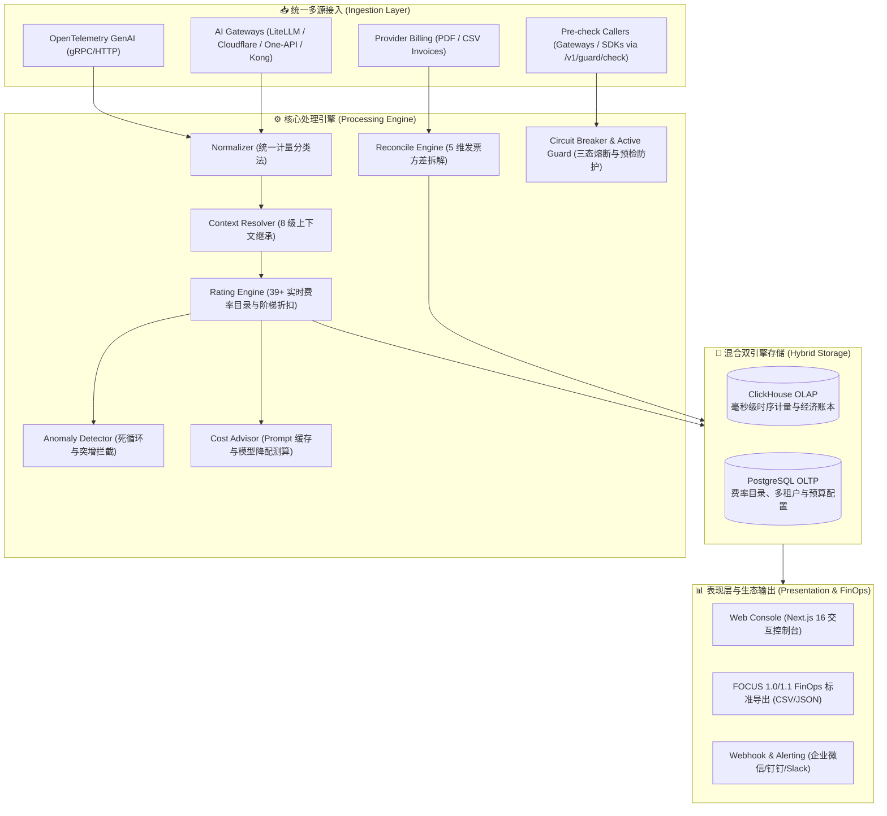

<div align="center">

# ⚡ AI Meter
### 给每一次 AI 调用装上“智能电表”
**独立于模型厂商的企业级 AI Usage & Cost Control Plane**

[](https://golang.org)
[](https://nextjs.org)
[](https://focus.finops.org)
[](LICENSE)

</div>

---

## 📖 为什么需要 AI Meter？

现在企业使用 AI 最大的问题，正在从“模型能不能用”，迅速变成：
> **“AI 到底花了多少钱，这些钱花在哪里，为什么花了这么多？”**

一个复杂的 Multi-Agent 工作流完成一次任务，背后可能混合调用了 GPT-4o、Claude 3.5 Sonnet、Gemini、DeepSeek-R1、Perplexity 搜索、向量数据库与十几个 Tool。最终企业只收到各大厂商几张完全割裂的账单，没人能准确算清：**哪位客户、哪个功能、哪个 Agent 消耗了多少成本，以及是否存在失控的死循环与资金浪费。**

**AI Meter 是一个独立于模型厂商的旁路控制面（Out-of-band Control Plane）：**
* **不侵入调用链路**：无需迁移业务 SDK 或强制接入代理网关，直接接收 OpenTelemetry GenAI 遥测、主流网关 Webhook 与厂商账单。
* **算清账**：统一多模态与推理计量单位，毫秒级流式计价与 8 级业务归因。
* **管住钱**：实时拦截 Multi-Agent 失控死循环，自动对账并拆解 5 维方差，给出量化的降本优化建议。
* **守住门**：提供 `<2ms` 极速预检拦截接口（`/v1/guard/check`）与三态熔断器，在预算超支或失控发生时主动切断。

---

## 🏗️ 核心架构与处理流



---

## ✨ 核心功能特性

### 1. 统一 AI 计量分类法 (Meter Taxonomy)
统一业界碎片化的计量口径，标准化抽象为：
* **Token 计量**：`LLM.InputToken`、`LLM.OutputToken`、`LLM.CacheReadToken`、`LLM.CacheWriteToken`、`LLM.ReasoningToken`（DeepSeek-R1 / o1 / o3 深度思考）。
* **多模态与工具**：`Image.Generation`、`Search.Query`、`Tool.Execution`、`Audio.InputSecond`。

### 2. 实时流式计价引擎 (Rating Engine)
* 预置全球主流 39+ 基础模型与云厂商基准费率（OpenAI, Anthropic, DeepSeek, Google, AWS Bedrock, Azure）。
* 支持版本时间窗口、阶梯定价与多租户合同专属折扣（Tenant Overrides）。

### 3. 8 级业务级联归因 (Cascading Attribution)
基于 W3C `baggage` 与 OpenTelemetry Trace Context，实现跨微服务与 Multi-Agent 树的自动级联继承：
```
Tenant → Customer → App → Workflow → Agent → Feature → Model → Provider
```

### 4. 工业级发票对账与 5 维方差拆解 (5-Factor Variance Engine)
* **智能解析**：支持直接导入各大厂商官方导出的 **PDF 发票** 与 **CSV 账单**，基于 CMap 字体表与流解压自动提取明细。
* **5 维方差归因**：
  1. 未监控流量（Unmonitored Traffic）
  2. 缓存差异惩罚（Cache Discrepancy）
  3. 费率版本漂移（Pricing Drift）
  4. 服务等级溢价（Service Tier Markup）
  5. 舍入与调整税费（Adjustments & Taxes）

### 5. 闭环防护与三态熔断器 (Active Guard & Circuit Breaker)
* **极速同步预检 (`POST /v1/guard/check`)**：耗时 `< 2ms`，支持在网关调用模型前检查月度预算与执行树深度。
* **失控死循环阻断 (`RUNAWAY_LOOP_PREVENTED`)**：调用深度达到 $\ge 12$ 时即刻切断，防止 Agent 陷入无休止递归轰炸。
* **三态熔断机制 (Closed $\rightarrow$ Open $\rightarrow$ Half-Open)**：触发严重超支后进入冷却阻断期，并自动推荐降级平替模型（如推荐降级至 `gpt-4o-mini`），支持控制台一键手动解封。
* **Fail-Open 柔性兜底**：控制面发生异常时默认放行，确保不发生次生业务阻断事故。

### 6. 智能异常雷达与失控告警 (Runaway Loop Radar)
* **死循环拦截**：实时遍历 Agent 执行树，当 Span 递归深度超标时自动报警并阻断失控调用。
* **消耗突增预警**：检测单次 Workflow 运行费用超过安全阈值（如单次超过 \$1.00 或 Token 爆炸）。
* **低效卡顿检测**：识别耗时极高（>25s）且产出极低（<50 Tokens）的无效阻塞。

### 7. AI 成本优化建议顾问 (Cost Optimization Advisor)
* **Prompt Caching 优化机会测算**：分析高频重复前缀与长上下文，测算开启缓存后的**每月预计节省金额（如 \$45/月）**。
* **模型降配平替 (Model Routing)**：自动识别日常分类/总结等轻量任务使用昂贵大模型（GPT-4o）的行为，建议降配为 GPT-4o-mini 或 DeepSeek-V3。
* **Reasoning Token 预算控制**：针对思考 Token 占比给出 `max_thinking_tokens` 上限优化策略。

### 8. 主流 AI 网关原生适配 (Gateway Adapters)
* 开放 `/v1/gateway/:vendor` Webhook 接入端点。
* 原生支持 **LiteLLM, Cloudflare AI Gateway, One-API, Kong** 的回调日志，即发即计费。

### 9. FinOps FOCUS 1.0 / 1.1 原生支持
* 原生支持 21 项 FOCUS 核心列，一键导出 CSV/JSON，无缝对接企业 ERP、PowerBI、Tableau 与 Cloudability。

---

## 🖥️ Web 控制台功能看板

| 路由 | 页面功能 | 核心指标与交互 |
| :--- | :--- | :--- |
| `/` | **Overview 全局大盘** | 总花费、Token 总量、缓存命中率、按模型/Agent 分布与消耗趋势 |
| `/traces` | **Traces 单元经济学** | 执行 Trace 列表、DAG 树状图渲染器（展开查看子 Agent 递归与单步消耗） |
| `/rates` | **费率目录知识库** | 39+ 预置模型基准价格表、租户阶梯折扣配置 |
| `/reconcile` | **发票对账与方差拆解** | 账单 PDF/CSV 拖拽上传、实付 vs 观测对比、5 维瀑布图拆解 |
| `/focus` | **FOCUS FinOps 导出** | 规范化账单数据预览、一键导出 FOCUS 1.0 标准 CSV |
| `/budgets` | **预算与告警规则** | 租户/工作流月度预算额度配置、进度条与 Webhook 告警流 |
| `/anomalies` | **实时异常雷达** | 严重级别筛选、失控 Agent 拦截现场指标 |
| `/recommendations` | **成本优化建议顾问** | 预计每月总节省金额 KPI、3 维建议卡片与精准修复指南 |
| `/circuit-breaker` | **熔断防护控制中心** | 三态熔断器大盘、阻断原因与冷却倒计时、一键重置解封与仿真沙箱 |

---

## 🚀 快速开始 (Quick Start)

### 1. 运行依赖基础设施 (Docker Compose)
```bash
# 启动 ClickHouse OLAP 与 PostgreSQL
docker compose up -d
```

### 2. 编译并启动 AI Meter 后端服务
```bash
# 编译二进制
go build -o bin/aimeter cmd/aimeter/main.go

# 启动控制台与采集引擎 (默认端口 :8080)
./bin/aimeter --config configs/aimeter.yaml
```

### 3. 启动前端 Web 控制台
```bash
cd web
npm install
npm run dev
```
打开浏览器访问：👉 **`http://localhost:3000`** (或本地配置端口)

---

## 📡 接口接入与鉴权示例

### 1. 极速同步预检与熔断鉴权 (Active Guard Pre-Check)
```bash
curl -X POST http://localhost:8080/v1/guard/check \
  -H "Content-Type: application/json" \
  -d '{
    "tenant_id": "org-enterprise-1",
    "workflow_id": "contract-review-agent",
    "model": "gpt-4o",
    "current_tree_depth": 3
  }'
```
* **放行响应**：`{"allowed": true, "decision_code": "OK", "circuit_state": "CLOSED"}`
* **阻断响应**：`{"allowed": false, "decision_code": "RUNAWAY_LOOP_PREVENTED", "circuit_state": "OPEN", "fallback_model": "gpt-4o-mini"}`

### 2. 发送 AI Gateway (LiteLLM) Webhook 回调
```bash
curl -X POST http://localhost:8080/v1/gateway/litellm \
  -H "Content-Type: application/json" \
  -H "baggage: tenant_id=org-enterprise-1,workflow_id=chat-flow" \
  -d '{
    "provider": "openai",
    "model": "gpt-4o",
    "prompt_tokens": 1200,
    "completion_tokens": 300,
    "cached_tokens": 800,
    "latency_ms": 420
  }'
```

---

## 📂 项目目录结构

```
AIMeter/
├── cmd/
│   ├── aimeter/             # 主服务入口
│   └── simulator/           # 遥测与异常仿真流量注入器
├── configs/                 # 配置文件与费率种子数据 (aimeter.yaml, rates.json)
├── migrations/              # 数据库迁移脚本 (ClickHouse & PostgreSQL)
├── pkg/
│   ├── advisor/             # AI 成本优化建议顾问引擎
│   ├── anomaly/             # 智能异常与死循环检测引擎
│   ├── api/                 # REST API 服务器与路由 Handlers
│   ├── attribution/         # 8 级上下文级联归因与 W3C baggage 解析
│   ├── budget/              # 预算管理与 Webhook 告警调度器
│   ├── collector/           # OTel 接收器与 AI 网关适配器
│   ├── config/              # 配置加载器
│   ├── domain/              # 核心领域模型与数据结构
│   ├── focus/               # FinOps FOCUS 1.0/1.1 标准导出器
│   ├── guard/               # 闭环防护与三态熔断器核心引擎
│   ├── normalizer/          # 统一计量分类法转换器
│   ├── rater/               # 实时流式计价引擎
│   ├── reconcile/           # 工业级 PDF/CSV 对账与 5 维方差拆解引擎
│   └── storage/             # ClickHouse, PostgreSQL 与 Memory 存储实现
└── web/                     # Next.js 16 现代 Web 控制台
```

---

## 📄 开源许可证

本项目基于 [Apache License 2.0](LICENSE) 协议开源。
