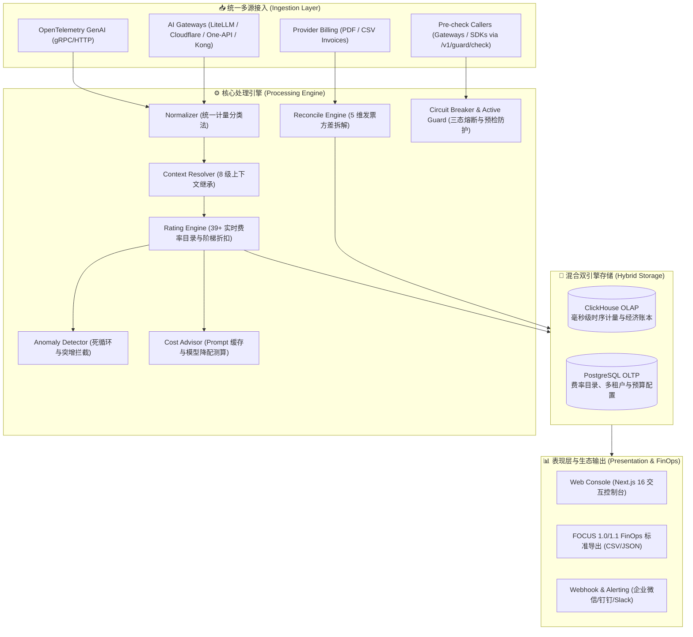

<div align="center">

# ⚡ AI Meter
### 给每一次 AI 调用装上“智能电表”
**独立于模型厂商的企业级 AI Usage & Cost Control Plane**

[](https://golang.org)
[](https://nextjs.org)
[](https://focus.finops.org)
[](LICENSE)

</div>

---

## 📖 为什么需要 AI Meter？

现在企业使用 AI 最大的问题，正在从“模型能不能用”，迅速变成：
> **“AI 到底花了多少钱，这些钱花在哪里，为什么花了这么多？”**

一个复杂的 Multi-Agent 工作流完成一次任务，背后可能混合调用了 GPT-4o、Claude 3.5 Sonnet、Gemini、DeepSeek-R1、Perplexity 搜索、向量数据库与十几个 Tool。最终企业只收到各大厂商几张完全割裂的账单，没人能准确算清：**哪位客户、哪个功能、哪个 Agent 消耗了多少成本，以及是否存在失控的死循环与资金浪费。**

**AI Meter 是一个独立于模型厂商的旁路控制面（Out-of-band Control Plane）：**
* **不侵入调用链路**：无需迁移业务 SDK 或强制接入代理网关，直接接收 OpenTelemetry GenAI 遥测、主流网关 Webhook 与厂商账单。
* **算清账**：统一多模态与推理计量单位，毫秒级流式计价与 8 级业务归因。
* **管住钱**：实时拦截 Multi-Agent 失控死循环，自动对账并拆解 5 维方差，给出量化的降本优化建议。
* **守住门**：提供 `<2ms` 极速预检拦截接口（`/v1/guard/check`）与三态熔断器，在预算超支或失控发生时主动切断。

---

## 🏗️ 核心架构与处理流


```mermaid
flowchart TD
    subgraph Sources["📥 统一多源接入 (Ingestion Layer)"]
        A1["OpenTelemetry GenAI (gRPC/HTTP)"]
        A2["AI Gateways (LiteLLM / Cloudflare / One-API / Kong)"]
        A3["Provider Billing (PDF / CSV Invoices)"]
        A4["Pre-check Callers (Gateways / SDKs via /v1/guard/check)"]
    end

    subgraph Processing["⚙️ 核心处理引擎 (Processing Engine)"]
        B1["Normalizer (统一计量分类法)"]
        B2["Context Resolver (8 级上下文继承)"]
        B3["Rating Engine (39+ 实时费率目录与阶梯折扣)"]
        B4["Anomaly Detector (死循环与突增拦截)"]
        B5["Cost Advisor (Prompt 缓存与模型降配测算)"]
        B6["Reconcile Engine (5 维发票方差拆解)"]
        B7["Circuit Breaker & Active Guard (三态熔断与预检防护)"]
    end

    subgraph Storage["💾 混合双引擎存储 (Hybrid Storage)"]
        C1[("ClickHouse OLAP<br>毫秒级时序计量与经济账本")]
        C2[("PostgreSQL OLTP<br>费率目录、多租户与预算配置")]
    end

    subgraph Presentation["📊 表现层与生态输出 (Presentation & FinOps)"]
        D1["Web Console (Next.js 16 交互控制台)"]
        D2["FOCUS 1.0/1.1 FinOps 标准导出 (CSV/JSON)"]
        D3["Webhook & Alerting (企业微信/钉钉/Slack)"]
    end

    A1 & A2 --> B1 --> B2 --> B3 --> Storage
    A4 --> B7
    B3 --> B4 & B5
    A3 --> B6 --> Storage
    Storage --> Presentation
```

---

## ✨ 核心功能特性

### 1. 统一 AI 计量分类法 (Meter Taxonomy)
统一业界碎片化的计量口径，标准化抽象为：
* **Token 计量**：`LLM.InputToken`、`LLM.OutputToken`、`LLM.CacheReadToken`、`LLM.CacheWriteToken`、`LLM.ReasoningToken`（DeepSeek-R1 / o1 / o3 深度思考）。
* **多模态与工具**：`Image.Generation`、`Search.Query`、`Tool.Execution`、`Audio.InputSecond`。

### 2. 实时流式计价引擎 (Rating Engine)
* 预置全球主流 39+ 基础模型与云厂商基准费率（OpenAI, Anthropic, DeepSeek, Google, AWS Bedrock, Azure）。
* 支持版本时间窗口、阶梯定价与多租户合同专属折扣（Tenant Overrides）。

### 3. 8 级业务级联归因 (Cascading Attribution)
基于 W3C `baggage` 与 OpenTelemetry Trace Context，实现跨微服务与 Multi-Agent 树的自动级联继承：
```
Tenant → Customer → App → Workflow → Agent → Feature → Model → Provider
```

### 4. 工业级发票对账与 5 维方差拆解 (5-Factor Variance Engine)
* **智能解析**：支持直接导入各大厂商官方导出的 **PDF 发票** 与 **CSV 账单**，基于 CMap 字体表与流解压自动提取明细。
* **5 维方差归因**：
  1. 未监控流量（Unmonitored Traffic）
  2. 缓存差异惩罚（Cache Discrepancy）
  3. 费率版本漂移（Pricing Drift）
  4. 服务等级溢价（Service Tier Markup）
  5. 舍入与调整税费（Adjustments & Taxes）

### 5. 闭环防护与三态熔断器 (Active Guard & Circuit Breaker)
* **极速同步预检 (`POST /v1/guard/check`)**：耗时 `< 2ms`，支持在网关调用模型前检查月度预算与执行树深度。
* **失控死循环阻断 (`RUNAWAY_LOOP_PREVENTED`)**：调用深度达到 $\ge 12$ 时即刻切断，防止 Agent 陷入无休止递归轰炸。

### 6. 私有化算力与开源模型成本折算引擎 (Self-Hosted GPU Cost Engine - Phase 11)
* **动态双轨成本折算**：精确按推理时长与 GPU 卡时折算硬件摊销成本（$\text{Cost} = \frac{\text{Duration (ms)}}{3,600,000} \times \text{Hourly Rate} \times \text{GPU Count}$），并结合输出 Token 反推等效 \$/1M Tokens。
* **硬件目录与自动绑定**：预置 H100 ($2.80/h), A100 ($1.60/h), L40S ($0.95/h), RTX 4090 ($0.40/h)，并推荐绑定 DeepSeek-R1, Qwen2.5, Llama 3.3 等主流开源模型。
* **三位一体兼容**：透明代理支持 `X-AIMeter-GPU-Type` 与 `X-AIMeter-GPU-Count` 自定义覆盖；网关原生接收 `/v1/gateway/vllm` 与 `/v1/gateway/ollama`。
* **Web 控制台双维度看板**：升级 `/rates` 为双 Tab（公有云费率 + 自建 GPU 目录与在线试算 Playground）；在 Traces 树状图中点亮 `[Self-Hosted GPU]` 芯片标识与单次硬件分摊成本。
* **三态熔断机制 (Closed $\rightarrow$ Open $\rightarrow$ Half-Open)**：触发严重超支后进入冷却阻断期，并自动推荐降级平替模型（如推荐降级至 `gpt-4o-mini`），支持控制台一键手动解封。
* **Fail-Open 柔性兜底**：控制面发生异常时默认放行，确保不发生次生业务阻断事故。

### 6. 智能异常雷达与失控告警 (Runaway Loop Radar)
* **死循环拦截**：实时遍历 Agent 执行树，当 Span 递归深度超标时自动报警并阻断失控调用。
* **消耗突增预警**：检测单次 Workflow 运行费用超过安全阈值（如单次超过 \$1.00 或 Token 爆炸）。
* **低效卡顿检测**：识别耗时极高（>25s）且产出极低（<50 Tokens）的无效阻塞。

### 7. AI 成本优化建议顾问 (Cost Optimization Advisor)
* **Prompt Caching 优化机会测算**：分析高频重复前缀与长上下文，测算开启缓存后的**每月预计节省金额（如 \$45/月）**。
* **模型降配平替 (Model Routing)**：自动识别日常分类/总结等轻量任务使用昂贵大模型（GPT-4o）的行为，建议降配为 GPT-4o-mini 或 DeepSeek-V3。
* **Reasoning Token 预算控制**：针对思考 Token 占比给出 `max_thinking_tokens` 上限优化策略。

### 8. 主流 AI 网关原生适配 (Gateway Adapters)
* 开放 `/v1/gateway/:vendor` Webhook 接入端点。
* 原生支持 **LiteLLM, Cloudflare AI Gateway, One-API, Kong** 的回调日志，即发即计费。

### 9. FinOps FOCUS 1.0 / 1.1 原生支持
* 原生支持 21 项 FOCUS 核心列，一键导出 CSV/JSON，无缝对接企业 ERP、PowerBI、Tableau 与 Cloudability。

### 10. 官方 Python 客户端 SDK 与 Agent 生态扩展 (Python SDK)
* **轻量非阻塞异步上报**：后台守护线程 + 内存队列，批量自动 Flush，业务主链路零延迟损耗。
* **极速 Active Guard 预检**：默认 20ms 短超时 + Fail-Open 柔性兜底保护，在控制面异常或网络超时时无感放行，绝不阻断业务。
* **`@meter.trace` 装饰器 & 上下文管理**：基于 `contextvars` 跨协程/线程自动级联父子 Span 与 DAG 树深度，自动反射解析 OpenAI / Anthropic 返回中的 Token 消耗。
* **主流 Agent 原生回调**：开箱即用支持 **LangChain**（`AIMeterCallbackHandler`）与 **LlamaIndex**（`AIMeterLlamaIndexCallbackHandler`）。

### 11. 智能反向代理网关与模型动态平替 (Smart LLM Reverse Proxy & Dynamic Fallback)
* **零代码侵入透明接入**：支持直接将官方 OpenAI SDK `base_url` 指向 AI Meter（如 `http://localhost:8080/v1`），完全无需修改任何调用代码。
* **双入口路由支持**：提供标准兼容入口 `/v1/chat/completions` 与显式多厂商入口 `/v1/proxy/:vendor/chat/completions`。
* **熔断/超支自动平替降级 (Dynamic Fallback)**：当高价模型（如 `gpt-4o`）触发熔断或预算超支时，网关自动平替重写为性价比模型（如 `gpt-4o-mini`），响应头携带 `X-AIMeter-Fallback: true`；亦支持通过 `X-AIMeter-Disable-Fallback: true` 快速阻断（HTTP 429）。
* **流式（SSE）零缓冲实时透传**：采用 `http.Flusher` 实时逐块透传，自动补充注入 `stream_options.include_usage=true`，流结束后台异步入库，保证零 TTFT 时延恶化与严格的零 Payload 隐私安全。

### 12. 多渠道实时告警通知与 Webhook 调度引擎 (Alert Notifications & Webhooks)
* **集中式告警调度中心 (`pkg/alert`)**：统一汇聚预算警戒（80% Warning / 100% Exceeded）、失控死循环阻断与熔断器跳闸事件。
* **智能自适应多渠道富文本卡片**：自动嗅探 Webhook 目标平台，原生适配**飞书（交互式卡片）、钉钉（Markdown 消息）、企业微信（Markdown 卡片）、Slack（Block Kit）**与**通用标准 Webhook**（带 `X-AIMeter-Signature` HMAC-SHA256 签名）。
* **指纹去重与冷却期降噪 (De-noising & Rate Limiting)**：基于 `hash(tenant_id, event_type, workflow_id)` 设立 5 分钟冷却阻断期，彻底杜绝高频并发场景下的群聊刷屏；失败提供最多 3 次指数退避重试。
* **交互式 Web 控制台与连通性验证**：`/budgets` 页面双 Tab 管理预算与告警通道，支持一键发送测试卡片与投递审计日志实时观测。

### 13. 企业级多租户安全鉴权与 API Key 凭证体系 (Enterprise RBAC & API Key Management)
* **工业级凭证安全存储 (`pkg/auth`)**：凭证格式为 `sk-aimeter-live-<32位安全随机熵>`，仅在签发时展示一次明文，数据库仅存 `SHA-256` 散列与脱敏掩码（如 `sk-aimeter-live-...8f4a`）。
* **极速内存验签 (<0.05ms) 与令牌桶频控**：内置高并发并发安全 LRU 缓存与独立 QPS 令牌桶限流，零 I/O 阻塞，完美坚守预检 `<2ms` 极速门禁，突增超额即刻返回 HTTP 429。
* **细粒度最小权限作用域 (Granular Scopes)**：原生支持 `proxy:invoke`（代理调用）、`guard:check`（预检拦截）、`telemetry:write`（遥测写入）、`read:metrics`（只读账单）与 `admin:*`（超级管理），杜绝跨权限越权。
* **独立凭证安全中心 (`/api-keys`)**：支持凭证清单审计、动态签发模态窗、一次性完整明文防盗弹窗，以及一键秒级挂起（Suspend）与吊销（Revoke）。

### 15. 实时 Token 级流式断流与单次请求硬限额 (Streaming Token-Level Hard-Capping - Phase 12)
* **微纳秒双轨增量估算引擎**：自研启发式多语言字词比率（中文/CJK ~1.0 Token/字，西文 ~3.8 字符/Token，耗时 `< 50ns`）结合原生 Usage Chunk 动态回填校准，流式转发零延迟阻塞。
* **物理关闭上游连接停计费**：在 SSE 逐块推送过程中实时累计，一旦超出单次请求安全限额（Token 阈值或 USD 金额阈值），代理立即物理切断上游 HTTP 连接（Cancel Context），从源头扼制供应商模型算力扣费。
* **优雅协议注入终结**：向客户端推送截断文案，注入带有 `finish_reason: "budget_exceeded"` 的终止 chunk，并以 `data: [DONE]\n\n` 优雅收尾，彻底杜绝客户端 SDK 异常崩溃或丢弃已接收文本。
* **双层级级联策略控制**：支持租户默认策略配置，并支持应用调用方通过 HTTP 请求头 `X-AIMeter-Max-Tokens` 与 `X-AIMeter-Max-Cost-USD` 实现逐请求粒度的动态精确覆盖。
* **Web 控制台全链路可视化**：`/budgets` 页面新增第 3 Tab（流式断流策略配置与协议说明）；`/traces` 列表及 `TraceTreeViewer` 树状层级图实时点亮 `⚡ [Stream Capped]` 徽标与规避浪费金额（Avoided Spend）。

### 16. 语义级智能 Prompt 压缩与 Token 瘦身代理 (Prompt Slimming Engine - Phase 13)
* **纯 Go 两阶段无依赖混合压缩**：自研高性能脱水引擎（`pkg/compress`），单次处理 `< 0.5ms`，零模型外呼、零 Sidecar 依赖。
* **代码与格式安全兜底保真**：Stage 1 结构化脱水智能保护 Markdown 代码块（```）与关键空白缩进；Stage 2 上下文自适应剪枝绝对保护 System 提示词与最近 $N$ 轮最新对话，仅剪枝历史低熵冗余客套语。
* **网关自动重写与透明回传**：支持请求头 `X-AIMeter-Compress-Prompt: true` 及 `X-AIMeter-Compress-Mode: light|moderate|aggressive` 动态控制；响应头透明回传 `X-AIMeter-Prompt-Compressed`, `X-AIMeter-Tokens-Saved`, `X-AIMeter-Compression-Ratio`。
* **全生命周期可观测性与交互式实验**：新增 `/compress` 控制台（租户策略纳管 + 交互式在线 Prompt 瘦身 Playground，支持 GPT-4o、Claude 3.5 Sonnet 等多模型节省金额实时对比矩阵）；`/traces` 列表中高亮渲染 `🌿 [Prompt Slimmed]` 徽标与节约账单。

### 17. 跨模型多供应商智能路由与 SLA/成本多目标调度 (Smart Router & SLA Arbiter - Phase 14)
* **微纳秒级多目标仲裁引擎 (`pkg/router`)**：纯内存并发安全无锁裁决（耗时 `< 0.08ms`），融合 EWMA 动态时延平滑跟踪、供应商可用性健康度与费率目录实时成本，构建 Pareto 最优解。
* **4 种开箱即用调度策略**：
  1. `cost_optimized`：成本最优，优先调度单位 Token 费率最低的可用端点；
  2. `latency_optimized`：延迟最优，基于 EWMA 实时 P99/均值延迟优先选路；
  3. `balanced`：性价比平衡，多目标综合权重裁决；
  4. `sla_failover`：高可用优先，端点故障（429/5xx）自适应秒级隔离与备选候选链（Failover Chain）平滑转移重试。
* **开箱即用虚拟模型别名池**：`router:flagship`（GPT-4o / Claude 3.5 Sonnet / Gemini 1.5 Pro）、`router:standard`、`router:cost-optimized`、`router:fast`、`router:auto`。
* **反向代理透明重定向与头标记**：支持通过 `model: "router:flagship"` 或 HTTP 请求头 `X-AIMeter-Router-Strategy` 无侵入调用，网关透明回传 `X-AIMeter-Routed`, `X-AIMeter-Routed-To`, `X-AIMeter-Routing-Strategy`, `X-AIMeter-Failover-Count`。
* **全生命周期路由大盘与仿真沙箱**：控制台 `/router` 呈现虚拟池纳管、供应商实时 EWMA 延迟健康矩阵与在线仿真沙箱；`/traces` 链路清晰点亮 `🔀 Smart Routed` 徽标与模型重定向链路。

### 18. 网关语义级响应缓存与零成本规避引擎 (Semantic Response Caching & Cost Avoidance Engine - Phase 15)
* **微纳秒双层混合匹配与 SimHash 算法**：纯 Go 内存并发安全架构，Layer 1 精确 SHA-256 哈希（耗时 `< 0.005ms`）+ Layer 2 64-bit 汉明距离 SimHash（耗时 `< 0.05ms`），融合多语言（CJK 单字/双字及西文词法归一化）加权分词，零外部向量数据库网络依赖。
* **企业级四重降本防线闭环**：与流式断流（Capping）、Prompt 压缩（Slimming）、智能路由（Router）形成合力，高频重复或语义相近请求直接在网关边缘零成本返回。
* **全透明双模拦截与动态请求头干预**：支持 `X-AIMeter-Cache: true|false`、`X-AIMeter-Cache-Threshold`（如 `0.85`）、`X-AIMeter-Cache-Refresh: true`（强制穿透刷新）、`X-AIMeter-Cache-TTL` 灵活按请求调优。
* **智能流式 SSE 零损耗仿真回放**：缓存命中流式请求时，自动模拟下发标准 SSE chunks（role chunk、content chunk、finish_reason stop chunk、usage chunk 与 `data: [DONE]\n\n`），客户端 SDK 零感知解析。
* **全链路审计透传与 0 成本经济学**：响应头透明回显 `X-AIMeter-Cache-Hit`, `X-AIMeter-Cache-Match-Type`, `X-AIMeter-Cache-Similarity`, `X-AIMeter-Cost-Avoided`, `X-AIMeter-Latency-Saved-Ms`；命中请求在 Ledger 中记录为 0 成本调用并核算规避支出。
* **全生命周期可观测性与交互式实验**：全新一级看板 `/cache`（4 维核心 KPI 概览、租户策略滑块配置、交互式双 Prompt 相似度 Playground、活跃条目实时检索与一键失效）；`/traces` 清晰点亮 `⚡ Cached` 徽标与 Avoided Spend 规避支出。

### 19. 多模态与 Tool/Agent 工具调用细粒度计量与计费引擎 (Multimodal Audio/Vision & Tool Calls Cost Ledger - Phase 16)
* **双轨混合全量模型**：物理单位（语音物理时长 `Audio.InputSecond/OutputSecond`、图像切片 `Vision.Input.HighResTile`）与厂商等效 Token 自动转换，无缝对齐最新主流多模态模型计价规则。
* **分级外部工具执行费率 (Tool Pricing Registry)**：预置沙箱代码解释器（`Tool.CodeInterpreter` $0.03/次）、联网搜索（`Tool.WebSearch` $0.005/次、Tavily $0.005/次）以及企业私有自定义 API 动态定价注册表，支持并发安全热增删改查。
* **全链路自适应深度嗅探**：网关反向代理自适应嗅探请求体 `messages` 中的图像 detail / 512×512 瓦片算法、输入语音时长，并嗅探响应体 `tool_calls` 执行频次与 `usage.audio_tokens`。
* **响应头透明审计透传**：`X-AIMeter-Tool-Calls`, `X-AIMeter-Audio-Tokens`, `X-AIMeter-Vision-Tiles`, `X-AIMeter-Multimodal-Cost`。
* **全生命周期大盘与在线沙箱**：全新一级看板 `/multimodal`（4 维核心宏观 KPI、Top 5 热门工具排行、Tool 费率管理表格与编辑 Modal、多模态与 Tool 在线仿真沙箱）；`/traces` 树状层级图实时点亮 `🎙️ Audio`, `🖼️ Vision`, `🛠️ Tool` 彩色徽标与分项卡片。

### 20. 多级分布式速率限制与令牌桶成本配额防护引擎 (Distributed Rate Limiting & Token-Bucket Cost Throttler - Phase 17)
* **三维双轨令牌桶算法 (RPM + TPM + CPM 成本速率)**：纯 Go 内存高并发原子无锁架构，同时约束 RPM（请求频次/分）、TPM（Token 吞吐/分）与 CPM（美元成本速率/分），内建平滑补充（Refill）与突发系数（Burst Multiplier 1.2x~1.5x）。
* **双模混合超限响应与微排队缓冲**：支持 `max_queue_delay_ms` 毫秒级延迟平滑挂起放行（微排队削峰填谷）；硬超限秒级阻断并返回标准 HTTP 429 与 `rate_limit_error` 结构化诊断体。
* **标准 RFC 与业界扩展响应头透明透传**：`X-RateLimit-Limit-RPM`, `X-RateLimit-Remaining-RPM`, `X-RateLimit-Limit-TPM`, `X-RateLimit-Remaining-TPM`, `X-RateLimit-Limit-CPM`, `X-RateLimit-Remaining-CPM`, `X-RateLimit-Reset`, `Retry-After`, `X-AIMeter-Rate-Limited`, `X-AIMeter-Rate-Limit-Breach`, `X-AIMeter-Throttled-Queue-Ms`。
* **网关透明代理与 TrueUp 动态纠偏**：在请求执行前评估预估 Token/成本并执行决策，请求完成后根据真实上游消费执行 `TrueUp` 动态差额补偿纠偏，保证账本与额度精准一致。
* **全生命周期限流大盘与仿真沙箱**：全新一级看板 `/throttling`（4 维核心宏观 KPI、多级配额策略管理表与新建/编辑模态窗、在线突发压力仿真沙箱与逐步执行时间线）；`/traces` 实时点亮 `🚦 429 Rate-Limited` 与 `⏳ Throttled (Queue: Xms)` 彩色徽标。

### 21. 企业级智能预算预测与自动自愈降本引擎 (Predictive Budget Forecasting & Automated Remediation Engine - Phase 18)
* **多维混合时序外推数学模型 (`pkg/forecast`)**：纯 Go 原生实现 EWMA 指数加权移动平均平滑、OLS 普通最小二乘趋势斜率拟合与工作日/周末潮汐因子加权，支持自然月对齐与未来 30 天消耗外推，计算延迟 `< 1ms`。
* **预算穿透精准预警与置信区间投影**：计算未来 30 天 P50 预期值与 P90 悲观上限值，分钟级精准推算月内预算穿透时刻时间戳（Breach Timestamp）。
* **四级渐进式闭环自愈状态机 (Progressive Remediation Matrix)**：
  1. `L0 健康正常 (<80%)`：常规运行，维持既定配置；
  2. `L1 无损瘦身 (80%~95%)`：Prompt 压缩自适应升级至 `aggressive`，语义缓存 TTL 与敏感度倾斜提升，实现 20%~40% 快速降本；
  3. `L2 平替与微排队 (95%~100%)`：联动 `slaArbiter` 自动将非核心流量导流至廉价平替模型，收紧 `throttlerEngine` 突发倍率至 1.0x 并开启毫秒级微排队；
  4. `L3 硬封顶熔断 (>100%)`：联动 `StreamCappingPolicy` 强制封顶单请求 Token/费用上限，非核心请求触发 429 配额保护，阻止账单无底洞。
* **自动闭环 (Auto-Pilot) 与干运行/人工审批双模切换**：支持租户级自治升降级与控制台一键覆写/恢复。
* **反向代理请求头贯通注入**：在网关响应头自动透传 `X-AIMeter-Remediation-Level` 与 `X-AIMeter-Remediation-Actions`。
* **全生命周期预测大盘与仿真沙箱**：全新一级看板 `/forecasting`（4 维核心宏观 KPI、SVG 交互式时序投影图、多租户自愈阶梯矩阵监控表与执行审计 Drawer、以及交互式 What-If 压力仿真沙箱）。

### 20. 多集群跨地域边缘控制面协同与配额同步引擎 (Multi-Region Edge Coordination & Distributed Quota Sync - Phase 19)
* **分层两级配额租约切片 (Hierarchical Quota Lease Slices)**：Central Hub 协同器根据各地域边缘节点（Spoke / Cloudflare Workers / AWS Lambda / 边缘机房）的历史流量与信用评级，动态按批切分下发带有 TTL 有效期的配额租约，消除跨大西洋/跨太平洋逐次请求的 WAN RTT 往返阻塞（耗时从 150ms 降至本地内存 `< 0.2ms`）。
* **自适应心跳与双向批冲正 (Adaptive Heartbeat & Bilateral Batch True-Up)**：Spoke 节点在租约限额内自主仲裁放行请求，周期性通过轻量心跳批量回传已消费金额（Delta True-Up）；Hub 集中刷新租约并根据消耗速率自动动态再平衡（Rebalance）。
* **网络分区自治软降级容灾 (Fail-Safe Local Degradation)**：当跨地域海缆或公网链路发生抖动或分区中断时，心跳超时探测器（默认 10s）自动将节点标为 `degraded` 或 `partitioned`，边缘节点进入本地保守自治模式（锁定 80% 软阈值安全水位、联动本地轻度限流或模型降配），既保证局部可用性，又杜绝超发穿透总预算。
* **网络分区推演沙箱与控制面管理**：全新一级看板 `/clustering`（4 维宏观 KPI、全球集群拓扑图与心跳链路监控、多地域租约切片管理、以及跨地域突发与网络断连推演沙箱）。

### 21. Prompt A/B 灰度实验、LLM 评测打分与单位业务经济效益 ROI 评估引擎 (Prompt A/B Testing, Evaluation & Unit Economics ROI Engine - Phase 20)
* **一致性哈希会话粘滞分流 (Consistent Hash Sticky Splitting)**：基于 `session_id` / `user_id` FNV-1a 一致性切流，保证同一终端用户的多轮会话体验连贯稳定；支持 `X-AIMeter-Variant` 请求头强制显式覆盖测试。
* **三轨混合质量评测 (Hybrid 3-Source Evaluation)**：融合 LLM-as-a-Judge 裁判抽样、零外部开销确定性规则（JSON 结构有效性、长度阈值、禁用语扣分）以及客户端业务反馈（点赞/点踩、任务是否成功解决）。
* **单位业务经济价值与帕累托最优边界 (Unit Economics ROI & Pareto Frontier)**：精确测算“每分质量成本（Cost-per-Quality-Point）”与“单次成功解决成本（Cost-per-Resolution）”，自动在控制台绘制散点坐标系，圈定帕累托最优变体并支持一键推全至 100% 生产流量。
* **在线蒙特卡洛 A/B 仿真沙箱**：全新一级看板 `/experiments`（4 维宏观 KPI、Variant A vs Variant B 深度指标看板、帕累托前沿分析图谱、以及在线推演沙箱）。

### 22. AI 数据隐私合规审计、PII 动态脱敏与敏感机密信息防泄漏拦截引擎 (AI Data Privacy Compliance, Dynamic PII Masking & DLP Guard Engine - Phase 21)
* **纯 Go 两阶段高性能嗅探器**：特征字符集极速预筛与预编译正则体系，单次嗅探耗时 `< 0.15ms`，零网络外呼、零外部服务依赖。
* **十类核心敏感实体全覆盖**：精准嗅探手机号（含大陆手机号与短横线）、18位二代身份证、电子邮箱、银行卡（内置 Luhn 模 10 校验算法有效剔除随机数字）、OpenAI/AWS API 密钥、JWT 令牌、内部局域网 IP、数据库连接串与企业自定义机密词。
* **三态阶梯式安全处置 (Block > Mask > Audit)**：支持基于租户或细粒度实体分别执行阻断拦截（HTTP 403）、动态假名脱敏与静默合规审计。
* **会话级双向透明可逆脱敏 (Reversible Pseudonymization)**：入站将机密替换为具名占位符（如 `[AIMETER_PHONE_1]`），上游大模型零接触真实敏感数据；网关出站透明利用保险库实时逆向还原，终端用户零感知；流式 SSE 逐行 chunk 实时解密。
* **全生命周期隐私合规控制中心**：全新一级看板 `/privacy`（4 维核心宏观 KPI、多租户策略配置矩阵、违规审计日志流与在线双向脱敏仿真沙箱）。

### 23. 多智能体协作拓扑图谱、多轮状态机成本归因与协作死循环拓扑审计引擎 (Multi-Agent Swarm Topology, Cost Attribution & Loop Graph Audit Engine - Phase 22)
* **有向有权多重图与成本解耦归因 (Directed Weighted Multigraph)**：单会话微秒级构建智能体调用图谱，将自身消耗开销（Self Cost）与下游派发开销（Delegated Cost）完全解耦，精确审计集群协作中“哪位 Agent 最能花钱，哪位最爱甩锅”。
* **滑动窗口 N-Gram 拓扑环路与二元乒乓死锁检测**：纯 Go 原生算法毫秒级（`<0.05ms`）捕获 $A \leftrightarrow B$ 二元死锁对峙与 $A \rightarrow B \rightarrow C \rightarrow A$ 多方踢皮球循环。
* **三级渐进式闭环干预策略 (L1 Warn → L2 Break-Prompt → L3 Block 409)**：
  1. `L1 拓扑警告 (warn)`：响应头标记环路告警，后台记录安全审计事件；
  2. `L2 柔性破局自愈 (break_prompt)`：网关向模型消息末尾动态追加结构化仲裁收拢指令，强制模型总结分歧作最终决策，自愈率达 96.5%；
  3. `L3 物理硬熔断 (block)`：连续死锁无法收敛时，网关立即中断上游并返回 HTTP 409 Conflict，从根源斩断计费死循环。
* **全生命周期协作拓扑看板与沙箱**：全新一级看板 `/swarm`（4 维宏观 KPI、交互式 SVG 拓扑网络图谱、节点成本归因下钻表、会话状态机流水抽屉、以及在线死循环演练沙箱）。

### 24. AI Agent 记忆生命周期、长期上下文向量检索成本归因与分级分层冷热压缩归档引擎 (Agent Memory Lifecycle, Semantic Recall Attribution & Tiered Compression Engine - Phase 23)
* **三层自适应温层架构 (Tiered Memory Architecture)**：
  1. `Hot 活跃工作记忆`：最近 $K$ 轮（默认 5 轮）原始保留，直插模型 Prompt，微秒级即时响应；
  2. `Warm 结构化事实卡片 (Fact Memo)`：超出 $K$ 轮历史自动提取结构化关键事实（键值/实体/决策），压降 75% 代币消耗；
  3. `Cold 向量外部归档`：基于访问半衰期动态衰减 $S = \text{Hits} \times e^{-\lambda \cdot \Delta t}$，非活跃记忆移出主动上下文转入外部冷存，按需召回。
* **微秒级语义利用率度量与负反馈噪声淘汰**：纯 Go 原生中英文分词与 N-Gram 语义重合度测算输出对注入记忆的引用率（Memory Utility & ROI），自动标识 $<25\%$ 的低效背景噪声并在压实阶段实施负反馈淘汰，杜绝长上下文二次方发散。
* **代理网关双向协同与无感压实**：网关自动嗅探 `X-AIMeter-Memory-Session`，将超出 Hot 窗口的历史消息替换为紧凑的 Fact Memo 摘要卡片，出站异步评估记忆语义重合度，零延迟阻塞正常流量。
* **全生命周期记忆大盘与膨胀推演沙箱**：全新一级看板 `/memory`（4 维宏观 KPI、三层记忆资产泳道、有效率与低效噪声审计、生命周期策略配置、以及长程记忆膨胀对比沙箱）。

### 25. AI 推理思维链深度审计、认知冗余剪枝与反思停机经济学控制引擎 (Chain-of-Thought / Reasoning Depth Audit, Cognitive Redundancy Pruning & Thinking Economy Engine - Phase 24)
* **四阶段认知状态机与极速语法分段**：纯 Go 原生模式识别与状态机，将 `<think>` 思考流自动分段归类为 `Hypothesis`（假设分析） → `Deduction`（演绎推导） → `Reflection`（反思验算） → `Convergence`（结论收敛），耗时 `< 0.05ms`。
* **反思震荡指数 (COI) 与认知冗余度双轨度量**：量化模型推理过程中的自我怀疑、循环对峙与反复纠结；基于 Jaccard 重叠度精准识别低效车轱辘话与低价值无效思考段落。
* **确定性认知剪枝重构 (Cognitive Pruning Synthesis)**：保留核心假设与最终收敛推导，智能剔除中间无实质价值的震荡与高重合反思段，生成精简 CoT 摘要，最高降低 70% 思考代币浪费。
* **网关三级弹性干预与流式 SSE 优雅收敛**：入站按策略自适应注入 `max_thinking_tokens`；出站透传 `X-AIMeter-Reasoning-Tokens`、`X-AIMeter-Reasoning-Cost`、`X-AIMeter-Thinking-Oscillation`、`X-AIMeter-Thinking-Action`、`X-AIMeter-Thinking-Budget`；流式超出思考预算时动态闭合 `</think>` 标签并注入收敛声明，保证客户端 UI 零崩溃。
* **全生命周期思维大盘与沙箱**：全新一级看板 `/reasoning`（4 维宏观 KPI、思维链认知时序审计、反思震荡热力榜、思考预算策略配置、以及内置 4 场景推演沙箱）。

### 26. 提示词前缀共享编排、多租户 KV-Cache 命中率经济学与上下文预热调度引擎 (Prefix Caching / KV-Cache Hit-Rate Economics & Context Prewarming Engine - Phase 25)
* **纯 Go 并发安全 Radix 前缀树拓扑 (`pkg/kvcache`)**：微秒级计算最长公共前缀 Token 匹配，支持节点动态分裂、块对齐判定（Block-Alignment Sensing，如 64/1024 Tokens）与 LRU/TTL 老化淘汰，内存无外部依赖。
* **动态变量沉底规范化重排 (Variable Sink Canonicalization)**：自动嗅探高熵动态变量（当前时间戳、UUID、会话 SessionID、随机种子），将其从 System Prompt 或静态前缀剥离并下沉至尾部重构，恢复被割裂的长知识库前缀连续性，提升缓存命中率 50%+。
* **轻量级 1-Token 探针预热与显存保鲜调度 (1-Token Probing & Context Prewarming)**：支持针对高频基础提示词执行后台 1-Token 轻量预热唤醒，标记 GPU 显存驻留保鲜状态（10 分钟 TTL），消除早高峰首请求冷启动（TTFT）毛刺。
* **反向代理双向协同与全息响应头审计**：网关透明拦截入站请求执行沉底规范化；响应头全息透传 `X-AIMeter-KVCache-Hit`, `X-AIMeter-KVCache-Tokens`, `X-AIMeter-KVCache-Ratio`, `X-AIMeter-KVCache-Saved-USD`, `X-AIMeter-Prefix-Canonicalized`, `X-AIMeter-Prewarm`。
* **全生命周期 KV-Cache 看板与沙箱**：全新一级看板 `/kvcache`（4 维宏观 KPI、可展开折叠的交互式 Radix 树谱、变量沉底与收益对比沙箱、主动预热控制台、审计流水表与策略配置面板）。

### 27. 大模型输出质量漂移检测、幻觉惩罚经济学与鲁棒性防御引擎 (LLM Output Quality Drift, Hallucination Penalty Economics & Robustness Guard Engine - Phase 26)
* **纯 Go 语法修复状态机 (`pkg/quality/repairer.go`)**：微秒级（`< 0.2ms`）智能清洗 Markdown 语法围栏、就地自动补齐截断未闭合的大括号与中括号、剥离非法尾部逗号、修复未闭合字符串，实现非流式下发透明自愈，彻底杜绝下游 JSON 解析崩溃。
* **三维多轨轻量嗅探器 (`pkg/quality/detector.go`)**：微秒级评估结构合规性、统计 Prompt 事实与输出数字/实体的幻觉指数 $H \in [0, 1]$、瞬时检测连续重复吐字退化，评定 `normal`, `repaired`, `degraded`, `hallucination`, `fatal_bad_debt` 五级状态。
* **三级阶梯式 SLA 惩罚与坏账冲销经济学**：轻度语法自愈按比例补偿（20%）、中度幻觉阶梯扣减（50%）、重度不可恢复全额 100% 冲销为坏账（Bad Debt Write-off），动态刷新各厂商实时信用评分并联动 Smart Router 降权避让。
* **反向代理双向协同与全息响应头审计**：透传 `X-AIMeter-Drift-Status`、`X-AIMeter-Hallucination-Score`、`X-AIMeter-Penalty-USD`、`X-AIMeter-Bad-Debt`、`X-AIMeter-Repaired`，非流式与流式异步入库审计 Trace。
* **全生命周期质量大盘与沙箱**：全新一级看板 `/quality`（4 维宏观 KPI、供应商可信度评分排行榜、在线自愈与损失推演沙箱、坏账审计流水表与策略配置面板）。

### 28. 长程 Agent 异步工作流 DAG 编排计费、检查点持久化与断点续算幂等重试引擎 (Long-Running Agent DAG Workflow Billing, Checkpointing & Resilient Idempotency Engine - Phase 27)
* **纯 Go 并发安全 DAG 拓扑状态机 (`pkg/workflow/dag.go`)**：基于 Kahn 算法实现高鲁棒性拓扑排序与环路检测，动态解析长程 Agent 各步骤依赖并判定下游可执行步骤（`GetNextExecutableSteps`）。
* **增量差分检查点与微秒级幂等回放 (`pkg/workflow/checkpoint.go`)**：支持基于 `(WorkflowID, StepID)` 及全局唯一幂等键 `IdempotencyKey` 微秒级读写，固化 SHA-256 Payload 快照、单步成本、Token 消耗与耗时；入站命中快照时瞬时毫秒级回放并跳过上游重复调用。
* **四维细粒度工作流全景账本 (`pkg/workflow/manager.go`)**：四维细粒度分解工作流开销（累计实际发生 `TotalIncurred`、有效产出净额 `EffectiveCost`、续算规避浪费 `AvoidedWaste`、失败沉没成本 `SunkCost`）。
* **断点续算与沉没止损熔断保护 (Sunk-Cost Circuit Breaker)**：续算时自动跳过所有已完成并固化快照的前序步骤，规避无谓重复计算；支持单工作流配置沉没成本上限（`SunkCostCapUSD`，如 $0.25），当连续失败重试累计浪费达到上限时即刻熔断，防止资损雪崩。
* **全生命周期工作流控制中心与沙箱**：全新一级看板 `/workflows`（4 维宏观 KPI、交互式 DAG 流程拓扑图谱、检查点增量快照抽屉、一键断点续算触发、实例审计表与全量重跑 vs 增量续算对比推演沙箱）。

### 29. Agent 运行时沙箱代码解释器、微轻量虚拟机算力与外部工具微事务清算引擎 (Agent Code Interpreter Sandbox, Ephemeral Micro-VM Compute & Tool Micro-Transaction Clearing Engine - Phase 28)
* **瞬态微轻量虚拟机算力折算模型与 60s 硬超时判定 (`pkg/sandbox/compute.go`)**：秒级精确核算 vCPU-sec 与 RAM-GB-sec，叠加微虚拟机容器拉起冷启动保底开销（$0.0005/run），对执行时长施加 60s 硬截断保护，超出自动标记为 `timeout_capped` 并截断计费，防挂起死锁。
* **预置外部工具微事务费率字典 (`pkg/sandbox/clearing.go`)**：并发安全纳管 `code_interpreter`, `web_search`, `browser_automation`, `financial_data`, `sql_sandbox` 等高频外部付费工具单价字典，支持动态单价解析与按次结算。
* **三合一全口径综合账本与会话级防失控熔断状态机 (`pkg/sandbox/manager.go`)**：打通 $\text{TripartiteTotal} = \text{ComputeCost} + \text{ToolCost} + \text{LLMCost}$，实时追踪会话累计支出；当单会话超出 `SessionCapUSD` 硬预算时网关直接返回 HTTP 429 斩断 Agent 失控死循环资损。
* **反向代理双向协同与全息响应头审计**：透传 `X-AIMeter-Sandbox-Cost`, `X-AIMeter-Tool-Cost`, `X-AIMeter-Tripartite-Total-Cost`, `X-AIMeter-Sandbox-Status` 与 `X-AIMeter-Sandbox-Execution-ID`，实时记录沙箱审计流水。
### 30. 企业级组织架构预算树、级联继承与软硬双轨配额管控引擎 (Hierarchical Team Budget Cascading & Dual-Quota Enforcement Engine - Phase 29)
* **加权物化路径树与微秒级祖先检索 (`pkg/hierarchy/tree.go`)**：基于物化路径（如 `corp/tech/ai-lab/nlp`）实现微秒级（`< 0.02ms`）祖先链检索、节点增删改查、前缀子树查找与前端可折叠 Forest 多叉树构建。
* **链式自底向上递归预检与双轨阈值熔断 (`pkg/hierarchy/checker.go`)**：逐级向上遍历所有祖先节点，当达到 80% 软阈值时自动发出软预警或触发 P2 优先级自动降配标记（`degrade_compress`）；当达到 100% 硬顶时判定是否具备 P0 核心保障与 `enable_overdraft` 透支缓冲借调，否则网关直接 429 熔断阻断。
* **节点健康状态机与原子级联记账 (`pkg/hierarchy/manager.go`)**：动态评估 `healthy`, `soft_warning`, `overdraft_active`, `hard_capped` 四态；请求成功后原子化自底向上累加该团队及其所有上级祖先的实际消耗金额（`RecordSpend`）。
* **反向代理双向协同与全息响应头审计**：透传 `X-AIMeter-Org-Path`、`X-AIMeter-Org-Action`、`X-AIMeter-Org-Remaining-USD`、`X-AIMeter-Org-Breach-Node` 与 `X-AIMeter-Org-Downgraded`。
* **全生命周期组织配额控制中心与沙箱**：全新一级看板 `/hierarchy`（4 维宏观 KPI、交互式可折叠组织层级树图谱、快速配额预检探测器与 What-If 级联配额冲击仿真推演沙箱）。

---

## 🖥️ Web 控制台功能看板

| 路由 | 页面功能 | 核心指标与交互 |
| :--- | :--- | :--- |
| `/` | **Overview 全局大盘** | 总花费、Token 总量、缓存命中率、按模型/Agent 分布与消耗趋势 |
| `/hierarchy` | **企业组织架构预算树与双轨配额管控中心** | 4 维宏观 KPI（中央总预算池、组织节点数与架构深度、预警与熔断管控、P0核心业务保障）、交互式可折叠组织拓扑树、配额利用率进度条、快速配额探测器、What-If 级联冲击仿真沙箱与节点配置抽屉 |
| `/sandboxes` | **Agent 沙箱代码解释器与工具微事务清算中心** | 4 维宏观 KPI（三合一总账本、沙箱算力累计、工具微事务累计、超时截断与预算阻断）、三合一全口径成本解耦瀑布、审计流水抽屉、预置工具单价字典在线编辑与交互式算力推演沙箱 |
| `/workflows` | **长程 Agent DAG 工作流编排计费与检查点控制中心** | 4 维宏观 KPI（累计发生、有效成本、续算规避浪费、失败沉没成本）、交互式 DAG 拓扑流程时序流、增量快照 Payload 预览抽屉、一键断点续算触发器、全量重跑 vs 断点续算经济学对比沙箱与实例审计表 |
| `/quality` | **质量漂移检测与幻觉惩罚经济学大盘** | 4 维宏观 KPI（评估请求数、自愈成功率、幻觉拦截数、SLA 惩罚与坏账冲销金额）、供应商可信度排行榜 (0~100)、在线自愈与损失推演沙箱（带自愈前后 Diff 与阶梯扣减拆解）、坏账审计流水表与策略配置面板 |
| `/kvcache` | **前缀缓存共享与 KV-Cache 经济学大盘** | 4 维宏观 KPI（前缀请求数、命中 Tokens、KV 命中率、节省金额）、交互式 Radix 前缀树拓扑图谱（展开/折叠/命中热力）、变量沉底规范化收益对比沙箱、主动 1-Token 预热工作台与实时审计流水 |
| `/reasoning` | **AI 推理思维链深度审计与认知剪枝大盘** | 4 维宏观 KPI（思考流总数、节省思考 Tokens、规避过度反思支出、平均反思震荡指数 COI）、思维链认知时序审计（Hypothesis/Deduction/Reflection/Convergence）、反思震荡热力榜、思考预算策略配置与思维经济学推演沙箱 |
| `/memory` | **Agent 记忆生命周期与分层压缩大盘** | 4 维宏观 KPI（记忆资产总量、节省 Context Tokens、规避浪费支出、平均记忆有效率与噪声拦截）、三层资产泳道（Hot 活跃窗口、Warm Fact Memo 事实摘要、Cold 向量冷存）、有效率与低效噪声审计、策略在线配置与长程对话记忆膨胀沙箱 |
| `/swarm` | **多智能体拓扑与死循环审计大盘** | 4 维宏观 KPI（协作会话数、死循环拦截数、破局自愈率、规避浪费金额）、交互式 SVG 拓扑网络图谱（径向轨道布局、带权重贝塞尔连线、死循环虚线脉冲高亮）、多轮状态机成本归因下钻表、时序流水抽屉与在线死循环演练沙箱 |
| `/privacy` | **数据隐私合规与 DLP 大盘** | 4 维宏观 KPI（合规审计总数、违规捕获与处置数、双向脱敏保真度、嗅探时延）、多实体处置规则矩阵、违规审计日志、在线脱敏与还原仿真沙箱 |
| `/experiments` | **Prompt A/B 实验与 ROI 评测大盘** | 4 维宏观 KPI（活跃实验数、已评估请求数、优胜变体降本率、平均质量得分）、变体 A/B 六维指标对比面板、帕累托最优散点分析图谱、一键推全安全确认动作与在线蒙特卡洛推演沙箱 |
| `/clustering` | **多集群跨地域协同大盘** | 4 维宏观 KPI（活跃节点、全局租约配额水位、平均 WAN 延迟、分区容灾规避超发金额）、全球集群星型拓扑图、租约切片表格与一键再平衡、网络分区与突发推演沙箱 |
| `/forecasting` | **预算时序预测与自愈大盘** | 4 维宏观 KPI（预算使用率、月末预测、穿透预警、自愈节省）、SVG 时序投影图（实线/虚线/P50-P90 置信区间）、四级自愈矩阵与 What-If 突发沙箱 |
| `/throttling` | **分布式速率限制与配额大盘** | 4 维宏观 KPI（评估请求数、429 拦截数、微排队缓冲数、避免 runaway 保护金额）、配额策略管理表、在线令牌桶突发压力仿真沙箱 |
| `/multimodal` | **多模态与工具调用计费大盘** | 4 维宏观 KPI（音频、视觉、工具与全口径支出）、Top 5 热门工具执行排行、Tool 费率管理表格、多模态与 Tool 在线仿真试算沙箱 |
| `/cache` | **语义级响应缓存大盘** | 4 维核心 KPI 概览（命中率、规避支出、节约时延、活跃条目）、租户策略配置、双 Prompt 相似度在线测试 Playground 与活跃条目失效控制 |
| `/router` | **智能路由与 SLA 调度大盘** | 虚拟模型池管理、供应商实时 EWMA 时延与可用性监控矩阵、交互式 Prompt 路由决策仿真沙箱 |
| `/traces` | **Traces 单元经济学** | 执行 Trace 列表、DAG 树状图渲染器、点亮 `🚦 Rate-Limited` 限流徽标、`🎙️ Audio`, `🖼️ Vision`, `🛠️ Tool` 多模态徽标、`⚡ Cached` 缓存徽标、`🔀 Smart Routed` 路由徽标、`⚡ Stream Capped` 截断徽标与 `🌿 Prompt Slimmed` 瘦身徽标及节约金额 |
| `/compress` | **Prompt 瘦身策略与实验室** | 租户级压缩模式配置、阈值设定、交互式在线 Prompt 瘦身与多模型节省金额实时比对矩阵 |
| `/rates` | **费率目录知识库** | 39+ 预置模型基准价格表、租户阶梯折扣配置、自建 GPU 目录与在线试算 Playground |
| `/reconcile` | **发票对账与方差拆解** | 账单 PDF/CSV 拖拽上传、实付 vs 观测对比、5 维瀑布图拆解 |
| `/focus` | **FOCUS FinOps 导出** | 规范化账单数据预览、一键导出 FOCUS 1.0 标准 CSV |
| `/budgets` | **预算、告警与流式断流** | 三 Tab 看板：租户/工作流月度预算额度、多渠道 Webhook 告警，以及实时 Token 级流式硬限额策略中心 |
| `/anomalies` | **实时异常雷达** | 严重级别筛选、失控 Agent 拦截现场指标 |
| `/recommendations` | **成本优化建议顾问** | 预计每月总节省金额 KPI、3 维建议卡片与精准修复指南 |
| `/circuit-breaker` | **熔断防护控制中心** | 三态熔断器大盘、阻断原因与冷却倒计时、一键重置解封与仿真沙箱 |
| `/api-keys` | **API 凭证安全中心** | 多租户 API Key 签发、SHA-256 存储脱敏、细粒度 Scopes 授权、QPS 限流与一次性明文弹窗 |

---

## 🚀 快速开始 (Quick Start)

### 1. 全栈一键运行 (Docker Compose 推荐)
```bash
# 一键拉起 ClickHouse, PostgreSQL, 后端控制面与 Next.js Web 控制台
docker compose -f deploy/docker-compose.yml up -d
```
* 控制台：👉 **`http://localhost:3000`**
* REST & 预检 API：`http://localhost:8080`
* Prometheus 指标：`http://localhost:8080/metrics`
* K8s 存活 / 就绪探针：`http://localhost:8080/livez` / `http://localhost:8080/readyz`

### 2. 本地源码极速启动 (开发模式)
```bash
# 启动依赖数据库
docker compose -f deploy/docker-compose.yml up -d clickhouse postgres

# 编译并启动 AI Meter 后端服务
go build -o bin/aimeter cmd/aimeter/main.go
./bin/aimeter --config configs/aimeter.yaml

# 启动前端 Web 控制台
cd web && npm run dev
```

### 3. 云原生 Kubernetes 生产部署 (Helm)
```bash
# 语法校验与本地渲染
helm lint deploy/helm/aimeter

# 安装部署至 Kubernetes 集群
helm install aimeter deploy/helm/aimeter \
  --set ingress.hosts[0].host="aimeter.yourcompany.com"
```

---

## 📡 接口接入与鉴权示例

### 1. 极速同步预检与熔断鉴权 (Active Guard Pre-Check)
```bash
curl -X POST http://localhost:8080/v1/guard/check \
  -H "Content-Type: application/json" \
  -d '{
    "tenant_id": "org-enterprise-1",
    "workflow_id": "contract-review-agent",
    "model": "gpt-4o",
    "current_tree_depth": 3
  }'
```
* **放行响应**：`{"allowed": true, "decision_code": "OK", "circuit_state": "CLOSED"}`
* **阻断响应**：`{"allowed": false, "decision_code": "RUNAWAY_LOOP_PREVENTED", "circuit_state": "OPEN", "fallback_model": "gpt-4o-mini"}`

### 2. 发送 AI Gateway (LiteLLM) Webhook 回调
```bash
curl -X POST http://localhost:8080/v1/gateway/litellm \
  -H "Content-Type: application/json" \
  -H "baggage: tenant_id=org-enterprise-1,workflow_id=chat-flow" \
  -d '{
    "provider": "openai",
    "model": "gpt-4o",
    "prompt_tokens": 1200,
    "completion_tokens": 300,
    "cached_tokens": 800,
    "latency_ms": 420
  }'
### 3. 透明反向代理调用 (零侵入 OpenAI SDK 接入与动态平替)
```python
from openai import OpenAI

# 直接将官方 OpenAI SDK base_url 指向 AI Meter 反向代理网关
client = OpenAI(
    base_url="http://localhost:8080/v1",
    api_key="sk-your-upstream-key",
    default_headers={
        "X-Tenant-ID": "org-enterprise-1",
        "X-Workflow-ID": "customer-support-flow",
    }
)

# 正常发起请求：自动享有 Active Guard 熔断预检、超支平替降级与异步计费！
response = client.chat.completions.create(
    model="gpt-4o",
    messages=[{"role": "user", "content": "Hello AI Meter"}]
)
print(response.choices[0].message.content)
```

### 4. 私有化 GPU 算力折算与在线试算 (Phase 11)
```bash
curl -X POST http://localhost:8080/api/v1/rates/gpus/calculate \
  -H "Content-Type: application/json" \
  -d '{
    "model": "deepseek-ai/DeepSeek-R1",
    "gpu_type": "A100",
    "gpu_count": 4,
    "duration_ms": 3600,
    "total_tokens": 2000
  }'
```
* **响应结果**：`{"model":"deepseek-ai/DeepSeek-R1","gpu_type":"A100","gpu_count":4,"duration_ms":3600,"hardware_cost_usd":0.0064,"hourly_rate_usd":1.6,"total_tokens":2000,"equivalent_token_rate":3.2}` (等效 \$3.20 / 1M Tokens，单次调用硬件成本仅 \$0.0064)。

### 5. 网关语义响应缓存与动态控制 (Phase 15)
```bash
curl -X POST http://localhost:8080/v1/chat/completions \
  -H "Content-Type: application/json" \
  -H "X-AIMeter-Cache: true" \
  -H "X-AIMeter-Cache-Threshold: 0.82" \
  -d '{
    "model": "gpt-4o",
    "messages": [{"role": "user", "content": "请写一段 Python 快速排序代码"}]
  }'
```
* **首次请求（穿透上游并写入缓存）**：`X-AIMeter-Cache-Hit: false`
* **相近语义二次请求（如“用 Python 写一个快速排序算法”）**：`X-AIMeter-Cache-Hit: true`, `X-AIMeter-Cache-Match-Type: semantic`, `X-AIMeter-Cache-Similarity: 0.85`, `X-AIMeter-Cost-Avoided: 0.00340`, `X-AIMeter-Latency-Saved-Ms: 680`，时延仅 **~0.3ms**。

---

## 📂 项目目录结构

```
AIMeter/
├── .github/
│   └── workflows/ci.yml     # 三阶并发质量门禁 CI 流水线 (Go, Next.js, Docker, Helm, Python SDK)
├── cmd/
│   ├── aimeter/             # 主服务入口
│   ├── bench/               # 万级 QPS 原生并发基准压测 CLI (Phase 10)
│   └── simulator/           # 遥测与异常仿真流量注入器
├── configs/                 # 配置文件与费率种子数据 (aimeter.yaml, rates.json)
├── deploy/
│   ├── Dockerfile.backend   # Go 最小化 Alpine 运行时构建
│   ├── Dockerfile.frontend  # Next.js standalone 生产容器构建
│   ├── docker-compose.yml   # 4 容器全栈一键编排环境
│   └── helm/aimeter/        # 生产级 Kubernetes Helm Chart (含 Ingress, HPA, ServiceMonitor)
├── migrations/              # 数据库迁移脚本 (ClickHouse & PostgreSQL)
├── pkg/
│   ├── advisor/             # AI 成本优化建议顾问引擎
│   ├── alert/               # 多渠道告警调度、冷却降噪与卡片适配 (Phase 8)
│   ├── anomaly/             # 智能异常与死循环检测引擎
│   ├── api/                 # REST API 服务器与探针路由 (/metrics, /livez, /readyz)
│   ├── attribution/         # 8 级上下文级联归因与 W3C baggage 解析
│   ├── auth/                # 企业级 API Key 凭证、SHA-256 哈希、LRU 验签与限流 (Phase 9)
│   ├── budget/              # 预算管理与 Webhook 告警调度器
│   ├── cache/               # 语义响应缓存、SimHash 算法与 LRU/TTL 淘汰池 (Phase 15)
│   ├── collector/           # OTel 接收器与 AI 网关适配器
│   ├── compress/            # Prompt 智能压缩与 Token 瘦身引擎 (Phase 13)
│   ├── config/              # 配置加载器与环境变量注入
│   ├── domain/              # 核心领域模型与数据结构
│   ├── focus/               # FinOps FOCUS 1.0/1.1 标准导出器
│   ├── guard/               # 闭环防护与三态熔断器核心引擎
│   ├── kvcache/             # 提示词前缀共享编排、Radix树拓扑、变量沉底与预热调度引擎 (Phase 25)
│   ├── memory/              # Agent 记忆生命周期、长期上下文向量检索归因与冷热压缩归档引擎 (Phase 23)
│   ├── metrics/             # Prometheus 核心指标定义与埋点
│   ├── normalizer/          # 统一计量分类法转换器
│   ├── proxy/               # 智能反向代理网关、动态平替、断流拦截、缓存回放与思维截断收敛 (Phase 7, 12, 14, 15, 24)
│   ├── quality/             # 输出质量漂移检测、纯 Go 语法自愈、幻觉量化与 SLA 惩罚引擎 (Phase 26)
│   ├── rater/               # 实时流式计价与自建 GPU 算力折算引擎 (Phase 1, 11)
│   ├── reasoning/           # 推理思维链深度审计、四阶段认知状态机与冗余剪枝引擎 (Phase 24)
│   ├── reconcile/           # 工业级 PDF/CSV 对账与 5 维方差拆解引擎
│   ├── router/              # 跨模型多供应商智能路由与 SLA 仲裁引擎 (Phase 14)
│   ├── storage/             # ClickHouse, PostgreSQL 与 Memory 存储实现
│   └── swarm/               # 多智能体拓扑图谱、多轮状态机成本归因与死循环审计引擎 (Phase 22)
├── sdks/
│   └── python/              # 官方 Python 客户端 SDK (基于 uv, @meter.trace, LangChain, LlamaIndex)
├── scripts/
│   └── bench/               # 云原生 k6 规范压测脚本 (k6_stress.js)
└── web/                     # Next.js 16 现代 Web 控制台 (支持 standalone 容器化)
```

---

## 📄 开源许可证

本项目基于 [Apache License 2.0](LICENSE) 协议开源。
