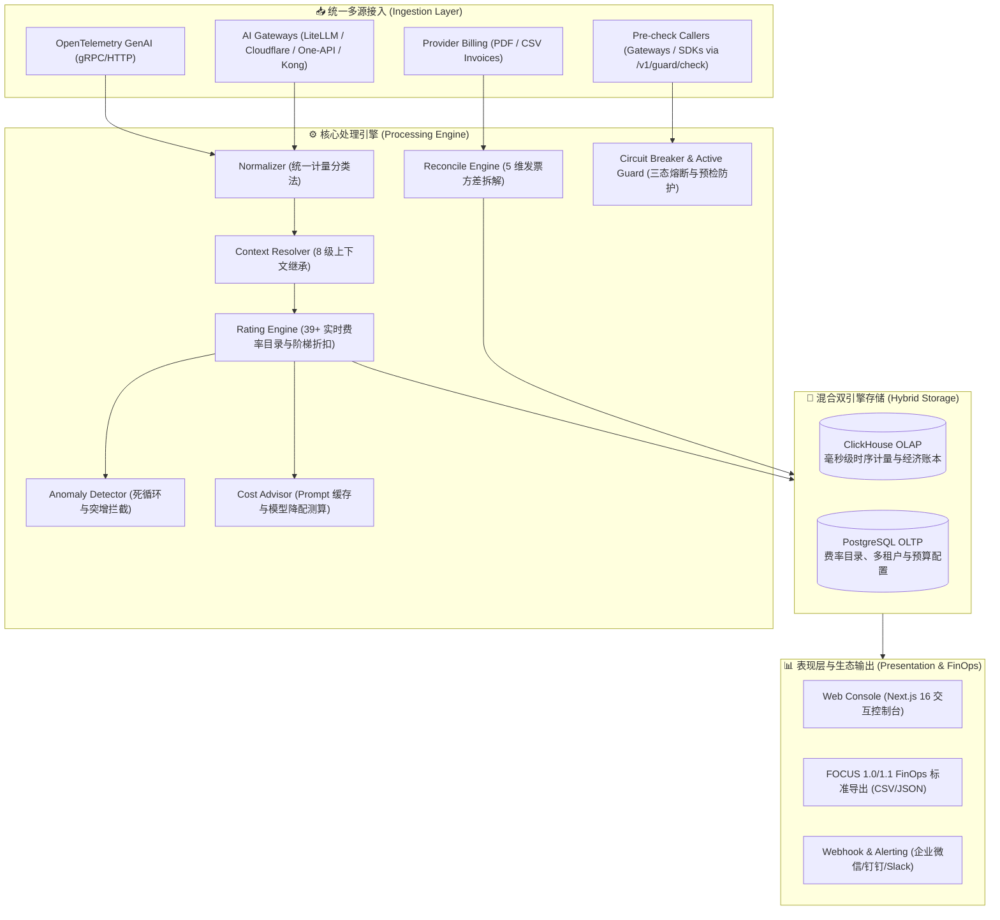

<div align="center">

# ⚡ AI Meter
### 给每一次 AI 调用装上“智能电表”
**独立于模型厂商的企业级 AI Usage & Cost Control Plane**

[](https://golang.org)
[](https://nextjs.org)
[](https://focus.finops.org)
[](LICENSE)

</div>

---

## 📖 为什么需要 AI Meter？

现在企业使用 AI 最大的问题，正在从“模型能不能用”，迅速变成：
> **“AI 到底花了多少钱，这些钱花在哪里，为什么花了这么多？”**

一个复杂的 Multi-Agent 工作流完成一次任务，背后可能混合调用了 GPT-4o、Claude 3.5 Sonnet、Gemini、DeepSeek-R1、Perplexity 搜索、向量数据库与十几个 Tool。最终企业只收到各大厂商几张完全割裂的账单，没人能准确算清：**哪位客户、哪个功能、哪个 Agent 消耗了多少成本，以及是否存在失控的死循环与资金浪费。**

**AI Meter 是一个独立于模型厂商的旁路控制面（Out-of-band Control Plane）：**
* **不侵入调用链路**：无需迁移业务 SDK 或强制接入代理网关，直接接收 OpenTelemetry GenAI 遥测、主流网关 Webhook 与厂商账单。
* **算清账**：统一多模态与推理计量单位，毫秒级流式计价与 8 级业务归因。
* **管住钱**：实时拦截 Multi-Agent 失控死循环，自动对账并拆解 5 维方差，给出量化的降本优化建议。
* **守住门**：提供 `<2ms` 极速预检拦截接口（`/v1/guard/check`）与三态熔断器，在预算超支或失控发生时主动切断。

---

## 🏗️ 核心架构与处理流


```mermaid
flowchart TD
    subgraph Sources["📥 统一多源接入 (Ingestion Layer)"]
        A1["OpenTelemetry GenAI (gRPC/HTTP)"]
        A2["AI Gateways (LiteLLM / Cloudflare / One-API / Kong)"]
        A3["Provider Billing (PDF / CSV Invoices)"]
        A4["Pre-check Callers (Gateways / SDKs via /v1/guard/check)"]
    end

    subgraph Processing["⚙️ 核心处理引擎 (Processing Engine)"]
        B1["Normalizer (统一计量分类法)"]
        B2["Context Resolver (8 级上下文继承)"]
        B3["Rating Engine (39+ 实时费率目录与阶梯折扣)"]
        B4["Anomaly Detector (死循环与突增拦截)"]
        B5["Cost Advisor (Prompt 缓存与模型降配测算)"]
        B6["Reconcile Engine (5 维发票方差拆解)"]
        B7["Circuit Breaker & Active Guard (三态熔断与预检防护)"]
    end

    subgraph Storage["💾 混合双引擎存储 (Hybrid Storage)"]
        C1[("ClickHouse OLAP<br>毫秒级时序计量与经济账本")]
        C2[("PostgreSQL OLTP<br>费率目录、多租户与预算配置")]
    end

    subgraph Presentation["📊 表现层与生态输出 (Presentation & FinOps)"]
        D1["Web Console (Next.js 16 交互控制台)"]
        D2["FOCUS 1.0/1.1 FinOps 标准导出 (CSV/JSON)"]
        D3["Webhook & Alerting (企业微信/钉钉/Slack)"]
    end

    A1 & A2 --> B1 --> B2 --> B3 --> Storage
    A4 --> B7
    B3 --> B4 & B5
    A3 --> B6 --> Storage
    Storage --> Presentation
```

---

## ✨ 核心功能特性

### 1. 统一 AI 计量分类法 (Meter Taxonomy)
统一业界碎片化的计量口径，标准化抽象为：
* **Token 计量**：`LLM.InputToken`、`LLM.OutputToken`、`LLM.CacheReadToken`、`LLM.CacheWriteToken`、`LLM.ReasoningToken`（DeepSeek-R1 / o1 / o3 深度思考）。
* **多模态与工具**：`Image.Generation`、`Search.Query`、`Tool.Execution`、`Audio.InputSecond`。

### 2. 实时流式计价引擎 (Rating Engine)
* 预置全球主流 39+ 基础模型与云厂商基准费率（OpenAI, Anthropic, DeepSeek, Google, AWS Bedrock, Azure）。
* 支持版本时间窗口、阶梯定价与多租户合同专属折扣（Tenant Overrides）。

### 3. 8 级业务级联归因 (Cascading Attribution)
基于 W3C `baggage` 与 OpenTelemetry Trace Context，实现跨微服务与 Multi-Agent 树的自动级联继承：
```
Tenant → Customer → App → Workflow → Agent → Feature → Model → Provider
```

### 4. 工业级发票对账与 5 维方差拆解 (5-Factor Variance Engine)
* **智能解析**：支持直接导入各大厂商官方导出的 **PDF 发票** 与 **CSV 账单**，基于 CMap 字体表与流解压自动提取明细。
* **5 维方差归因**：
  1. 未监控流量（Unmonitored Traffic）
  2. 缓存差异惩罚（Cache Discrepancy）
  3. 费率版本漂移（Pricing Drift）
  4. 服务等级溢价（Service Tier Markup）
  5. 舍入与调整税费（Adjustments & Taxes）

### 5. 闭环防护与三态熔断器 (Active Guard & Circuit Breaker)
* **极速同步预检 (`POST /v1/guard/check`)**：耗时 `< 2ms`，支持在网关调用模型前检查月度预算与执行树深度。
* **失控死循环阻断 (`RUNAWAY_LOOP_PREVENTED`)**：调用深度达到 $\ge 12$ 时即刻切断，防止 Agent 陷入无休止递归轰炸。

### 6. 私有化算力与开源模型成本折算引擎 (Self-Hosted GPU Cost Engine - Phase 11)
* **动态双轨成本折算**：精确按推理时长与 GPU 卡时折算硬件摊销成本（$\text{Cost} = \frac{\text{Duration (ms)}}{3,600,000} \times \text{Hourly Rate} \times \text{GPU Count}$），并结合输出 Token 反推等效 \$/1M Tokens。
* **硬件目录与自动绑定**：预置 H100 ($2.80/h), A100 ($1.60/h), L40S ($0.95/h), RTX 4090 ($0.40/h)，并推荐绑定 DeepSeek-R1, Qwen2.5, Llama 3.3 等主流开源模型。
* **三位一体兼容**：透明代理支持 `X-AIMeter-GPU-Type` 与 `X-AIMeter-GPU-Count` 自定义覆盖；网关原生接收 `/v1/gateway/vllm` 与 `/v1/gateway/ollama`。
* **Web 控制台双维度看板**：升级 `/rates` 为双 Tab（公有云费率 + 自建 GPU 目录与在线试算 Playground）；在 Traces 树状图中点亮 `[Self-Hosted GPU]` 芯片标识与单次硬件分摊成本。
* **三态熔断机制 (Closed $\rightarrow$ Open $\rightarrow$ Half-Open)**：触发严重超支后进入冷却阻断期，并自动推荐降级平替模型（如推荐降级至 `gpt-4o-mini`），支持控制台一键手动解封。
* **Fail-Open 柔性兜底**：控制面发生异常时默认放行，确保不发生次生业务阻断事故。

### 6. 智能异常雷达与失控告警 (Runaway Loop Radar)
* **死循环拦截**：实时遍历 Agent 执行树，当 Span 递归深度超标时自动报警并阻断失控调用。
* **消耗突增预警**：检测单次 Workflow 运行费用超过安全阈值（如单次超过 \$1.00 或 Token 爆炸）。
* **低效卡顿检测**：识别耗时极高（>25s）且产出极低（<50 Tokens）的无效阻塞。

### 7. AI 成本优化建议顾问 (Cost Optimization Advisor)
* **Prompt Caching 优化机会测算**：分析高频重复前缀与长上下文，测算开启缓存后的**每月预计节省金额（如 \$45/月）**。
* **模型降配平替 (Model Routing)**：自动识别日常分类/总结等轻量任务使用昂贵大模型（GPT-4o）的行为，建议降配为 GPT-4o-mini 或 DeepSeek-V3。
* **Reasoning Token 预算控制**：针对思考 Token 占比给出 `max_thinking_tokens` 上限优化策略。

### 8. 主流 AI 网关原生适配 (Gateway Adapters)
* 开放 `/v1/gateway/:vendor` Webhook 接入端点。
* 原生支持 **LiteLLM, Cloudflare AI Gateway, One-API, Kong** 的回调日志，即发即计费。

### 9. FinOps FOCUS 1.0 / 1.1 原生支持
* 原生支持 21 项 FOCUS 核心列，一键导出 CSV/JSON，无缝对接企业 ERP、PowerBI、Tableau 与 Cloudability。

### 10. 官方 Python 客户端 SDK 与 Agent 生态扩展 (Python SDK)
* **轻量非阻塞异步上报**：后台守护线程 + 内存队列，批量自动 Flush，业务主链路零延迟损耗。
* **极速 Active Guard 预检**：默认 20ms 短超时 + Fail-Open 柔性兜底保护，在控制面异常或网络超时时无感放行，绝不阻断业务。
* **`@meter.trace` 装饰器 & 上下文管理**：基于 `contextvars` 跨协程/线程自动级联父子 Span 与 DAG 树深度，自动反射解析 OpenAI / Anthropic 返回中的 Token 消耗。
* **主流 Agent 原生回调**：开箱即用支持 **LangChain**（`AIMeterCallbackHandler`）与 **LlamaIndex**（`AIMeterLlamaIndexCallbackHandler`）。

### 11. 智能反向代理网关与模型动态平替 (Smart LLM Reverse Proxy & Dynamic Fallback)
* **零代码侵入透明接入**：支持直接将官方 OpenAI SDK `base_url` 指向 AI Meter（如 `http://localhost:8080/v1`），完全无需修改任何调用代码。
* **双入口路由支持**：提供标准兼容入口 `/v1/chat/completions` 与显式多厂商入口 `/v1/proxy/:vendor/chat/completions`。
* **熔断/超支自动平替降级 (Dynamic Fallback)**：当高价模型（如 `gpt-4o`）触发熔断或预算超支时，网关自动平替重写为性价比模型（如 `gpt-4o-mini`），响应头携带 `X-AIMeter-Fallback: true`；亦支持通过 `X-AIMeter-Disable-Fallback: true` 快速阻断（HTTP 429）。
* **流式（SSE）零缓冲实时透传**：采用 `http.Flusher` 实时逐块透传，自动补充注入 `stream_options.include_usage=true`，流结束后台异步入库，保证零 TTFT 时延恶化与严格的零 Payload 隐私安全。

### 12. 多渠道实时告警通知与 Webhook 调度引擎 (Alert Notifications & Webhooks)
* **集中式告警调度中心 (`pkg/alert`)**：统一汇聚预算警戒（80% Warning / 100% Exceeded）、失控死循环阻断与熔断器跳闸事件。
* **智能自适应多渠道富文本卡片**：自动嗅探 Webhook 目标平台，原生适配**飞书（交互式卡片）、钉钉（Markdown 消息）、企业微信（Markdown 卡片）、Slack（Block Kit）**与**通用标准 Webhook**（带 `X-AIMeter-Signature` HMAC-SHA256 签名）。
* **指纹去重与冷却期降噪 (De-noising & Rate Limiting)**：基于 `hash(tenant_id, event_type, workflow_id)` 设立 5 分钟冷却阻断期，彻底杜绝高频并发场景下的群聊刷屏；失败提供最多 3 次指数退避重试。
* **交互式 Web 控制台与连通性验证**：`/budgets` 页面双 Tab 管理预算与告警通道，支持一键发送测试卡片与投递审计日志实时观测。

### 13. 企业级多租户安全鉴权与 API Key 凭证体系 (Enterprise RBAC & API Key Management)
* **工业级凭证安全存储 (`pkg/auth`)**：凭证格式为 `sk-aimeter-live-<32位安全随机熵>`，仅在签发时展示一次明文，数据库仅存 `SHA-256` 散列与脱敏掩码（如 `sk-aimeter-live-...8f4a`）。
* **极速内存验签 (<0.05ms) 与令牌桶频控**：内置高并发并发安全 LRU 缓存与独立 QPS 令牌桶限流，零 I/O 阻塞，完美坚守预检 `<2ms` 极速门禁，突增超额即刻返回 HTTP 429。
* **细粒度最小权限作用域 (Granular Scopes)**：原生支持 `proxy:invoke`（代理调用）、`guard:check`（预检拦截）、`telemetry:write`（遥测写入）、`read:metrics`（只读账单）与 `admin:*`（超级管理），杜绝跨权限越权。
* **独立凭证安全中心 (`/api-keys`)**：支持凭证清单审计、动态签发模态窗、一次性完整明文防盗弹窗，以及一键秒级挂起（Suspend）与吊销（Revoke）。

### 15. 实时 Token 级流式断流与单次请求硬限额 (Streaming Token-Level Hard-Capping - Phase 12)
* **微纳秒双轨增量估算引擎**：自研启发式多语言字词比率（中文/CJK ~1.0 Token/字，西文 ~3.8 字符/Token，耗时 `< 50ns`）结合原生 Usage Chunk 动态回填校准，流式转发零延迟阻塞。
* **物理关闭上游连接停计费**：在 SSE 逐块推送过程中实时累计，一旦超出单次请求安全限额（Token 阈值或 USD 金额阈值），代理立即物理切断上游 HTTP 连接（Cancel Context），从源头扼制供应商模型算力扣费。
* **优雅协议注入终结**：向客户端推送截断文案，注入带有 `finish_reason: "budget_exceeded"` 的终止 chunk，并以 `data: [DONE]\n\n` 优雅收尾，彻底杜绝客户端 SDK 异常崩溃或丢弃已接收文本。
* **双层级级联策略控制**：支持租户默认策略配置，并支持应用调用方通过 HTTP 请求头 `X-AIMeter-Max-Tokens` 与 `X-AIMeter-Max-Cost-USD` 实现逐请求粒度的动态精确覆盖。
* **Web 控制台全链路可视化**：`/budgets` 页面新增第 3 Tab（流式断流策略配置与协议说明）；`/traces` 列表及 `TraceTreeViewer` 树状层级图实时点亮 `⚡ [Stream Capped]` 徽标与规避浪费金额（Avoided Spend）。

### 16. 语义级智能 Prompt 压缩与 Token 瘦身代理 (Prompt Slimming Engine - Phase 13)
* **纯 Go 两阶段无依赖混合压缩**：自研高性能脱水引擎（`pkg/compress`），单次处理 `< 0.5ms`，零模型外呼、零 Sidecar 依赖。
* **代码与格式安全兜底保真**：Stage 1 结构化脱水智能保护 Markdown 代码块（```）与关键空白缩进；Stage 2 上下文自适应剪枝绝对保护 System 提示词与最近 $N$ 轮最新对话，仅剪枝历史低熵冗余客套语。
* **网关自动重写与透明回传**：支持请求头 `X-AIMeter-Compress-Prompt: true` 及 `X-AIMeter-Compress-Mode: light|moderate|aggressive` 动态控制；响应头透明回传 `X-AIMeter-Prompt-Compressed`, `X-AIMeter-Tokens-Saved`, `X-AIMeter-Compression-Ratio`。
* **全生命周期可观测性与交互式实验**：新增 `/compress` 控制台（租户策略纳管 + 交互式在线 Prompt 瘦身 Playground，支持 GPT-4o、Claude 3.5 Sonnet 等多模型节省金额实时对比矩阵）；`/traces` 列表中高亮渲染 `🌿 [Prompt Slimmed]` 徽标与节约账单。

### 17. 跨模型多供应商智能路由与 SLA/成本多目标调度 (Smart Router & SLA Arbiter - Phase 14)
* **微纳秒级多目标仲裁引擎 (`pkg/router`)**：纯内存并发安全无锁裁决（耗时 `< 0.08ms`），融合 EWMA 动态时延平滑跟踪、供应商可用性健康度与费率目录实时成本，构建 Pareto 最优解。
* **4 种开箱即用调度策略**：
  1. `cost_optimized`：成本最优，优先调度单位 Token 费率最低的可用端点；
  2. `latency_optimized`：延迟最优，基于 EWMA 实时 P99/均值延迟优先选路；
  3. `balanced`：性价比平衡，多目标综合权重裁决；
  4. `sla_failover`：高可用优先，端点故障（429/5xx）自适应秒级隔离与备选候选链（Failover Chain）平滑转移重试。
* **开箱即用虚拟模型别名池**：`router:flagship`（GPT-4o / Claude 3.5 Sonnet / Gemini 1.5 Pro）、`router:standard`、`router:cost-optimized`、`router:fast`、`router:auto`。
* **反向代理透明重定向与头标记**：支持通过 `model: "router:flagship"` 或 HTTP 请求头 `X-AIMeter-Router-Strategy` 无侵入调用，网关透明回传 `X-AIMeter-Routed`, `X-AIMeter-Routed-To`, `X-AIMeter-Routing-Strategy`, `X-AIMeter-Failover-Count`。
* **全生命周期路由大盘与仿真沙箱**：控制台 `/router` 呈现虚拟池纳管、供应商实时 EWMA 延迟健康矩阵与在线仿真沙箱；`/traces` 链路清晰点亮 `🔀 Smart Routed` 徽标与模型重定向链路。

---

## 🖥️ Web 控制台功能看板

| 路由 | 页面功能 | 核心指标与交互 |
| :--- | :--- | :--- |
| `/` | **Overview 全局大盘** | 总花费、Token 总量、缓存命中率、按模型/Agent 分布与消耗趋势 |
| `/router` | **智能路由与 SLA 调度大盘** | 虚拟模型池管理、供应商实时 EWMA 时延与可用性监控矩阵、交互式 Prompt 路由决策仿真沙箱 |
| `/traces` | **Traces 单元经济学** | 执行 Trace 列表、DAG 树状图渲染器、点亮 `🔀 Smart Routed` 路由徽标、`⚡ Stream Capped` 截断徽标与 `🌿 Prompt Slimmed` 瘦身徽标及节约金额 |
| `/compress` | **Prompt 瘦身策略与实验室** | 租户级压缩模式配置、阈值设定、交互式在线 Prompt 瘦身与多模型节省金额实时比对矩阵 |
| `/rates` | **费率目录知识库** | 39+ 预置模型基准价格表、租户阶梯折扣配置、自建 GPU 目录与在线试算 Playground |
| `/reconcile` | **发票对账与方差拆解** | 账单 PDF/CSV 拖拽上传、实付 vs 观测对比、5 维瀑布图拆解 |
| `/focus` | **FOCUS FinOps 导出** | 规范化账单数据预览、一键导出 FOCUS 1.0 标准 CSV |
| `/budgets` | **预算、告警与流式断流** | 三 Tab 看板：租户/工作流月度预算额度、多渠道 Webhook 告警，以及实时 Token 级流式硬限额策略中心 |
| `/anomalies` | **实时异常雷达** | 严重级别筛选、失控 Agent 拦截现场指标 |
| `/recommendations` | **成本优化建议顾问** | 预计每月总节省金额 KPI、3 维建议卡片与精准修复指南 |
| `/circuit-breaker` | **熔断防护控制中心** | 三态熔断器大盘、阻断原因与冷却倒计时、一键重置解封与仿真沙箱 |
| `/api-keys` | **API 凭证安全中心** | 多租户 API Key 签发、SHA-256 存储脱敏、细粒度 Scopes 授权、QPS 限流与一次性明文弹窗 |

---

## 🚀 快速开始 (Quick Start)

### 1. 全栈一键运行 (Docker Compose 推荐)
```bash
# 一键拉起 ClickHouse, PostgreSQL, 后端控制面与 Next.js Web 控制台
docker compose -f deploy/docker-compose.yml up -d
```
* 控制台：👉 **`http://localhost:3000`**
* REST & 预检 API：`http://localhost:8080`
* Prometheus 指标：`http://localhost:8080/metrics`
* K8s 存活 / 就绪探针：`http://localhost:8080/livez` / `http://localhost:8080/readyz`

### 2. 本地源码极速启动 (开发模式)
```bash
# 启动依赖数据库
docker compose -f deploy/docker-compose.yml up -d clickhouse postgres

# 编译并启动 AI Meter 后端服务
go build -o bin/aimeter cmd/aimeter/main.go
./bin/aimeter --config configs/aimeter.yaml

# 启动前端 Web 控制台
cd web && npm run dev
```

### 3. 云原生 Kubernetes 生产部署 (Helm)
```bash
# 语法校验与本地渲染
helm lint deploy/helm/aimeter

# 安装部署至 Kubernetes 集群
helm install aimeter deploy/helm/aimeter \
  --set ingress.hosts[0].host="aimeter.yourcompany.com"
```

---

## 📡 接口接入与鉴权示例

### 1. 极速同步预检与熔断鉴权 (Active Guard Pre-Check)
```bash
curl -X POST http://localhost:8080/v1/guard/check \
  -H "Content-Type: application/json" \
  -d '{
    "tenant_id": "org-enterprise-1",
    "workflow_id": "contract-review-agent",
    "model": "gpt-4o",
    "current_tree_depth": 3
  }'
```
* **放行响应**：`{"allowed": true, "decision_code": "OK", "circuit_state": "CLOSED"}`
* **阻断响应**：`{"allowed": false, "decision_code": "RUNAWAY_LOOP_PREVENTED", "circuit_state": "OPEN", "fallback_model": "gpt-4o-mini"}`

### 2. 发送 AI Gateway (LiteLLM) Webhook 回调
```bash
curl -X POST http://localhost:8080/v1/gateway/litellm \
  -H "Content-Type: application/json" \
  -H "baggage: tenant_id=org-enterprise-1,workflow_id=chat-flow" \
  -d '{
    "provider": "openai",
    "model": "gpt-4o",
    "prompt_tokens": 1200,
    "completion_tokens": 300,
    "cached_tokens": 800,
    "latency_ms": 420
  }'
### 3. 透明反向代理调用 (零侵入 OpenAI SDK 接入与动态平替)
```python
from openai import OpenAI

# 直接将官方 OpenAI SDK base_url 指向 AI Meter 反向代理网关
client = OpenAI(
    base_url="http://localhost:8080/v1",
    api_key="sk-your-upstream-key",
    default_headers={
        "X-Tenant-ID": "org-enterprise-1",
        "X-Workflow-ID": "customer-support-flow",
    }
)

# 正常发起请求：自动享有 Active Guard 熔断预检、超支平替降级与异步计费！
response = client.chat.completions.create(
    model="gpt-4o",
    messages=[{"role": "user", "content": "Hello AI Meter"}]
)
print(response.choices[0].message.content)
```

### 4. 私有化 GPU 算力折算与在线试算 (Phase 11)
```bash
curl -X POST http://localhost:8080/api/v1/rates/gpus/calculate \
  -H "Content-Type: application/json" \
  -d '{
    "model": "deepseek-ai/DeepSeek-R1",
    "gpu_type": "A100",
    "gpu_count": 4,
    "duration_ms": 3600,
    "total_tokens": 2000
  }'
```
* **响应结果**：`{"model":"deepseek-ai/DeepSeek-R1","gpu_type":"A100","gpu_count":4,"duration_ms":3600,"hardware_cost_usd":0.0064,"hourly_rate_usd":1.6,"total_tokens":2000,"equivalent_token_rate":3.2}` (等效 \$3.20 / 1M Tokens，单次调用硬件成本仅 \$0.0064)。

---

## 📂 项目目录结构

```
AIMeter/
├── .github/
│   └── workflows/ci.yml     # 三阶并发质量门禁 CI 流水线 (Go, Next.js, Docker, Helm, Python SDK)
├── cmd/
│   ├── aimeter/             # 主服务入口
│   ├── bench/               # 万级 QPS 原生并发基准压测 CLI (Phase 10)
│   └── simulator/           # 遥测与异常仿真流量注入器
├── configs/                 # 配置文件与费率种子数据 (aimeter.yaml, rates.json)
├── deploy/
│   ├── Dockerfile.backend   # Go 最小化 Alpine 运行时构建
│   ├── Dockerfile.frontend  # Next.js standalone 生产容器构建
│   ├── docker-compose.yml   # 4 容器全栈一键编排环境
│   └── helm/aimeter/        # 生产级 Kubernetes Helm Chart (含 Ingress, HPA, ServiceMonitor)
├── migrations/              # 数据库迁移脚本 (ClickHouse & PostgreSQL)
├── pkg/
│   ├── advisor/             # AI 成本优化建议顾问引擎
│   ├── alert/               # 多渠道告警调度、冷却降噪与卡片适配 (Phase 8)
│   ├── anomaly/             # 智能异常与死循环检测引擎
│   ├── api/                 # REST API 服务器与探针路由 (/metrics, /livez, /readyz)
│   ├── attribution/         # 8 级上下文级联归因与 W3C baggage 解析
│   ├── auth/                # 企业级 API Key 凭证、SHA-256 哈希、LRU 验签与限流 (Phase 9)
│   ├── budget/              # 预算管理与 Webhook 告警调度器
│   ├── collector/           # OTel 接收器与 AI 网关适配器
│   ├── config/              # 配置加载器与环境变量注入
│   ├── domain/              # 核心领域模型与数据结构
│   ├── focus/               # FinOps FOCUS 1.0/1.1 标准导出器
│   ├── guard/               # 闭环防护与三态熔断器核心引擎
│   ├── metrics/             # Prometheus 核心指标定义与埋点
│   ├── normalizer/          # 统一计量分类法转换器
│   ├── proxy/               # 智能反向代理网关、动态平替与流式拦截 (Phase 7)
│   ├── rater/               # 实时流式计价引擎
│   ├── reconcile/           # 工业级 PDF/CSV 对账与 5 维方差拆解引擎
│   └── storage/             # ClickHouse, PostgreSQL 与 Memory 存储实现
├── sdks/
│   └── python/              # 官方 Python 客户端 SDK (基于 uv, @meter.trace, LangChain, LlamaIndex)
├── scripts/
│   └── bench/               # 云原生 k6 规范压测脚本 (k6_stress.js)
└── web/                     # Next.js 16 现代 Web 控制台 (支持 standalone 容器化)
```

---

## 📄 开源许可证

本项目基于 [Apache License 2.0](LICENSE) 协议开源。
