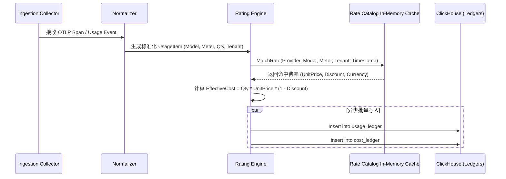

# AI Meter: AI Usage & Cost Control Plane
## Technical & Product Specification (v1.0)

---

## 1. 概述与定位 (Executive Summary)

### 1.1 核心问题
随着企业 GenAI 与 Multi-Agent 应用由实验阶段迈向大规模生产，AI 基础设施的成本结构发生了根本性变化：
* **调用链路复杂**：单次业务操作往往触发多 Agent 协同、复杂工作流、跨模型调用（GPT-4o, Claude 3.5, Gemini 1.5, DeepSeek R1）、外挂向量库检索、多模态生成及多种工具调用（Tool Calls）。
* **计费黑盒与账单碎片化**：企业面临来自不同云厂商和模型提供商的离散月度账单，缺乏统一计量标准。
* **业务归因缺失**：传统账单仅能展示“模型总花费”，无法回答 **“哪个客户、哪个业务功能、哪个 Agent 消耗了多少成本？单位经济模型（Unit Economics）是否健康？”**

### 1.2 产品定义与核心价值
**AI Meter 是一个独立于模型供应商的 AI Usage & Cost Control Plane（AI 经济控制面）。**

AI Meter 不参与前向流量转发代理（Not a Proxy/Gateway），而是作为**旁路控制面（Out-of-band Control Plane）**运行：
* **零侵入/低侵入**：企业无需迁移现有 SDK 或网关（支持 OpenAI/Anthropic/Gemini SDK、LiteLLM、Azure、Bedrock、自建 vLLM 等）。
* **事实层**：接收 OpenTelemetry GenAI 遥测事件与 Usage 数据，形成不可篡改的 **Usage Ledger**。
* **经济层**：依托全球 **Rate Catalog** 与流式 **Rating Engine**，实时计算精确到毫秒/单次调用的 **Cost Ledger**。
* **财务层**：将成本数据标准化并向外输出为 **FOCUS (FinOps Open Cost and Usage Specification)** 规范，对接企业 ERP/BI/FinOps 体系。

```
+-----------------------------------------------------------------------------------+
|                                  AI Meter                                         |
|                                                                                   |
|  [ Observe ]  -->  [ Normalize ]  -->  [ Rate ]  -->  [ Attribute ] --> [ FOCUS ] |
|  技术事实(OTel)      计量统一化         计价引擎         8层业务归因       财务事实 |
+-----------------------------------------------------------------------------------+
```

---

## 2. 总体架构与数据流 (System Architecture & Data Flow)

### 2.1 整体架构全景图

```mermaid
flowchart TD
    subgraph ClientLayer [AI Application & Agents Layer]
        App[Agentic App / AI Service]
        SDK[OTel GenAI SDK / Instrumentation]
        App --> SDK
    end

    subgraph IngestionLayer [Ingestion & Collector Layer]
        OTLP_Receiver["OTLP Receiver (gRPC: 4317 / HTTP: 4318)"]
        REST_Receiver["REST Usage Event API (/v1/events)"]
        SDK -->|OTLP Traces/Spans/Baggage| OTLP_Receiver
        SDK -->|Direct Usage Event| REST_Receiver
    end

    subgraph PipelineLayer [Real-time Processing Pipeline (Go Core)]
        Normalizer[Taxonomy Normalizer]
        AttributionParser[Context & Baggage Extractor]
        RatingEngine[In-stream Rating Engine]
        
        OTLP_Receiver --> AttributionParser
        REST_Receiver --> AttributionParser
        AttributionParser --> Normalizer
        Normalizer --> RatingEngine
    end

    subgraph StorageLayer [Hybrid Storage Layer]
        subgraph PostgresDB [PostgreSQL (OLTP)]
            RateCatalogDB[(Rate Catalog & Tiers)]
            TenantConfig[(Tenants & Contracts)]
            BudgetsConfig[(Budgets & Rules)]
        end

        subgraph ClickHouseDB [ClickHouse (OLAP)]
            UsageLedger[(Usage Ledger)]
            CostLedger[(Cost Ledger)]
            TraceTree[(Trace Hierarchy View)]
        end
    end

    RatingEngine -->|Read Rates & Discounts (Cached)| RateCatalogDB
    RatingEngine -->|Batch Insert Usage Events| UsageLedger
    RatingEngine -->|Batch Insert Cost Items| CostLedger

    subgraph ManagementPlane [Control Plane & Analytics]
        ControlAPI[Control Plane REST/gRPC API]
        CostExplorer[Cost Explorer & Analytics Engine]
        ReconcileEngine[Reconciliation Engine]
        FocusExporter[FOCUS 1.0/1.1 Exporter]
        
        ClickHouseDB --> CostExplorer
        PostgresDB --> ControlAPI
    end

    subgraph UILayer [Presentation Layer (Next.js)]
        WebUI[AI Meter Web Dashboard]
        CostExplorerUI[Unit Economics & Trace Explorer]
        RateAdminUI[Rate Catalog & Contract Admin]
        ReconcileUI[Reconcile & Variance View]
        
        WebUI --> ControlAPI
        CostExplorerUI --> CostExplorer
    end

    subgraph ExternalBilling [Provider Invoices]
        ProviderAPIs[OpenAI / AWS / Azure / GCP APIs]
        InvoiceFiles[CSV / PDF Invoices]
        ProviderAPIs --> ReconcileEngine
        InvoiceFiles --> ReconcileEngine
        ReconcileEngine --> ClickHouseDB
    end

    subgraph FinOpsEcosystem [Enterprise FinOps & BI]
        ParquetExport[S3 / GCS Parquet Exports]
        BIPlatform[Snowflake / Databricks / Tableau / ERP]
        FocusExporter --> ParquetExport
        ParquetExport --> BIPlatform
    end
```

### 2.2 数据生命周期六步链路 (6-Layer Core Pipeline)

1. **Observe (采集)**：接收携带 W3C TraceContext 与 Baggage 的 OTLP GenAI Spans，提取物理计量事实（Token、Cache、Reasoning、Tool Call、Latency）。
2. **Normalize (标准化)**：将各大厂商差异化的字段（如 OpenAI `prompt_tokens_details.cached_tokens`、Anthropic `cache_read_input_tokens`）统一转换为 **Meter Taxonomy** 标准度量。
3. **Rate (计价)**：流式引擎根据 `Provider × Model × Meter × Region × Tier × Time` 匹配内存缓存的价格表及租户特定合同折扣，计算出每次调用乃至每个度量项的 `Calculated Cost`。
4. **Attribute (归因)**：结合分布式链路上下文，通过级联算法将成本逐级绑定到 8 层业务实体：`Provider -> Model -> Application -> Workflow -> Agent -> Feature -> Tenant -> Customer`。
5. **Reconcile (对账 - Phase 2)**：周期性拉取 Provider 实际账单或导入发票，与系统内的 `Calculated Cost` 对比，自动拆解方差（Cache 未命中、阶梯价、批处理折扣、税费）。
6. **FOCUS (财务标准输出 - Phase 2)**：将归因后的成本账本转化为标准的 FinOps FOCUS 数据集，支持 Parquet 定时导出与 BI/ERP 直连。

---

## 3. 标准计量模型与数据结构 (Data Models & Taxonomy)

### 3.1 Meter Taxonomy (统一计量字典)

系统将所有异构 AI 消耗统一为规范化的命名空间与度量单位：

| 计量标识 (Meter Identifier) | 说明 | 基础单位 (Unit) | 典型来源 |
| :--- | :--- | :--- | :--- |
| `LLM.InputToken` | 标准未命中缓存的输入 Token | `Count` | 所有 LLM 模型 |
| `LLM.OutputToken` | 标准生成的输出 Token | `Count` | 所有 LLM 模型 |
| `LLM.CacheReadToken` | 命中的 Prompt 缓存读取 Token | `Count` | OpenAI, Anthropic, Gemini, DeepSeek |
| `LLM.CacheWriteToken` | 缓存创建/写入的 Token | `Count` | Anthropic, DeepSeek |
| `LLM.ReasoningToken` | 思考/推理链消耗的 Token | `Count` | OpenAI o1/o3, DeepSeek R1 |
| `Image.Generation` | 图像生成/编辑调用 | `Request` / `Resolution` | DALL-E 3, Midjourney, Stable Diffusion |
| `Audio.InputSecond` | 语音识别/输入时长 | `Second` | Whisper, Gemini Multimodal |
| `Audio.OutputSecond` | 语音合成/输出时长 | `Second` | OpenAI TTS, ElevenLabs |
| `Video.Second` | 视频生成/解析时长 | `Second` | Sora, Runway, Kling |
| `Search.Query` | 联网搜索工具调用 | `Query` | Tavily, Perplexity, Bing Search |
| `VectorDB.ReadUnit` | 向量检索计算单元 | `Unit` / `Query` | Pinecone, Qdrant, Milvus |
| `Tool.Execution` | 自定义工具/沙箱执行时长 | `Second` / `Call` | Code Interpreter, API Tools |

---

### 3.2 存储模型设计

#### (1) Usage Ledger (ClickHouse 表结构)
记录纯粹的技术物理消耗事实：

```sql
CREATE TABLE IF NOT EXISTS aimeter.usage_ledger (
    event_id             UUID,
    timestamp            DateTime64(3, 'UTC'),
    trace_id             String,
    span_id              String,
    parent_span_id       String,
    
    -- 归因上下文 (Attribution Context)
    tenant_id            LowCardinality(String),
    customer_id          LowCardinality(String),
    app_id               LowCardinality(String),
    workflow_id          LowCardinality(String),
    agent_id             LowCardinality(String),
    feature_id           LowCardinality(String),
    environment          LowCardinality(String), -- prod, staging, dev
    
    -- 供应商与模型
    provider             LowCardinality(String), -- openai, anthropic, bedrock, vllm
    model                LowCardinality(String), -- gpt-4o, claude-3-5-sonnet, deepseek-r1
    region               LowCardinality(String), -- us-east-1, global
    service_tier         LowCardinality(String), -- default, priority, batch
    
    -- 计量明细 (Normalized Metrics)
    meter_name           LowCardinality(String), -- LLM.InputToken, LLM.CacheReadToken, etc.
    quantity             Float64,
    unit                 LowCardinality(String),
    
    -- 性能与指标
    latency_ms           UInt32,
    time_to_first_token_ms UInt32,
    http_status_code     UInt16,
    error_code           LowCardinality(String),
    
    -- 原始扩展属性
    raw_attributes       Map(String, String)
) ENGINE = MergeTree()
PARTITION BY toYYYYMM(timestamp)
ORDER BY (tenant_id, app_id, workflow_id, provider, model, meter_name, timestamp);
```

#### (2) Cost Ledger (ClickHouse 表结构)
记录经过 Rate Catalog 计价后的经济账本（实时写入或重计费更新）：

```sql
CREATE TABLE IF NOT EXISTS aimeter.cost_ledger (
    cost_item_id         UUID,
    usage_event_id       UUID,
    timestamp            DateTime64(3, 'UTC'),
    trace_id             String,
    span_id              String,
    
    -- 归因层级
    tenant_id            LowCardinality(String),
    customer_id          LowCardinality(String),
    app_id               LowCardinality(String),
    workflow_id          LowCardinality(String),
    agent_id             LowCardinality(String),
    feature_id           LowCardinality(String),
    
    -- 供应商与规格
    provider             LowCardinality(String),
    model                LowCardinality(String),
    meter_name           LowCardinality(String),
    quantity             Float64,
    unit                 LowCardinality(String),
    
    -- 计价与金额 (支持多币种与有效费率)
    rate_id              UUID,
    rate_version         String,
    unit_price           Decimal(18, 8),
    currency             LowCardinality(FixedString(3)), -- USD, CNY, EUR
    
    -- 成本细分 (FOCUS 兼容)
    list_cost            Decimal(18, 6), -- 官方标价成本
    contract_discount    Decimal(18, 6), -- 合同折扣金额
    effective_cost       Decimal(18, 6), -- 实际应付/核算成本 (list_cost - discount)
    
    -- 标记
    is_reconciled        UInt8 DEFAULT 0,
    reconciliation_id    Nullable(UUID),
    billing_period       String -- 2026-09
) ENGINE = ReplacingMergeTree()
PARTITION BY toYYYYMM(timestamp)
ORDER BY (tenant_id, customer_id, workflow_id, timestamp, cost_item_id);
```

#### (3) Rate Catalog Schema (PostgreSQL 表结构)
管理全球公有价格、生效时间区间与租户定制合同价：

```sql
CREATE TABLE rate_catalogs (
    id UUID PRIMARY KEY DEFAULT gen_random_uuid(),
    provider VARCHAR(64) NOT NULL,
    model VARCHAR(128) NOT NULL,
    meter_name VARCHAR(128) NOT NULL,
    region VARCHAR(64) DEFAULT 'global',
    service_tier VARCHAR(64) DEFAULT 'default', -- default, priority, batch
    
    -- 费率类型
    pricing_type VARCHAR(32) DEFAULT 'flat', -- flat, tiered, volume
    unit_price NUMERIC(18, 8) NOT NULL,
    currency CHAR(3) DEFAULT 'USD',
    unit VARCHAR(32) NOT NULL, -- 1K_Tokens, 1M_Tokens, Count, Second
    
    -- 生效时间区间 (支持价格历史版本变更与未来调价)
    effective_start_at TIMESTAMPTZ NOT NULL,
    effective_end_at TIMESTAMPTZ,
    
    -- 作用域 (NULL 表示全球公共基准费率，非空表示租户专属合同费率)
    tenant_id VARCHAR(64),
    discount_rate NUMERIC(5, 4) DEFAULT 0.0000, -- 0.2000 表示 8 折
    
    metadata JSONB,
    created_at TIMESTAMPTZ DEFAULT NOW(),
    updated_at TIMESTAMPTZ DEFAULT NOW()
);

CREATE INDEX idx_rates_lookup 
ON rate_catalogs (provider, model, meter_name, tenant_id, effective_start_at, effective_end_at);
```

---

## 4. 核心子系统详细设计 (Subsystems Deep-Dive)

### 4.1 OTel GenAI 采集与标准化子系统 (Collector & Normalizer)

#### 4.1.1 协议适配与接收
* **OTLP 原生接口**：内置高性能 OTLP Receiver，监听 `gRPC (4317)` 与 `HTTP/Protobuf/JSON (4318)` 端点，直接解析 OpenTelemetry `TracesData` 与 `LogsData`。
* **REST Usage API**：暴露 `/v1/usage/events` 端点，允许外部网关、定时 Worker 或轻量脚本通过简单的 JSON Batch POST 发送计量事件。

#### 4.1.2 语义对齐与提取 (Mapping Rules)
基于 OpenTelemetry Semantic Conventions for GenAI 规范，自动从 Span Attributes 中提取：
* `gen_ai.system` / `gen_ai.provider` $\rightarrow$ `provider`
* `gen_ai.request.model` / `gen_ai.response.model` $\rightarrow$ `model`
* `gen_ai.usage.input_tokens` $\rightarrow$ `LLM.InputToken`
* `gen_ai.usage.output_tokens` $\rightarrow$ `LLM.OutputToken`
* `gen_ai.usage.cached_tokens` / `prompt_tokens_details.cached_tokens` $\rightarrow$ `LLM.CacheReadToken`
* `gen_ai.usage.reasoning_tokens` $\rightarrow$ `LLM.ReasoningToken`
* `server.port`, `server.address` $\rightarrow$ `region/endpoint`

#### 4.1.3 跨厂商方言适配矩阵 (Vendor Normalization Matrix)

```
[OpenAI API Response]
  └── prompt_tokens_details.cached_tokens  ──> LLM.CacheReadToken
  └── completion_tokens_details.reasoning  ──> LLM.ReasoningToken
  └── (prompt_tokens - cached_tokens)      ──> LLM.InputToken

[Anthropic API Response]
  └── cache_read_input_tokens              ──> LLM.CacheReadToken
  └── cache_creation_input_tokens          ──> LLM.CacheWriteToken
  └── input_tokens                         ──> LLM.InputToken
  └── output_tokens                        ──> LLM.OutputToken

[Google Gemini API Response]
  └── cachedContentTokenCount              ──> LLM.CacheReadToken
  └── promptTokenCount                     ──> LLM.InputToken
  └── candidatesTokenCount                 ──> LLM.OutputToken

[AWS Bedrock / Azure OpenAI / DeepSeek]
  └── 自动根据底层模型类型路由到对应 Normalizer 规则解析
```

---

### 4.2 上下文传递与 8 层归因引擎 (Attribution Engine)

#### 4.2.1 归因维度体系 (8-Level Hierarchy)
从商业结果到物理基础设施的完整链路映射：
1. **Tenant (租户)**：企业客户或组织机构（如 `org_enterprise_102`）
2. **Customer (终端客户/账号)**：该租户下的最终用户/账户（如 `cust_vip_409`）
3. **Application (应用系统)**：业务系统代号（如 `legal-copilot`）
4. **Workflow (业务工作流)**：一次端到端业务任务实例（如 `contract_review_job_987`）
5. **Agent (智能体节点)**：工作流内的特定角色（如 `contract_risk_analyzer`）
6. **Feature (产品功能模块)**：UI 或业务功能点（如 `redline_generation`）
7. **Model & Provider (模型与供应商)**：物理执行端（如 `anthropic:claude-3-5-sonnet`）
8. **Business Outcome (业务产出)**：本次任务完成的产出指标（如 `1 Contract Reviewed`）

#### 4.2.2 上下文传递协议 (W3C Baggage + Span Attributes)
* **Baggage 自动继承**：当根请求（Root Span）启动时，注入 W3C Baggage Header：
  ```
  baggage: aimeter.tenant=org_102,aimeter.customer=cust_409,aimeter.workflow=contract_review,aimeter.feature=redline
  ```
* **分布式级联传播**：后续所有下游 RPC、消息队列、子 Agent、Tool 调用的 Span 自动携带 Baggage。
* **Trace Tree 内存解析**：针对部分仅在父 Span 打标的场景，AI Meter 采集端在内存保持微批 Trace 树缓存（LRU 窗口 30~60s），子 Span 自动向上级联继承未显式声明的租户与工作流属性。

---

### 4.3 价格目录与流式计价引擎 (Rate Catalog & Rating Engine)



#### 4.3.1 计价策略与算法
* **精确匹配维度**：
  $$\text{Key} = \text{TenantID} \times \text{Provider} \times \text{Model} \times \text{Meter} \times \text{Region} \times \text{ServiceTier}$$
* **优先级决策树**：
  1. 租户特定合同专属费率（Tenant Custom Rate，若指定了特定单价）
  2. 租户全局折扣覆盖（Tenant Global Discount %，基于公共基准费率打折）
  3. 公共基准费率（Public Base Rate，按生效时间区间 `effective_start_at <= event_time < effective_end_at` 匹配）
* **重计费支持 (Re-rating Job)**：当用户补录历史合同折扣或供应商追溯调价时，系统提供后台批处理作业，按时间区间扫描 `usage_ledger`，重新计价并覆盖更新 `cost_ledger`。

---

### 4.4 对账与方差拆解引擎 (Reconciliation Engine - Phase 2)

#### 4.4.1 对账流程
1. **账单摄入**：通过定时 Worker 调用云厂商 Billing API（如 OpenAI Organization Usage API、AWS Cost Explorer、Azure Cost Details Export）或由财务导入月度账单 CSV。
2. **核对与方差归因**：
   $$\Delta \text{Cost} = \text{Billed Cost (实际开票)} - \text{Observed Calculated Cost (观测核算)}$$
3. **差异自动拆解分析 (Variance Breakdown)**：
   * **未观测流量 (Unmonitored Traffic)**：直接通过 Web 界面调用但未走 SDK/Tracing 的请求。
   * **缓存未命中与惩罚 (Cache Discrepancies)**：由于 Prompt 格式或网络导致 Provider 实际未给到 Cache Discount。
   * **服务优先级溢价 (Service Tier Markups)**：Priority / Fast Tier 产生的额外费率。
   * **价格版本变动 (Pricing Drift)**：厂商中途调整价格而本地 Rate Catalog 未及时同步。
   * **四舍五入与货币汇率差 (Rounding & FX)**。

---

### 4.5 FOCUS 标准输出与 FinOps 集成 (Phase 2)

AI Meter 原生对齐 **FOCUS (FinOps Open Cost and Usage Specification) 1.0/1.1** 规范：

| FOCUS 标准列 | AI Meter 数据映射 | 说明 |
| :--- | :--- | :--- |
| `BilledCost` | `cost_ledger.list_cost` | 官方标准金额 |
| `EffectiveCost` | `cost_ledger.effective_cost` | 扣减折扣后的实际摊销成本 |
| `ProviderName` | `cost_ledger.provider` | 供应商（如 OpenAI, AWS） |
| `ServiceName` | `"GenAI / LLM"` | 云服务分类 |
| `SkuPriceId` | `cost_ledger.rate_id` | 费率条目标识 |
| `UsageQuantity` | `cost_ledger.quantity` | 消耗量（Token数、次数等） |
| `UsageUnit` | `cost_ledger.unit` | 计量单位 |
| `ChargeCategory` | `"Usage"` | 费用类型 |
| `SubAccountId` | `cost_ledger.tenant_id` | 企业租户 ID |
| `ResourceName` | `cost_ledger.model` | 资源实体标识 |
| `Tags` | `{"workflow": ..., "agent": ..., "customer": ...}` | 业务标签映射 |

* **数据分发**：支持定时自动导出 Parquet / CSV 文件写入企业指定的 S3 / GCS / Azure Blob 存储桶，支持 Datadog, Vantage, Kubecost, Snowflake 等 FinOps 平台即插即用接入。

---

## 5. 技术栈与工程实现蓝图 (Engineering Blueprint)

### 5.1 技术选型

* **后端服务核心 (Core Backend)**:
  * **语言**: Go (Go 1.23+)
  * **框架/库**: 
    * `go.opentelemetry.io/collector` (组件化 OTLP 接收)
    * `gin-gonic/gin` 或 `connect-go` (高性能 REST/gRPC API)
    * `ClickHouse-go/v2` (底层批量高速写入驱动，带 Buffer Pool)
    * `pgx/v5` (PostgreSQL 高性能连接池)
    * `patrickmn/go-cache` / `Ristretto` (内存级 Rate Catalog 零锁缓存)
* **前端控制台 (Frontend Web Console)**:
  * **框架**: Next.js (App Router, TypeScript, React 19)
  * **样式与组件**: Tailwind CSS, shadcn/ui, Radix Primitives, Lucide Icons
  * **图表与可视化**: Apache ECharts (用于复杂 Trace 树与 Unit Economics 下钻图表), Tremor
* **数据存储与分析 (Data Layer)**:
  * **OLAP 分析库**: ClickHouse (单机或集群，千万级事件秒级多维查询)
  * **OLTP 关系库**: PostgreSQL 16+ (Rate Catalog、租户、预算规则、权限与元数据)
* **部署与交付 (Packaging)**:
  * **架构模式**: 模块化单体 (Modular Monolith)，单一二进制文件支持以 `all-in-one`、`collector-only`、`api-only` 或 `worker-only` 角色启动。
  * **分发格式**: Docker Compose（一键拉起 Go Core + Next.js + ClickHouse + Postgres）以及 Kubernetes Helm Chart。

---

### 5.2 项目目录结构规划 (Repository Structure)

```
AIMeter/
├── cmd/
│   └── aimeter/
│       └── main.go                 # 统一启动入口 (根据环境变量/FLAG启动不同角色)
├── configs/
│   ├── aimeter.example.yaml        # 核心配置文件示例
│   └── rates_seed.json             # 内置全球主流模型官方公有费率种子
├── deploy/
│   ├── docker-compose.yml          # 一键本地运行环境 (含 ClickHouse, Postgres)
│   ├── Dockerfile.backend          # Go 后端镜像构建
│   ├── Dockerfile.frontend         # Next.js 前端镜像构建
│   └── helm/                       # K8s Helm Charts
├── migrations/
│   ├── clickhouse/                 # ClickHouse DDL 脚本
│   │   ├── 001_create_usage_ledger.sql
│   │   └── 002_create_cost_ledger.sql
│   └── postgres/                   # Postgres DDL 迁移
│       ├── 001_create_rate_catalog.sql
│       └── 002_create_tenants_and_budgets.sql
├── pkg/
│   ├── api/                        # Control Plane REST / gRPC 接口路由与处理
│   ├── attribution/                # W3C Baggage 解析与 Trace 级联继承引擎
│   ├── collector/                  # OTLP gRPC/HTTP Receiver 适配层
│   ├── focus/                      # FOCUS 1.0/1.1 导出与字段映射转换器
│   ├── normalizer/                 # 多厂商方言转换为统一 Meter Taxonomy
│   ├── rater/                      # 内存缓存查找与流式计价执行引擎
│   ├── reconcile/                  # 厂商账单拉取、CSV 解析与方差对账算法
│   └── storage/                    # 存储层访问封装 (ClickHouse & Postgres Client)
├── web/                            # Next.js 前端控制台工程
│   ├── src/
│   │   ├── app/                    # Next.js App Router (Dashboard, Traces, Rates, Reconcile)
│   │   ├── components/             # UI 组件与 Trace 树可视化图表
│   │   ├── lib/                    # API Client 与状态管理
│   │   └── types/                  # 前端 TypeScript 类型定义
│   ├── package.json
│   └── tailwind.config.js
├── SPEC.md                         # 架构与规范文档 (本文件)
└── README.md
```

---

## 6. MVP 核心落地路径与杀手锏场景 (MVP & Key Trace Flow)

### 6.1 MVP 核心杀手锏链路 (The "Aha" Trace)
第一版交付最关键的能力是让研发和业务团队在 UI 上清晰看到这样一条**端到端成本透明 Trace**：

```
[Trace: req_8849204_contract_review]
├── Root Span: Legal Document Processing Workflow (Customer: ACME Corp | Tenant: Org-A)
│   ├── Planner Agent (Claude 3.5 Sonnet)
│   │   ├── Input: 3,200 Tokens (Cached: 2,400)
│   │   └── Output: 850 Tokens
│   │   └── Subtotal Cost: $0.0168
│   ├── Search Tool: SEC Edgar Search (Tavily Query)
│   │   └── 2 Queries -> Subtotal Cost: $0.0100
│   ├── Clause Risk Analyzer Agent (DeepSeek R1 via OpenRouter)
│   │   ├── Input: 18,500 Tokens
│   │   ├── Reasoning: 4,200 Tokens
│   │   └── Output: 1,200 Tokens
│   │   └── Subtotal Cost: $0.0542
│   └── Final Summary Synthesis (GPT-4o)
│       ├── Input: 8,400 Tokens
│       └── Output: 2,100 Tokens
│       └── Subtotal Cost: $0.0525
│
└── [TOTAL BUSINESS UNIT ECONOMICS]
    ├── Task: 1 Legal Contract Review
    ├── Processing Time: 14.2s
    └── Total Cost: $0.1335
```

---

## 7. 分期演进路线图 (Phased Roadmap)

### Phase 1: MVP 核心经济闭环 (Core Observe-Normalize-Rate-Explore)
* [ ] 搭建 Go 模块化单体与 Next.js 基础工程框架。
* [ ] 实现 OTLP gRPC/HTTP Receiver 与标准 REST Usage API。
* [ ] 实现主流模型（OpenAI, Anthropic, Gemini, DeepSeek, Bedrock）的 Taxonomy Normalizer。
* [ ] 建立 PostgreSQL 存储的公有 Rate Catalog（带主流模型 Seed 数据与内存缓存刷新）。
* [ ] 实现实时流式 Rating Engine，并将 Usage Ledger & Cost Ledger 批量高效写入 ClickHouse。
* [ ] 实现 W3C Baggage 与 Span Attributes 归因提取。
* [ ] 构建 Next.js Cost Explorer：支持多维成本统计分析与端到端 Trace 树成本下钻视图。
* [ ] 交付一键启动 Docker Compose 编排文件。

### Phase 2: 企业级 FinOps 与对账能力 (Enterprise FinOps & Reconcile)
* [ ] 开发多租户专属合同费率覆盖与折扣管理（Custom Contract Rates）。
* [ ] 实现主流云厂商（OpenAI, AWS, Azure）账单 API 定时拉取与 CSV 上传解析器。
* [ ] 构建 Reconciliation Engine，提供日/月度观测金额与开票金额的方差拆解视图。
* [ ] 实现 FOCUS 1.0/1.1 标准导出适配器（支持 Parquet/CSV 自动同步至 S3/GCS）。
* [ ] 增加预算设置（Budgets）与阈值 Webhook/Email 告警。

### Phase 3: AI 成本智能与架构优化建议 (Cost Intelligence)
* [ ] 构建 AI Spend 行业基准与模型能效比分析（Unit Economics Benchmark）。
* [ ] 提供自动化优化洞察（如：检测高频重复 Prompt 提示 Cache 命中提升空间、大模型降级至小型蒸馏模型/Reasoning 模型的 ROI 预估）。
* [ ] 智能路由与成本异常自动检测（Anomaly Detection）。

---

## 8. 安全与隐私原则 (Security & Privacy)

1. **零 Payload 存储原则 (Zero-Payload Retention)**：
   * AI Meter 是纯粹的经济与计量控制面，**默认绝不记录或持久化 Prompt 内容、用户输入文本与模型回复内容（No Prompts / No Completions stored）**。
   * 系统仅收集 Token 数、延迟、模型名、维度标签等元数据。
2. **多租户严格逻辑隔离**：
   * 所有 OLTP 与 OLAP 查询均以 `tenant_id` 作为强制过滤索引条件。
3. **数据主权与私有化友好**：
   * 系统支持完全在客户自身 VPC / 内部 K8s 集群中无外网依赖私有化运行。
