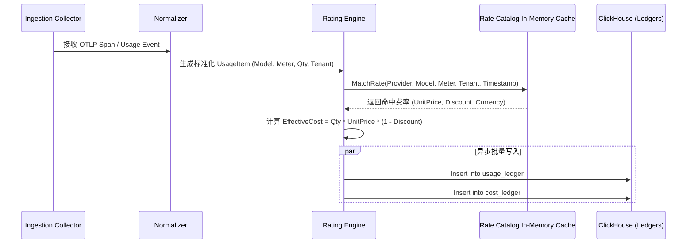

# AI Meter: AI Usage & Cost Control Plane
## Technical & Product Specification (v1.0)

---

## 1. 概述与定位 (Executive Summary)

### 1.1 核心问题
随着企业 GenAI 与 Multi-Agent 应用由实验阶段迈向大规模生产，AI 基础设施的成本结构发生了根本性变化：
* **调用链路复杂**：单次业务操作往往触发多 Agent 协同、复杂工作流、跨模型调用（GPT-4o, Claude 3.5, Gemini 1.5, DeepSeek R1）、外挂向量库检索、多模态生成及多种工具调用（Tool Calls）。
* **计费黑盒与账单碎片化**：企业面临来自不同云厂商和模型提供商的离散月度账单，缺乏统一计量标准。
* **业务归因缺失**：传统账单仅能展示“模型总花费”，无法回答 **“哪个客户、哪个业务功能、哪个 Agent 消耗了多少成本？单位经济模型（Unit Economics）是否健康？”**

### 1.2 产品定义与核心价值
**AI Meter 是一个独立于模型供应商的 AI Usage & Cost Control Plane（AI 经济控制面）。**

AI Meter 不参与前向流量转发代理（Not a Proxy/Gateway），而是作为**旁路控制面（Out-of-band Control Plane）**运行：
* **零侵入/低侵入**：企业无需迁移现有 SDK 或网关（支持 OpenAI/Anthropic/Gemini SDK、LiteLLM、Azure、Bedrock、自建 vLLM 等）。
* **事实层**：接收 OpenTelemetry GenAI 遥测事件与 Usage 数据，形成不可篡改的 **Usage Ledger**。
* **经济层**：依托全球 **Rate Catalog** 与流式 **Rating Engine**，实时计算精确到毫秒/单次调用的 **Cost Ledger**。
* **财务层**：将成本数据标准化并向外输出为 **FOCUS (FinOps Open Cost and Usage Specification)** 规范，对接企业 ERP/BI/FinOps 体系。

```
+-----------------------------------------------------------------------------------+
|                                  AI Meter                                         |
|                                                                                   |
|  [ Observe ]  -->  [ Normalize ]  -->  [ Rate ]  -->  [ Attribute ] --> [ FOCUS ] |
|  技术事实(OTel)      计量统一化         计价引擎         8层业务归因       财务事实 |
+-----------------------------------------------------------------------------------+
```

---

## 2. 总体架构与数据流 (System Architecture & Data Flow)

### 2.1 整体架构全景图

```mermaid
flowchart TD
    subgraph ClientLayer [AI Application & Agents Layer]
        App[Agentic App / AI Service]
        SDK[OTel GenAI SDK / Instrumentation]
        App --> SDK
    end

    subgraph IngestionLayer [Ingestion & Collector Layer]
        OTLP_Receiver["OTLP Receiver (gRPC: 4317 / HTTP: 4318)"]
        REST_Receiver["REST Usage Event API (/v1/events)"]
        SDK -->|OTLP Traces/Spans/Baggage| OTLP_Receiver
        SDK -->|Direct Usage Event| REST_Receiver
    end

    subgraph PipelineLayer [Real-time Processing Pipeline (Go Core)]
        Normalizer[Taxonomy Normalizer]
        AttributionParser[Context & Baggage Extractor]
        RatingEngine[In-stream Rating Engine]
        
        OTLP_Receiver --> AttributionParser
        REST_Receiver --> AttributionParser
        AttributionParser --> Normalizer
        Normalizer --> RatingEngine
    end

    subgraph StorageLayer [Hybrid Storage Layer]
        subgraph PostgresDB [PostgreSQL (OLTP)]
            RateCatalogDB[(Rate Catalog & Tiers)]
            TenantConfig[(Tenants & Contracts)]
            BudgetsConfig[(Budgets & Rules)]
        end

        subgraph ClickHouseDB [ClickHouse (OLAP)]
            UsageLedger[(Usage Ledger)]
            CostLedger[(Cost Ledger)]
            TraceTree[(Trace Hierarchy View)]
        end
    end

    RatingEngine -->|Read Rates & Discounts (Cached)| RateCatalogDB
    RatingEngine -->|Batch Insert Usage Events| UsageLedger
    RatingEngine -->|Batch Insert Cost Items| CostLedger

    subgraph ManagementPlane [Control Plane & Analytics]
        ControlAPI[Control Plane REST/gRPC API]
        CostExplorer[Cost Explorer & Analytics Engine]
        ReconcileEngine[Reconciliation Engine]
        FocusExporter[FOCUS 1.0/1.1 Exporter]
        
        ClickHouseDB --> CostExplorer
        PostgresDB --> ControlAPI
    end

    subgraph UILayer [Presentation Layer (Next.js)]
        WebUI[AI Meter Web Dashboard]
        CostExplorerUI[Unit Economics & Trace Explorer]
        RateAdminUI[Rate Catalog & Contract Admin]
        ReconcileUI[Reconcile & Variance View]
        
        WebUI --> ControlAPI
        CostExplorerUI --> CostExplorer
    end

    subgraph ExternalBilling [Provider Invoices]
        ProviderAPIs[OpenAI / AWS / Azure / GCP APIs]
        InvoiceFiles[CSV / PDF Invoices]
        ProviderAPIs --> ReconcileEngine
        InvoiceFiles --> ReconcileEngine
        ReconcileEngine --> ClickHouseDB
    end

    subgraph FinOpsEcosystem [Enterprise FinOps & BI]
        ParquetExport[S3 / GCS Parquet Exports]
        BIPlatform[Snowflake / Databricks / Tableau / ERP]
        FocusExporter --> ParquetExport
        ParquetExport --> BIPlatform
    end
```

### 2.2 数据生命周期六步链路 (6-Layer Core Pipeline)

1. **Observe (采集)**：接收携带 W3C TraceContext 与 Baggage 的 OTLP GenAI Spans，提取物理计量事实（Token、Cache、Reasoning、Tool Call、Latency）。
2. **Normalize (标准化)**：将各大厂商差异化的字段（如 OpenAI `prompt_tokens_details.cached_tokens`、Anthropic `cache_read_input_tokens`）统一转换为 **Meter Taxonomy** 标准度量。
3. **Rate (计价)**：流式引擎根据 `Provider × Model × Meter × Region × Tier × Time` 匹配内存缓存的价格表及租户特定合同折扣，计算出每次调用乃至每个度量项的 `Calculated Cost`。
4. **Attribute (归因)**：结合分布式链路上下文，通过级联算法将成本逐级绑定到 8 层业务实体：`Provider -> Model -> Application -> Workflow -> Agent -> Feature -> Tenant -> Customer`。
5. **Reconcile (对账 - Phase 2)**：周期性拉取 Provider 实际账单或导入发票，与系统内的 `Calculated Cost` 对比，自动拆解方差（Cache 未命中、阶梯价、批处理折扣、税费）。
6. **FOCUS (财务标准输出 - Phase 2)**：将归因后的成本账本转化为标准的 FinOps FOCUS 数据集，支持 Parquet 定时导出与 BI/ERP 直连。

---

## 3. 标准计量模型与数据结构 (Data Models & Taxonomy)

### 3.1 Meter Taxonomy (统一计量字典)

系统将所有异构 AI 消耗统一为规范化的命名空间与度量单位：

| 计量标识 (Meter Identifier) | 说明 | 基础单位 (Unit) | 典型来源 |
| :--- | :--- | :--- | :--- |
| `LLM.InputToken` | 标准未命中缓存的输入 Token | `Count` | 所有 LLM 模型 |
| `LLM.OutputToken` | 标准生成的输出 Token | `Count` | 所有 LLM 模型 |
| `LLM.CacheReadToken` | 命中的 Prompt 缓存读取 Token | `Count` | OpenAI, Anthropic, Gemini, DeepSeek |
| `LLM.CacheWriteToken` | 缓存创建/写入的 Token | `Count` | Anthropic, DeepSeek |
| `LLM.ReasoningToken` | 思考/推理链消耗的 Token | `Count` | OpenAI o1/o3, DeepSeek R1 |
| `Image.Generation` | 图像生成/编辑调用 | `Request` / `Resolution` | DALL-E 3, Midjourney, Stable Diffusion |
| `Audio.InputSecond` | 语音识别/输入时长 | `Second` | Whisper, Gemini Multimodal |
| `Audio.OutputSecond` | 语音合成/输出时长 | `Second` | OpenAI TTS, ElevenLabs |
| `Video.Second` | 视频生成/解析时长 | `Second` | Sora, Runway, Kling |
| `Search.Query` | 联网搜索工具调用 | `Query` | Tavily, Perplexity, Bing Search |
| `VectorDB.ReadUnit` | 向量检索计算单元 | `Unit` / `Query` | Pinecone, Qdrant, Milvus |
| `Tool.Execution` | 自定义工具/沙箱执行时长 | `Second` / `Call` | Code Interpreter, API Tools |

---

### 3.2 存储模型设计

#### (1) Usage Ledger (ClickHouse 表结构)
记录纯粹的技术物理消耗事实：

```sql
CREATE TABLE IF NOT EXISTS aimeter.usage_ledger (
    event_id             UUID,
    timestamp            DateTime64(3, 'UTC'),
    trace_id             String,
    span_id              String,
    parent_span_id       String,
    
    -- 归因上下文 (Attribution Context)
    tenant_id            LowCardinality(String),
    customer_id          LowCardinality(String),
    app_id               LowCardinality(String),
    workflow_id          LowCardinality(String),
    agent_id             LowCardinality(String),
    feature_id           LowCardinality(String),
    environment          LowCardinality(String), -- prod, staging, dev
    
    -- 供应商与模型
    provider             LowCardinality(String), -- openai, anthropic, bedrock, vllm
    model                LowCardinality(String), -- gpt-4o, claude-3-5-sonnet, deepseek-r1
    region               LowCardinality(String), -- us-east-1, global
    service_tier         LowCardinality(String), -- default, priority, batch
    
    -- 计量明细 (Normalized Metrics)
    meter_name           LowCardinality(String), -- LLM.InputToken, LLM.CacheReadToken, etc.
    quantity             Float64,
    unit                 LowCardinality(String),
    
    -- 性能与指标
    latency_ms           UInt32,
    time_to_first_token_ms UInt32,
    http_status_code     UInt16,
    error_code           LowCardinality(String),
    
    -- 原始扩展属性
    raw_attributes       Map(String, String)
) ENGINE = MergeTree()
PARTITION BY toYYYYMM(timestamp)
ORDER BY (tenant_id, app_id, workflow_id, provider, model, meter_name, timestamp);
```

#### (2) Cost Ledger (ClickHouse 表结构)
记录经过 Rate Catalog 计价后的经济账本（实时写入或重计费更新）：

```sql
CREATE TABLE IF NOT EXISTS aimeter.cost_ledger (
    cost_item_id         UUID,
    usage_event_id       UUID,
    timestamp            DateTime64(3, 'UTC'),
    trace_id             String,
    span_id              String,
    
    -- 归因层级
    tenant_id            LowCardinality(String),
    customer_id          LowCardinality(String),
    app_id               LowCardinality(String),
    workflow_id          LowCardinality(String),
    agent_id             LowCardinality(String),
    feature_id           LowCardinality(String),
    
    -- 供应商与规格
    provider             LowCardinality(String),
    model                LowCardinality(String),
    meter_name           LowCardinality(String),
    quantity             Float64,
    unit                 LowCardinality(String),
    
    -- 计价与金额 (支持多币种与有效费率)
    rate_id              UUID,
    rate_version         String,
    unit_price           Decimal(18, 8),
    currency             LowCardinality(FixedString(3)), -- USD, CNY, EUR
    
    -- 成本细分 (FOCUS 兼容)
    list_cost            Decimal(18, 6), -- 官方标价成本
    contract_discount    Decimal(18, 6), -- 合同折扣金额
    effective_cost       Decimal(18, 6), -- 实际应付/核算成本 (list_cost - discount)
    
    -- 标记
    is_reconciled        UInt8 DEFAULT 0,
    reconciliation_id    Nullable(UUID),
    billing_period       String -- 2026-09
) ENGINE = ReplacingMergeTree()
PARTITION BY toYYYYMM(timestamp)
ORDER BY (tenant_id, customer_id, workflow_id, timestamp, cost_item_id);
```

#### (3) Rate Catalog Schema (PostgreSQL 表结构)
管理全球公有价格、生效时间区间与租户定制合同价：

```sql
CREATE TABLE rate_catalogs (
    id UUID PRIMARY KEY DEFAULT gen_random_uuid(),
    provider VARCHAR(64) NOT NULL,
    model VARCHAR(128) NOT NULL,
    meter_name VARCHAR(128) NOT NULL,
    region VARCHAR(64) DEFAULT 'global',
    service_tier VARCHAR(64) DEFAULT 'default', -- default, priority, batch
    
    -- 费率类型
    pricing_type VARCHAR(32) DEFAULT 'flat', -- flat, tiered, volume
    unit_price NUMERIC(18, 8) NOT NULL,
    currency CHAR(3) DEFAULT 'USD',
    unit VARCHAR(32) NOT NULL, -- 1K_Tokens, 1M_Tokens, Count, Second
    
    -- 生效时间区间 (支持价格历史版本变更与未来调价)
    effective_start_at TIMESTAMPTZ NOT NULL,
    effective_end_at TIMESTAMPTZ,
    
    -- 作用域 (NULL 表示全球公共基准费率，非空表示租户专属合同费率)
    tenant_id VARCHAR(64),
    discount_rate NUMERIC(5, 4) DEFAULT 0.0000, -- 0.2000 表示 8 折
    
    metadata JSONB,
    created_at TIMESTAMPTZ DEFAULT NOW(),
    updated_at TIMESTAMPTZ DEFAULT NOW()
);

CREATE INDEX idx_rates_lookup 
ON rate_catalogs (provider, model, meter_name, tenant_id, effective_start_at, effective_end_at);
```

---

## 4. 核心子系统详细设计 (Subsystems Deep-Dive)

### 4.1 OTel GenAI 采集与标准化子系统 (Collector & Normalizer)

#### 4.1.1 协议适配与接收
* **OTLP 原生接口**：内置高性能 OTLP Receiver，监听 `gRPC (4317)` 与 `HTTP/Protobuf/JSON (4318)` 端点，直接解析 OpenTelemetry `TracesData` 与 `LogsData`。
* **REST Usage API**：暴露 `/v1/usage/events` 端点，允许外部网关、定时 Worker 或轻量脚本通过简单的 JSON Batch POST 发送计量事件。

#### 4.1.2 语义对齐与提取 (Mapping Rules)
基于 OpenTelemetry Semantic Conventions for GenAI 规范，自动从 Span Attributes 中提取：
* `gen_ai.system` / `gen_ai.provider` $\rightarrow$ `provider`
* `gen_ai.request.model` / `gen_ai.response.model` $\rightarrow$ `model`
* `gen_ai.usage.input_tokens` $\rightarrow$ `LLM.InputToken`
* `gen_ai.usage.output_tokens` $\rightarrow$ `LLM.OutputToken`
* `gen_ai.usage.cached_tokens` / `prompt_tokens_details.cached_tokens` $\rightarrow$ `LLM.CacheReadToken`
* `gen_ai.usage.reasoning_tokens` $\rightarrow$ `LLM.ReasoningToken`
* `server.port`, `server.address` $\rightarrow$ `region/endpoint`

#### 4.1.3 跨厂商方言适配矩阵 (Vendor Normalization Matrix)

```
[OpenAI API Response]
  └── prompt_tokens_details.cached_tokens  ──> LLM.CacheReadToken
  └── completion_tokens_details.reasoning  ──> LLM.ReasoningToken
  └── (prompt_tokens - cached_tokens)      ──> LLM.InputToken

[Anthropic API Response]
  └── cache_read_input_tokens              ──> LLM.CacheReadToken
  └── cache_creation_input_tokens          ──> LLM.CacheWriteToken
  └── input_tokens                         ──> LLM.InputToken
  └── output_tokens                        ──> LLM.OutputToken

[Google Gemini API Response]
  └── cachedContentTokenCount              ──> LLM.CacheReadToken
  └── promptTokenCount                     ──> LLM.InputToken
  └── candidatesTokenCount                 ──> LLM.OutputToken

[AWS Bedrock / Azure OpenAI / DeepSeek]
  └── 自动根据底层模型类型路由到对应 Normalizer 规则解析
```

---

### 4.2 上下文传递与 8 层归因引擎 (Attribution Engine)

#### 4.2.1 归因维度体系 (8-Level Hierarchy)
从商业结果到物理基础设施的完整链路映射：
1. **Tenant (租户)**：企业客户或组织机构（如 `org_enterprise_102`）
2. **Customer (终端客户/账号)**：该租户下的最终用户/账户（如 `cust_vip_409`）
3. **Application (应用系统)**：业务系统代号（如 `legal-copilot`）
4. **Workflow (业务工作流)**：一次端到端业务任务实例（如 `contract_review_job_987`）
5. **Agent (智能体节点)**：工作流内的特定角色（如 `contract_risk_analyzer`）
6. **Feature (产品功能模块)**：UI 或业务功能点（如 `redline_generation`）
7. **Model & Provider (模型与供应商)**：物理执行端（如 `anthropic:claude-3-5-sonnet`）
8. **Business Outcome (业务产出)**：本次任务完成的产出指标（如 `1 Contract Reviewed`）

#### 4.2.2 上下文传递协议 (W3C Baggage + Span Attributes)
* **Baggage 自动继承**：当根请求（Root Span）启动时，注入 W3C Baggage Header：
  ```
  baggage: aimeter.tenant=org_102,aimeter.customer=cust_409,aimeter.workflow=contract_review,aimeter.feature=redline
  ```
* **分布式级联传播**：后续所有下游 RPC、消息队列、子 Agent、Tool 调用的 Span 自动携带 Baggage。
* **Trace Tree 内存解析**：针对部分仅在父 Span 打标的场景，AI Meter 采集端在内存保持微批 Trace 树缓存（LRU 窗口 30~60s），子 Span 自动向上级联继承未显式声明的租户与工作流属性。

---

### 4.3 价格目录与流式计价引擎 (Rate Catalog & Rating Engine)


```mermaid
sequenceDiagram
    participant Collector as Ingestion Collector
    participant Normalizer as Normalizer
    participant Rater as Rating Engine
    participant Cache as Rate Catalog In-Memory Cache
    participant CH as ClickHouse (Ledgers)
    
    Collector->>Normalizer: 接收 OTLP Span / Usage Event
    Normalizer->>Rater: 生成标准化 UsageItem (Model, Meter, Qty, Tenant)
    Rater->>Cache: MatchRate(Provider, Model, Meter, Tenant, Timestamp)
    Cache-->>Rater: 返回命中费率 (UnitPrice, Discount, Currency)
    Rater->>Rater: 计算 EffectiveCost = Qty * UnitPrice * (1 - Discount)
    par 异步批量写入
        Rater->>CH: Insert into usage_ledger
        Rater->>CH: Insert into cost_ledger
    end
```

#### 4.3.1 计价策略与算法
* **精确匹配维度**：
  $$\text{Key} = \text{TenantID} \times \text{Provider} \times \text{Model} \times \text{Meter} \times \text{Region} \times \text{ServiceTier}$$
* **优先级决策树**：
  1. 租户特定合同专属费率（Tenant Custom Rate，若指定了特定单价）
  2. 租户全局折扣覆盖（Tenant Global Discount %，基于公共基准费率打折）
  3. 公共基准费率（Public Base Rate，按生效时间区间 `effective_start_at <= event_time < effective_end_at` 匹配）
* **重计费支持 (Re-rating Job)**：当用户补录历史合同折扣或供应商追溯调价时，系统提供后台批处理作业，按时间区间扫描 `usage_ledger`，重新计价并覆盖更新 `cost_ledger`。

---

### 4.4 对账与方差拆解引擎 (Reconciliation Engine - Phase 2)

#### 4.4.1 对账流程
1. **账单摄入**：通过定时 Worker 调用云厂商 Billing API（如 OpenAI Organization Usage API、AWS Cost Explorer、Azure Cost Details Export）或由财务导入月度账单 CSV。
2. **核对与方差归因**：
   $$\Delta \text{Cost} = \text{Billed Cost (实际开票)} - \text{Observed Calculated Cost (观测核算)}$$
3. **差异自动拆解分析 (Variance Breakdown)**：
   * **未观测流量 (Unmonitored Traffic)**：直接通过 Web 界面调用但未走 SDK/Tracing 的请求。
   * **缓存未命中与惩罚 (Cache Discrepancies)**：由于 Prompt 格式或网络导致 Provider 实际未给到 Cache Discount。
   * **服务优先级溢价 (Service Tier Markups)**：Priority / Fast Tier 产生的额外费率。
   * **价格版本变动 (Pricing Drift)**：厂商中途调整价格而本地 Rate Catalog 未及时同步。
   * **四舍五入与货币汇率差 (Rounding & FX)**。

---

### 4.5 FOCUS 标准输出与 FinOps 集成 (Phase 2)

AI Meter 原生对齐 **FOCUS (FinOps Open Cost and Usage Specification) 1.0/1.1** 规范：

| FOCUS 标准列 | AI Meter 数据映射 | 说明 |
| :--- | :--- | :--- |
| `BilledCost` | `cost_ledger.list_cost` | 官方标准金额 |
| `EffectiveCost` | `cost_ledger.effective_cost` | 扣减折扣后的实际摊销成本 |
| `ProviderName` | `cost_ledger.provider` | 供应商（如 OpenAI, AWS） |
| `ServiceName` | `"GenAI / LLM"` | 云服务分类 |
| `SkuPriceId` | `cost_ledger.rate_id` | 费率条目标识 |
| `UsageQuantity` | `cost_ledger.quantity` | 消耗量（Token数、次数等） |
| `UsageUnit` | `cost_ledger.unit` | 计量单位 |
| `ChargeCategory` | `"Usage"` | 费用类型 |
| `SubAccountId` | `cost_ledger.tenant_id` | 企业租户 ID |
| `ResourceName` | `cost_ledger.model` | 资源实体标识 |
| `Tags` | `{"workflow": ..., "agent": ..., "customer": ...}` | 业务标签映射 |

* **数据分发**：支持定时自动导出 Parquet / CSV 文件写入企业指定的 S3 / GCS / Azure Blob 存储桶，支持 Datadog, Vantage, Kubecost, Snowflake 等 FinOps 平台即插即用接入。

---

## 5. 技术栈与工程实现蓝图 (Engineering Blueprint)

### 5.1 技术选型

* **后端服务核心 (Core Backend)**:
  * **语言**: Go (Go 1.23+)
  * **框架/库**: 
    * `go.opentelemetry.io/collector` (组件化 OTLP 接收)
    * `gin-gonic/gin` 或 `connect-go` (高性能 REST/gRPC API)
    * `ClickHouse-go/v2` (底层批量高速写入驱动，带 Buffer Pool)
    * `pgx/v5` (PostgreSQL 高性能连接池)
    * `patrickmn/go-cache` / `Ristretto` (内存级 Rate Catalog 零锁缓存)
* **前端控制台 (Frontend Web Console)**:
  * **框架**: Next.js (App Router, TypeScript, React 19)
  * **样式与组件**: Tailwind CSS, shadcn/ui, Radix Primitives, Lucide Icons
  * **图表与可视化**: Apache ECharts (用于复杂 Trace 树与 Unit Economics 下钻图表), Tremor
* **数据存储与分析 (Data Layer)**:
  * **OLAP 分析库**: ClickHouse (单机或集群，千万级事件秒级多维查询)
  * **OLTP 关系库**: PostgreSQL 16+ (Rate Catalog、租户、预算规则、权限与元数据)
* **部署与交付 (Packaging)**:
  * **架构模式**: 模块化单体 (Modular Monolith)，单一二进制文件支持以 `all-in-one`、`collector-only`、`api-only` 或 `worker-only` 角色启动。
  * **分发格式**: Docker Compose（一键拉起 Go Core + Next.js + ClickHouse + Postgres）以及 Kubernetes Helm Chart。

---

### 5.2 项目目录结构规划 (Repository Structure)

```
AIMeter/
├── cmd/
│   └── aimeter/
│       └── main.go                 # 统一启动入口 (根据环境变量/FLAG启动不同角色)
├── configs/
│   ├── aimeter.example.yaml        # 核心配置文件示例
│   └── rates_seed.json             # 内置全球主流模型官方公有费率种子
├── deploy/
│   ├── docker-compose.yml          # 一键本地运行环境 (含 ClickHouse, Postgres)
│   ├── Dockerfile.backend          # Go 后端镜像构建
│   ├── Dockerfile.frontend         # Next.js 前端镜像构建
│   └── helm/                       # K8s Helm Charts
├── migrations/
│   ├── clickhouse/                 # ClickHouse DDL 脚本
│   │   ├── 001_create_usage_ledger.sql
│   │   └── 002_create_cost_ledger.sql
│   └── postgres/                   # Postgres DDL 迁移
│       ├── 001_create_rate_catalog.sql
│       └── 002_create_tenants_and_budgets.sql
├── pkg/
│   ├── api/                        # Control Plane REST / gRPC 接口路由与处理
│   ├── attribution/                # W3C Baggage 解析与 Trace 级联继承引擎
│   ├── collector/                  # OTLP gRPC/HTTP Receiver 适配层
│   ├── focus/                      # FOCUS 1.0/1.1 导出与字段映射转换器
│   ├── normalizer/                 # 多厂商方言转换为统一 Meter Taxonomy
│   ├── rater/                      # 内存缓存查找与流式计价执行引擎
│   ├── reconcile/                  # 厂商账单拉取、CSV 解析与方差对账算法
│   └── storage/                    # 存储层访问封装 (ClickHouse & Postgres Client)
├── web/                            # Next.js 前端控制台工程
│   ├── src/
│   │   ├── app/                    # Next.js App Router (Dashboard, Traces, Rates, Reconcile)
│   │   ├── components/             # UI 组件与 Trace 树可视化图表
│   │   ├── lib/                    # API Client 与状态管理
│   │   └── types/                  # 前端 TypeScript 类型定义
│   ├── package.json
│   └── tailwind.config.js
├── SPEC.md                         # 架构与规范文档 (本文件)
└── README.md
```

---

## 6. MVP 核心落地路径与杀手锏场景 (MVP & Key Trace Flow)

### 6.1 MVP 核心杀手锏链路 (The "Aha" Trace)
第一版交付最关键的能力是让研发和业务团队在 UI 上清晰看到这样一条**端到端成本透明 Trace**：

```
[Trace: req_8849204_contract_review]
├── Root Span: Legal Document Processing Workflow (Customer: ACME Corp | Tenant: Org-A)
│   ├── Planner Agent (Claude 3.5 Sonnet)
│   │   ├── Input: 3,200 Tokens (Cached: 2,400)
│   │   └── Output: 850 Tokens
│   │   └── Subtotal Cost: $0.0168
│   ├── Search Tool: SEC Edgar Search (Tavily Query)
│   │   └── 2 Queries -> Subtotal Cost: $0.0100
│   ├── Clause Risk Analyzer Agent (DeepSeek R1 via OpenRouter)
│   │   ├── Input: 18,500 Tokens
│   │   ├── Reasoning: 4,200 Tokens
│   │   └── Output: 1,200 Tokens
│   │   └── Subtotal Cost: $0.0542
│   └── Final Summary Synthesis (GPT-4o)
│       ├── Input: 8,400 Tokens
│       └── Output: 2,100 Tokens
│       └── Subtotal Cost: $0.0525
│
└── [TOTAL BUSINESS UNIT ECONOMICS]
    ├── Task: 1 Legal Contract Review
    ├── Processing Time: 14.2s
    └── Total Cost: $0.1335
```

---

## 7. 分期演进路线图 (Phased Roadmap)

### Phase 1: MVP 核心经济闭环 (Core Observe-Normalize-Rate-Explore)
* [x] 搭建 Go 模块化单体与 Next.js 基础工程框架。
* [x] 实现 OTLP gRPC/HTTP Receiver 与标准 REST Usage API。
* [x] 实现主流模型（OpenAI, Anthropic, Gemini, DeepSeek, Bedrock）的 Taxonomy Normalizer。
* [x] 建立 PostgreSQL 存储的公有 Rate Catalog（带主流模型 Seed 数据与内存缓存刷新）。
* [x] 实现实时流式 Rating Engine，并将 Usage Ledger & Cost Ledger 批量高效写入 ClickHouse。
* [x] 实现 W3C Baggage 与 Span Attributes 归因提取。
* [x] 构建 Next.js Cost Explorer：支持多维成本统计分析与端到端 Trace 树成本下钻视图。
* [x] 交付一键启动 Docker Compose 编排文件。

### Phase 2: 企业级 FinOps 与对账能力 (Enterprise FinOps & Reconcile)
* [x] 开发多租户专属合同费率覆盖与折扣管理（Custom Contract Rates）。
* [x] 实现主流云厂商（OpenAI, AWS, Azure）账单 API 定时拉取与 CSV/PDF 上传解析器。
* [x] 构建 Reconciliation Engine，提供日/月度观测金额与开票金额的 5 维方差拆解视图。
* [x] 实现 FOCUS 1.0/1.1 标准导出适配器（支持 CSV/JSON 规范化流式导出）。
* [x] 增加多粒度预算设置（Budgets）与阈值 Webhook 实时告警。

### Phase 3: AI 成本智能与架构优化建议 (Cost Intelligence)
* [x] 构建 AI Spend 智能异常与死循环自动拦截雷达（Runaway Loop Radar & Anomaly Detector）。
* [x] 提供自动化优化洞察（Prompt Caching 命中提升测算、大模型降配平替 ROI 预估、Thinking Token 控制）。
* [x] 适配主流 AI 网关（LiteLLM, Cloudflare AI Gateway, One-API, Kong）Webhook 日志。

### Phase 4: 闭环防护与三态熔断器 (Active Guard & Circuit Breaker)
* [x] 构建 <2ms 极速同步预检接口（POST /v1/guard/check）与 DAG 递归深度拦截。
* [x] 实现 Closed -> Open -> Half-Open 三态熔断器核心与推荐平替降级策略。
* [x] 交付控制台熔断防护大盘、一键重置解封与仿真测试沙箱。

### Phase 5: 生产化工程与可观测体系 (Production Engineering & Observability)
* [x] 交付生产级 Dockerfile.backend 与 Dockerfile.frontend（Next.js standalone 轻量容器）。
* [x] 升级 docker-compose.yml 实现 Backend + Frontend + ClickHouse + Postgres 4 容器全栈一键编排。
* [x] 引入 Prometheus 指标监控（/metrics）与 Kubernetes 标准双探针（/livez, /readyz）。
* [x] 交付云原生 Kubernetes Helm Chart（含 Ingress, HPA 弹性伸缩, ServiceMonitor, ConfigMap）。
* [x] 构建 GitHub Actions 三阶并发质量门禁 CI 流水线（Go test -race, Next.js standalone build, Docker & Helm lint）。

### Phase 6: 客户端 SDK 与 Agent 生态扩展 (Client SDKs & Framework Adapters)
* [x] 基于 uv 搭建标准 Python SDK 工程（sdks/python/，支持 pyproject.toml 与 py.typed）。
* [x] 交付极速 Active Guard 预检客户端（默认 20ms 超时 + Fail-Open 柔性降级）。
* [x] 交付非阻塞后台守护线程上报器（BackgroundReporter，带内存队列、批量 Flush 与 atexit 优雅刷盘）。
* [x] 交付 @meter.trace 装饰器与上下文管理器（基于 contextvars 自动级联树深度与父子 Span，自动嗅探提取 OpenAI/Anthropic Token 消耗）。
* [x] 交付 LangChain（AIMeterCallbackHandler）与 LlamaIndex（AIMeterLlamaIndexCallbackHandler）原生回调适配器。
* [x] 补齐 GitHub Actions CI 中的 Python SDK 自动化测试 Job。

### Phase 7: 智能反向代理网关与模型动态平替 (Smart LLM Reverse Proxy & Dynamic Fallback)
* [x] 交付双入口透明反向代理（OpenAI 标准兼容 `/v1/chat/completions` 与多厂商前缀 `/v1/proxy/:vendor/chat/completions`）。
* [x] 交付前置熔断预算预检与级联模型平替管理器（FallbackManager），支持高性价比模型平替映射（如 gpt-4o ➔ gpt-4o-mini）。
* [x] 支持通过 `X-AIMeter-Disable-Fallback: true` 快速阻断（HTTP 429）与平替响应头标记（`X-AIMeter-Fallback: true`）。
* [x] 交付流式 SSE 零缓冲逐块实时透传（Flusher）与 `stream_options.include_usage=true` 自动注入补齐。
* [x] 交付流式/非流式响应异步计量入库流水线（零 Payload 隐私原则）。
* [x] 暴露 Prometheus 代理指标（`aimeter_proxy_requests_total`, `aimeter_proxy_duration_seconds`, `aimeter_proxy_fallback_events_total`）。
* [x] 控制台 Traces 列表直观渲染 `Fallback` 徽标、原模型/实际模型比对与成本节省（Cost Saved）核算。

### Phase 8: 多渠道实时告警通知与 Webhook 调度引擎 (Alert Notifications & Webhooks)
* [x] 建立集中式告警调度中心（`pkg/alert/`），统一纳管预算超支、熔断器跳闸与失控死循环异常事件。
* [x] 原生适配多渠道富文本与卡片消息（飞书交互式卡片、钉钉 Markdown、企业微信 Markdown、Slack Block Kit 与通用标准 JSON）。
* [x] 实现基于指纹的 5 分钟静默冷却期防群聊刷屏、聚合抑制计数与最多 3 次指数退避容错重试。
* [x] 交付 Webhook 端点管理 REST API 与一键发送测试卡片功能（`/api/v1/alerts/channels`、`/api/v1/alerts/channels/test`、`/api/v1/alerts/deliveries`）。
* [x] 升级 Web 控制台 `/budgets` 为双 Tab 交互看板（预算配额管理 + 告警通道与投递审计日志）。

### Phase 9: 企业级多租户安全鉴权与 API Key 凭证体系 (Enterprise RBAC & API Key Management)
* [x] 建立工业级凭证安全体系（`pkg/auth/`），格式规范为 `sk-aimeter-live-<32位随机安全熵>`。
* [x] 实施不可逆 `SHA-256` 散列存储与脱敏掩码（如 `sk-aimeter-live-...8f4a`），密钥明文仅在签发时展示一次。
* [x] 构建高并发并发安全带 LRU 淘汰的内存极速验签引擎（单次验签 `< 0.05ms`），确保 Active Guard `< 2ms` 预检零性能衰减。
* [x] 交付细粒度最小权限作用域（`proxy:invoke`, `guard:check`, `telemetry:write`, `read:metrics`, `admin:*`）。
* [x] 实现针对每个 Key 的独立令牌桶 QPS 限流器（超额即刻返回 HTTP 429 频控拦截）。
* [x] 交付支持开发模式（Permissive）与生产严格模式（Enforcing）的平滑鉴权中间件。
* [x] 交付 Web 控制台全新 `/api-keys` 一级路由看板（凭证清单、模态窗签发、一次性明文防盗弹窗与挂起/吊销即时生命周期控制）。

### Phase 10: 万级 QPS 生产级基准压测与性能体检套件 (High-QPS Benchmark & Stress Test Suite)
* [x] 交付 Go 原生高并发压测引擎 CLI（`cmd/bench/`），内置高性能 Mock Server 与 TCP Keep-Alive 连接池，零外部依赖一键运行。
* [x] 交付云原生标准 `k6` 压测套件（`scripts/bench/k6_stress.js`），支持阶梯负载与 CI/DevOps 自动化门禁。
* [x] 覆盖 4 维核心场景矩阵实测验证（预检 **10.1 万 QPS / P99 1.66ms**、LRU 验签 **10.8 万 QPS / P99 1.45ms**、反向代理 **4.1 万 QPS / P99 4.04ms**、遥测微批 **6.5 万 QPS / P99 2.78ms**，100% 通过 SLA 门禁）。
* [x] 完成双重检查锁定（DCL）架构优化，消除高并发下的写锁争用，微基准下验签纯算力耗时仅 **~199ns**、预检仅 **~164ns**。
* [x] 自动生成权威结构化生产性能报告（[`BENCHMARK.md`](file:///Users/corlin/2026/AIMeter/BENCHMARK.md)），支持 `--sla-gate` 质量回归阻断。

### Phase 11: 私有化算力与开源模型成本折算引擎 (Self-Hosted GPU & vLLM/Ollama Cost Modeling)
* [x] 建立私有化 GPU 加速卡硬件目录与卡时单价折算引擎（`pkg/rater/gpu.go`），内置 H100 ($2.80/h), A100 ($1.60/h), L40S ($0.95/h), RTX 4090 ($0.40/h) 标准卡时费率。
* [x] 实现动态双轨模型成本精确核算：$\text{Cost} = \frac{\text{Duration (ms)}}{3,600,000} \times \text{Hourly Rate} \times \text{GPU Count}$，并自动反推等效 \$/1M Tokens。
* [x] 建立开源模型推荐硬件绑定表（DeepSeek-R1 4×A100, Qwen2.5 2×A100/1×L40S, Llama 3.3 等）与动态覆写机制。
* [x] 适配 vLLM 与 Ollama 原生调用（网关接收 `/v1/gateway/:vendor` 与请求头 `X-AIMeter-GPU-Type` / `X-AIMeter-GPU-Count` 透传识别）。
* [x] 暴露 GPU 算力 REST API（`/api/v1/rates/gpus`, `/api/v1/rates/gpus/bindings`, `/api/v1/rates/gpus/calculate` 在线试算）。
* [x] 升级 Web 控制台 `/rates` 为双 Tab 看板（公有云模型基准费率 + 自建 GPU 硬件目录与模型绑定表 + 在线实时成本计算器）。
* [x] 升级 Traces 树状图渲染：点亮 `[Self-Hosted GPU]` 芯片标识、卡型、卡数、纯推理时长及等效每百万 Token 费率。

### Phase 12: 实时 Token 级流式断流与单次请求硬限额 (Streaming Token-Level Hard-Capping & Budget Cut-off)
* [x] 构建高性能双轨混合 Token 增量估算引擎（`pkg/proxy/token_counter.go`），支持多语言极速启发式统计（中文/CJK ~1.0 Token/字，西文 ~3.8 字符/Token，耗时 <50ns）结合原生 Usage Chunk 动态回填校准。
* [x] 实现反向代理流式传输中的实时累计与物理阻断引擎：单次请求超出最大 Token (`max_tokens_per_req`) 或最大金额 (`max_cost_usd_per_req`) 时，立即调用 `cancelUpstream()` 物理关闭上游 HTTP 连接，从源头停止云厂商模型扣费。
* [x] 交付优雅 SSE 终结协议注入器（`BuildTerminationSSEChunks`），下发友好截断告知文案 + 注入终结状态 `finish_reason: "budget_exceeded"` + 推送 `data: [DONE]\n\n`，确保客户端与应用 SDK 正常解析无丢包。
* [x] 支持双层级灵活限额级联：支持租户默认策略纳管与通过客户端 HTTP 请求头 `X-AIMeter-Max-Tokens` / `X-AIMeter-Max-Cost-USD` 动态覆盖。
* [x] 暴露流式断流租户配置 REST API（`GET/POST /api/v1/budgets/stream-capping`），并在跨域 CORS 中完整暴露断流控制响应头。
* [x] 升级 Web 控制台 `/budgets` 看板，增加全新第 3 个 Tab：“流式断流与单次硬限额 (Streaming Hard-Capping)”，支持在线调整租户策略与查看协议架构。
* [x] 升级 Web 控制台 `/traces` 列表与 `TraceTreeViewer` 树状层级图，被断流请求高亮渲染 `⚡ Stream Capped` 警示徽标与 Avoided Runaway Spend（规避浪费金额）。
* [x] 交付严密后端端到端流式断流代理集成测试套件（`pkg/proxy/token_capping_test.go`），覆盖增量估算、终结 chunk 构造与上游 Cancel 行为。

### Phase 13: 语义级智能 Prompt 压缩与 Token 瘦身代理 (Semantic Prompt Compression & Token Slimming Engine)
* [x] 交付纯 Go 高性能两阶段无依赖 Prompt 压缩引擎（`pkg/compress/engine.go`），单次脱水时延 `< 0.5ms`，无需部署外部模型或 Python Sidecar。
* [x] 实现 Stage 1 结构化语义脱水：智能折叠多余空白与重复标点，并具备 Markdown 代码块（```）与缩进保护，保留代码格式与 JSON 结构完整性。
* [x] 实现 Stage 2 上下文自适应信息熵剪枝：绝对保护 System 提示词与最近 $N$ 轮最新对话，自动识别并过滤历史冗余客套语（如“你好”、“请问”等低信息熵词）。
* [x] 实现安全兜底与跳过机制：极短文本（< 60 字符）自动跳过，压缩率保真底线控制。
* [x] 接入反向代理网关：通过请求头 `X-AIMeter-Compress-Prompt: true` 及 `X-AIMeter-Compress-Mode` 动态开关，自动重写上游请求 `messages` 并通过响应头 `X-AIMeter-Prompt-Compressed`, `X-AIMeter-Tokens-Saved`, `X-AIMeter-Compression-Ratio` 透明回传节省指标。
* [x] 建立租户级压缩策略管理与仿真 REST API（`GET/POST /api/v1/compress/policy`, `POST /api/v1/compress/simulate`）。
* [x] 交付全新 Web 页面 `/compress`（Prompt Slim 策略中心与多模型交互式试算对比 Playground）。
* [x] 升级 `/traces` 列表与 `TraceTreeViewer` 树状层级图：点亮 `🌿 Prompt Slimmed` 徽标、节省 Token 数与节省美元金额（`Slimmed: +$X`）。

### Phase 14: 跨模型多供应商自动化智能路由与 SLA/成本多目标调度引擎 (Cost-Aware Multi-Provider Router & SLA Arbiter)
* [x] 构建微纳秒级 SLA 智能仲裁与端点健康引擎（`pkg/router/arbiter.go`），支持 EWMA 实时延迟平滑更新（$\alpha=0.2$）、熔断自愈与连续异常自动降级，纯内存裁决耗时 `< 0.08ms`。
* [x] 实现复合多目标加权评分模型（Pareto Composite Scoring），支持 4 种开箱即用路由策略预设：`cost_optimized`（成本最优）、`latency_optimized`（延迟最优）、`balanced`（性价比平衡）与 `sla_failover`（高可用容灾优先）。
* [x] 内置 5 大开箱即用虚拟模型路由别名池：`router:flagship`（跨厂商旗舰模型调度）、`router:standard`（高性价比生产主力调度）、`router:cost-optimized`（极低成本任务调度）、`router:fast`（极致低时延调度）与 `router:auto`（全能自适应调度）。
* [x] 双模网关集成与自动容灾转移（Failover）：反向代理网关支持虚拟模型别名拦截与请求头 `X-AIMeter-Router-Strategy` 动态策略覆盖；当主端点异常（429/5xx/连接失败）时，自动沿备选候选链（Failover Chain）无缝转移重试并施加健康惩罚。
* [x] 响应头透明回传全链路路由审计指标：`X-AIMeter-Routed`, `X-AIMeter-Routed-To`, `X-AIMeter-Routing-Strategy`, `X-AIMeter-Failover-Count`。
* [x] 建立路由策略管理与仿真 REST API：`GET/POST /api/v1/router/pools`、`GET /api/v1/router/health`、`POST /api/v1/router/simulate`。
* [x] 交付 Web 控制台全新一级看板 `/router`（虚拟模型池策略管理、供应商实时 EWMA 时延与健康度监控矩阵、交互式在线 Prompt 路由决策仿真沙箱）。
* [x] 升级 `/traces` 列表及 `TraceTreeViewer` 节点：点亮 `🔀 Smart Routed` 徽标、原模型/目标模型重定向映射、调度策略说明与容灾跳数。

### Phase 15: 网关语义级响应缓存与零成本规避引擎 (Semantic Response Caching & Cost Avoidance Engine)
* [x] 构建微纳秒双层混合匹配与 SimHash 语义缓存引擎（`pkg/cache/`），融合 Layer 1 Exact SHA-256（耗时 `< 0.005ms`）与 Layer 2 64-bit 汉明距离 SimHash（耗时 `< 0.05ms`），支持 CJK 字符与西文分词归一化，纯 Go 内存并发安全，零外部向量数据库网络依赖。
* [x] 实现带读写锁与并发安全的 TTL 过期与 LRU 内存淘汰池，支持租户独立策略（默认启用、相似度阈值 0.82、最大容量 10,000 条、TTL 24h）。
* [x] 反向代理网关全透明拦截与请求头动态干预：支持通过 `X-AIMeter-Cache: true|false`、`X-AIMeter-Cache-Threshold`、`X-AIMeter-Cache-Refresh`、`X-AIMeter-Cache-TTL` 灵活控制；未命中时穿透上游并异步写入缓存。
* [x] 智能流式 SSE 零损耗仿真回放：缓存命中流式请求时，自动模拟下发标准 SSE chunks（role chunk、content chunk、finish_reason stop chunk、usage chunk 与 `data: [DONE]\n\n`），客户端 SDK 零感知解析。
* [x] 响应头透明回传全链路缓存审计指标：`X-AIMeter-Cache-Hit: true|false`、`X-AIMeter-Cache-Match-Type: exact|semantic`、`X-AIMeter-Cache-Similarity`、`X-AIMeter-Cost-Avoided`、`X-AIMeter-Latency-Saved-Ms`。
* [x] 零成本经济学核算（0-Cost Economics）：缓存命中请求在 Usage Ledger 中记录为 0 成本调用，并将规避的等效模型花费与节省的往返时延写入 Trace 遥测。
* [x] 暴露语义缓存租户策略管理、活跃条目清理与在线仿真 REST API：`GET/POST /api/v1/cache/policy`、`GET /api/v1/cache/entries`、`DELETE /api/v1/cache/entries/:id`、`POST /api/v1/cache/entries/clear`、`POST /api/v1/cache/simulate`。
* [x] 交付 Web 控制台全新一级看板 `/cache`：4 维核心 KPI 概览（命中率、累计规避支出、节约时延、活跃条目）、租户策略滑块配置、交互式双 Prompt 相似度 Playground、活跃缓存条目表格与一键失效。
* [x] 升级 `/traces` 列表及 `TraceTreeViewer` 节点：点亮 `⚡ Cached` 徽标、匹配模式（EXACT/SEMANTIC）、相似度百分比与 Avoided Spend 规避支出核算。

### Phase 16: 多模态与 Tool/Agent 工具调用细粒度计量与计费引擎 (Multimodal Audio/Vision & Tool Calls Cost Ledger)
* [x] 构建高性能多模态与工具解析及计费引擎（`pkg/multimodal/`）：支持双轨混合全量模型，覆盖物理单位（`Audio.InputSecond/OutputSecond`，图像瓦片 `Vision.Input.HighResTile`）与厂商等效 Token 自动转换，以及 Tool 分级执行费率（`Tool.CodeInterpreter` $0.03/次, `Tool.WebSearch` $0.005/次, `Tool.Custom`）。
* [x] 扩展领域模型（`pkg/domain/models.go`）与预置费率种子数据（`configs/rates_seed.json`）：增补多模态计量分类 MeterTaxonomy（`MeterAudioInputToken`, `MeterAudioOutputToken`, `MeterVisionInputLowRes`, `MeterVisionInputHighResTile`, `MeterToolCodeInterpreter`, `MeterToolWebSearch`, `MeterToolCustom` 等），以及 `gpt-4o-realtime-preview` / `gpt-4o-audio-preview` / `whisper-1` / `tts-1` / 视觉 512×512 瓦片与工具预置费率。
* [x] 网关深度自适应拦截与嗅探：请求体深度解析多模态输入（`messages` 中的 `image_url` detail 及 512×512 瓦片切片算法，`input_audio` base64 与时长估算）；响应体深度提取 `tool_calls`（提取工具名、执行次数并匹配费率），以及 `usage.prompt_tokens_details.audio_tokens`。
* [x] 网关响应头透明透传多模态指标：`X-AIMeter-Tool-Calls`, `X-AIMeter-Audio-Tokens`, `X-AIMeter-Vision-Tiles`, `X-AIMeter-Multimodal-Cost`。
* [x] 存储层与遥测管道端到端联动：将 `aimeter.has_multimodal`, `aimeter.audio_duration_seconds`, `aimeter.audio_tokens`, `aimeter.image_count`, `aimeter.image_tiles_count`, `aimeter.tool_calls_count`, `aimeter.multimodal_cost_usd`, `aimeter.multimodal_details_json` 注入 RawAttributes 并反序列化回填至各 `TraceTreeNode` 与 `TraceDetail`。
* [x] 建立控制面 REST API（`pkg/api/`）：暴露 `GET /api/v1/multimodal/stats`（宏观多模态支出与 Top 5 工具排行）、`GET /api/v1/multimodal/tools`（工具费率清单）、`POST /api/v1/multimodal/tools`（新增或修改工具费率）、`DELETE /api/v1/multimodal/tools/:name`（删除工具费率）、`POST /api/v1/multimodal/simulate`（在线仿真试算）。
* [x] 交付 Web 控制台全新一级看板 `/multimodal`：4 维宏观 KPI（音频、视觉、工具与全口径支出）、Top 5 热门工具执行排行榜、Tool 费率管理表格与新增/编辑 Modal、以及多模态与 Tool 在线仿真沙箱。
* [x] 升级 `/traces` 列表与 `TraceTreeViewer` 树状层级图：点亮 `🎙️ Audio`, `🖼️ Vision`, `🛠️ Tool` 彩色徽标，并在树状节点中渲染多模态分项开销卡片与外部工具调用执行明细。

### Phase 17: 多级分布式速率限制与令牌桶成本配额防护引擎 (Distributed Rate Limiting & Token-Bucket Cost Throttler)
* [x] 核心引擎与计量算法实现（`pkg/throttler/`）：三维双轨令牌桶算法，同时约束 RPM（请求频次/分）、TPM（Token 吞吐/分）与 CPM（美元成本速率/分），内建毫秒级平滑平补（Refill）与突发系数（Burst Multiplier 1.2x~1.5x）。
* [x] 双模混合超限响应与微排队缓冲：支持 `max_queue_delay_ms` 毫秒级延迟平滑挂起放行（微排队削峰填谷）；硬超限秒级阻断并返回标准 HTTP 429 与 `rate_limit_error` 结构化诊断体。
* [x] 标准 RFC 与业界扩展响应头透明透传：`X-RateLimit-Limit-RPM`, `X-RateLimit-Remaining-RPM`, `X-RateLimit-Limit-TPM`, `X-RateLimit-Remaining-TPM`, `X-RateLimit-Limit-CPM`, `X-RateLimit-Remaining-CPM`, `X-RateLimit-Reset`, `Retry-After`, `X-AIMeter-Rate-Limited`, `X-AIMeter-Rate-Limit-Breach`, `X-AIMeter-Throttled-Queue-Ms`。
* [x] 网关代理反向透明接入与 TrueUp 差额纠偏：在网关请求执行前评估预估 Token/成本并执行决策，请求完成后根据真实上游消费执行 `TrueUp` 动态差额补偿纠偏，保证账本与额度高度精准。
* [x] 存储层与遥测字段回填：将 `aimeter.rate_limited`, `aimeter.rate_limit_type`, `aimeter.rate_limit_queued_ms` 回填至 `TraceDetail` 与 `TraceTreeNode`，阻断或排队请求在链路追踪中实时可审计。
* [x] 控制面 REST API 交付（`pkg/api/`）：暴露 `GET /api/v1/throttling/policies`（策略列表）、`POST /api/v1/throttling/policies`（创建/更新策略）、`DELETE /api/v1/throttling/policies/:id`（删除策略）、`GET /api/v1/throttling/stats`（宏观防护总览）、`POST /api/v1/throttling/simulate`（在线突发压力仿真沙箱）。
* [x] 交付 Web 控制台全新一级看板 `/throttling`：4 维宏观 KPI（总评估请求数、429 拦截数、微排队缓冲数、避免 runaway 破产保护金额）、多级配额策略管理表与新建/编辑模态窗、在线突发压力仿真沙箱与逐步执行时间线。
* [x] 升级 `/traces` 列表及 `TraceTreeViewer` 节点：点亮 `🚦 429 Rate-Limited` 与 `⏳ Throttled (Queue: Xms)` 彩色徽标。

### Phase 18: 企业级智能预算预测与自动自愈降本引擎 (Predictive Budget Forecasting & Automated Remediation Engine)
* [x] 多维混合时序外推数学模型（`pkg/forecast/`）：纯 Go 原生实现 EWMA 指数加权移动平均平滑、OLS 普通最小二乘趋势斜率拟合与工作日/周末潮汐因子加权，支持自然月对齐与未来 30 天消耗外推。
* [x] 预算穿透精准预警与置信区间投影：计算未来 30 天 P50 预期值与 P90 悲观上限值，分钟级精准推算月内预算穿透时刻时间戳（Breach Timestamp）。
* [x] 四级渐进式闭环自愈状态机：
  * **L0 健康正常 (<80%)**：常规运行，保留租户既定默认配置；
  * **L1 无损瘦身 (80%~95%)**：Prompt 压缩自适应升级至 `aggressive`，语义缓存 TTL 与敏感度倾斜提升；
  * **L2 平替与微排队 (95%~100%)**：联动 `slaArbiter` 自动将非核心流量导流至廉价平替模型，收紧 `throttlerEngine` 突发倍率至 1.0x 并开启微排队；
  * **L3 硬封顶熔断 (>100%)**：联动 `StreamCappingPolicy` 强制封顶单请求 Token/费用上限，非核心请求触发 429 配额保护。
* [x] 自动闭环 (Auto-Pilot) 与干运行/人工审批双模切换：支持租户级自治升降级与控制台一键覆写/恢复。
* [x] 控制面 REST API 交付（`pkg/api/`）：
  * `GET /api/v1/forecast/projections`（时序投影曲线与穿透预测）
  * `GET /api/v1/forecast/remediations`（各租户自愈状态与执行审计日志）
  * `POST /api/v1/forecast/remediations/apply`（手动审批与强制重置自愈状态）
  * `POST /api/v1/forecast/simulate`（实时 What-If 突发流量压力沙箱）
  * `GET /api/v1/forecast/policies` 与 `POST /api/v1/forecast/policies`（自愈策略规则维护）
* [x] 反向代理请求头贯通注入：在网关响应头自动透传 `X-AIMeter-Remediation-Level` 与 `X-AIMeter-Remediation-Actions`。
* [x] 交付 Web 控制台全新一级看板 `/forecasting`：4 维宏观 KPI（月度预算消耗率、月末预测总花费、高风险穿透租户数、自愈累计节省金额）、SVG 交互式时序投影图（实线消耗、虚线预测、P50-P90 置信区间带、穿透点高亮）、多租户自愈阶梯矩阵监控表与执行审计 Drawer、以及交互式 What-If 压力仿真沙箱。

### Phase 19: 多集群跨地域边缘控制面协同与配额同步引擎 (Multi-Region Edge Coordination & Distributed Quota Sync)
* [x] **领域模型与多地域拓扑骨架（`pkg/domain/models.go` & `configs/cluster_seed.json`）**：
  * 建立 `ClusterNode`（涵盖 `node_id`, `region`, `role: hub|spoke`, `status: online|degraded|partitioned|offline`, `allocated_quota_usd`, `consumed_quota_usd`, `wan_latency_ms`, `sync_version`, `degradation_mode`）。
  * 建立 `QuotaLease`（涵盖 `lease_id`, `node_id`, `tenant_id`, `assigned_limit_usd`, `used_amount_usd`, `remaining_usd`, `soft_threshold_pct`, `expires_at`, `status: active|expired|rebalanced|revoked`）。
  * 内置跨地域标准拓扑种子配置：涵盖 `us-east-1` (Central Hub), `eu-central-1` (Spoke), `ap-southeast-1` (Spoke), `edge-global` (Spoke/Cloudflare/Lambda Worker)。
* [x] **分层两级配额租约与双向批冲正协同引擎（`pkg/cluster/coordinator.go`）**：
  * **零 WAN RTT 本地微秒级仲裁**：Central Hub 为各边缘 Spoke 节点切片下发具有 TTL 有效期的配额租约（Lease Slice），边缘节点在租约限额内自主仲裁请求放行，彻底消除逐请求跨地域往返延迟（耗时 `< 0.2ms` 对比跨大西洋 WAN 120ms~250ms）。
  * **自适应心跳与双向批同步**：Spoke 定期以批量 Delta 形式冲正已消耗额度（True-Up），Hub 刷新租约并根据各节点实时消耗速率动态执行再平衡 (`RebalanceLeases`)。
  * **网络分区自治软降级容灾（Fail-Safe Degradation）**：心跳丢失超过超时窗口（默认 10s）自动标记为 `degraded` / `partitioned`，边缘节点进入本地保守自治模式（锁定软阈值 80%、自动联动模型降配或轻度限流），坚决阻止预算失控超发。
  * **跨地域网络分区仿真沙箱（`Simulate`）**：支持针对特定 Spoke 节点注入网络断连、WAN 抖动与突发请求，毫秒级推演故障隔离、降级防护与规避超发金额。
* [x] **反向代理网关贯通与控制面 REST API（`pkg/proxy/` & `pkg/api/`）**：
  * 网关响应头透明注入集群归属标记：`X-AIMeter-Cluster-Node` 与 `X-AIMeter-Cluster-Region`。
  * 暴露 7 大集群管理 REST API 端点：
    * `GET /api/v1/cluster/nodes`（查询集群全部节点及健康状态）
    * `POST /api/v1/cluster/nodes/register`（边缘节点动态自注册与拓扑扩展）
    * `POST /api/v1/cluster/nodes/heartbeat`（节点心跳上报与批额度双向冲正）
    * `GET /api/v1/cluster/leases`（查询活跃配额租约列表）
    * `POST /api/v1/cluster/leases/rebalance`（手动或自动化租约配额动态再平衡）
    * `GET /api/v1/cluster/stats`（多集群全局统计与防超发成果指标）
    * `POST /api/v1/cluster/simulate`（网络分区故障演练与规避超发试算）
* [x] **Web 控制台全新一级看板 `/clustering`（`web/src/app/clustering/`）**：
  * **4 维宏观 KPI**：活跃边缘节点数（含降级/分区告警）、全局配额分配与消耗水位、平均 WAN 延迟、分区容灾规避超发金额。
  * **全球拓扑与心跳可视化**：Hub-and-Spoke 星型连接矩阵，直观呈现节点健康徽标、往返延迟、租约水位进度条与即时 Ping 探测。
  * **分布式租约切片表格**：Lease ID、Node / Region、Tenant、配额上限、已用额度、动态水位条与一键再平衡。
  * **网络分区推演沙箱**：支持选择断网地域、突发倍率 (1x~5x)、WAN 延迟与自愈降级开关，输出详细时间线步骤与架构建议。
* [x] **严格测试与质量门禁保障**：
  * 后端全量测试 `go test -v -count=1 -race ./...` 100% 通过（0 race 警告）。
  * 前端全量构建 `npm run build` 100% 成功（20/20 静态路由编译零报错）。
  * 客户端 SDK `pytest -v sdks/python/tests` 13/13 100% 通过。

### Phase 20: 企业级 Prompt A/B 灰度实验、LLM 评测打分与单位业务经济效益 ROI 评估引擎 (Prompt A/B Testing, Evaluation & Unit Economics ROI Engine)
* [x] **领域模型与生产级种子数据（`pkg/domain/models.go` & `configs/experiments_seed.json`）**：
  * 定义完整数据结构：`Experiment`（状态机 `draft`, `running`, `paused`, `concluded`、一致性哈希 key、分流比例、优胜变体）、`ExperimentVariant`（变体 A/B 模型名、System Prompt / 模板覆写、累计请求/Token/花费、延迟 P95、平均质量分、单位质量成本 `CostPerQualityPoint`、单次成功解决成本 `CostPerResolution`）、`HeuristicRule`、`ExperimentEvalConfig`、`ExperimentFeedback` 与 `ExperimentStatsSummary`。
  * 预置两个开箱即用标杆对比实验：`exp-reasoning-vs-speed`（DeepSeek-R1 思考流 vs GPT-4o 旗舰流法律审核 ROI）与 `exp-prompt-slimming`（冗长 CoT vs 结构化 JSON 提示词极速瘦身对比）。
* [x] **核心实验分流与评测打分引擎（`pkg/experiment/engine.go`）**：
  * **一致性哈希粘滞分流**：基于会话标识（`session_id` / `user_id`）做 FNV-1a 一致性哈希，确保同一终端用户在多轮会话中体验稳定不跳变；并支持 `X-AIMeter-Variant` 请求头强制显式覆盖；
  * **动态 Prompt / 模型改写**：网关层根据命中的变体动态注入 System Prompt 或模板后缀，无侵入重写转发模型；
  * **三轨混合打分体系**：支持轻量 LLM 裁判异步抽样、确定性启发式规则质检（JSON 校验、最小长度、禁用语扣分）与客户端业务反馈（点赞/点踩、工单解决信号回填）；
  * **帕累托最优边界与推全（Pareto Frontier & Promotion）**：自动分析成本降幅与质量偏离，高亮性价比最优变体，支持 `PromoteWinner` 一键将胜出变体推全至 100% 生产流量；
  * **蒙特卡洛 A/B 仿真推演沙箱（`Simulate`）**：模拟大规模请求切流，即时推算月度节省金额与 ROI 效能倍率。
* [x] **控制面 REST API 与反向代理网关贯通（`pkg/api/` & `pkg/proxy/`）**：
  * 暴露 8 大 REST 控制端点：
    * `GET /api/v1/experiments`（租户实验列表）
    * `POST /api/v1/experiments`（创建实验）
    * `GET /api/v1/experiments/:id`（实验详情与实时 ROI）
    * `PUT /api/v1/experiments/:id`（更新实验配置）
    * `POST /api/v1/experiments/:id/promote`（一键推全胜出变体）
    * `POST /api/v1/experiments/feedback`（业务端反馈回传）
    * `GET /api/v1/experiments/stats`（宏观实验大盘指标）
    * `POST /api/v1/experiments/simulate`（在线蒙特卡洛仿真沙箱）
  * 反向代理网关自动注入响应头：`X-AIMeter-Experiment-Id`, `X-AIMeter-Variant`, `X-AIMeter-Variant-Model`，并在非流式/流式响应结束异步记录评测数据。
* [x] **Web 控制台全新一级看板 `/experiments`（`web/src/app/experiments/`）**：
  * **4 维宏观 KPI**：活跃实验数、已评估请求量、胜出变体平均降本率、平均质量评分；
  * **实验管理与创建模态窗**：可视化配置变体 A/B 模型、System Prompt 模板、分流比例滑块与评测规则；
  * **Variant A vs Variant B 深度指标看板**：请求量、花费、延迟、质量评分、单位质量成本与单次解决成本六维矩阵对比；
  * **交互式帕累托最优散点图谱 (Pareto Frontier)**：直观标定性价比最优变体，提供一键推全安全确认动作；
  * **在线 A/B 蒙特卡洛仿真沙箱**：即时模拟大规模流量切流与月度节省美元。
### Phase 21: AI 数据隐私合规审计、PII 动态脱敏与敏感机密信息防泄漏拦截引擎 (AI Data Privacy Compliance, Dynamic PII Masking & DLP Guard Engine)
* [x] **领域模型与种子合规配置（`pkg/domain/models.go` & `configs/dlp_seed.json`）**：
  * 定义核心数据结构：`DLPPolicy`（租户、启用开关、默认动作 `audit`/`mask`/`block`、实体细粒度动作字典、出站反向解密开关 `EnableUnmasking`、自定义机密词）、`DLPDetectedEntity`、`DLPScanResult`、`DLPAuditLogEntry`、`DLPStatsSummary`、`DLPSimulateRequest` 与 `DLPSimulateResponse`；
  * 预置两个种子策略：`default` 默认通用策略与 `finance-enterprise-1` 金融级严格策略。
* [x] **纯 Go 高性能两阶段探测与假名脱敏引擎（`pkg/dlp/`）**：
  * **快速字符集预筛与预编译正则**：单次无违规嗅探仅需 `<0.01ms`，有违规扫描 `<0.15ms`，全流程零网络外部依赖；
  * **全实体分类高精度嗅探**：支持中国大陆手机号（含带前缀与短横线）、18位二代身份证、电子邮件、银行卡（内置 Luhn 模 10 校验算法有效剔除随机数字）、OpenAI/AWS API 密钥、JWT 令牌、内部局域网 IP、数据库连接串（`postgres://`, `redis://` 等）、自定义敏感词；
  * **三态处置阶梯 (Block > Mask > Audit)**：支持基于全局或实体粒度分别执行阻断拦截、动态假名脱敏或静默审计；
  * **会话级双向可逆脱敏 (Reversible Pseudonymization)**：入站将机密替换为具名占位符（如 `[AIMETER_PHONE_1]`），模型接收脱敏 Prompt 零接触真数据；网关出站自动利用保密保险库（Vault）实时透明还原真实信息，终端用户零感知；流式 SSE 逐行 chunk 实时逆向还原。
* [x] **控制面 REST API 与反向代理网关贯通（`pkg/api/` & `pkg/proxy/`）**：
  * 暴露 7 大 REST 控制端点：
    * `GET /api/v1/privacy/policies`（策略列表）
    * `GET /api/v1/privacy/policies/:tenant_id`（指定租户策略详情）
    * `POST /api/v1/privacy/policies`（保存/修改租户策略）
    * `DELETE /api/v1/privacy/policies/:tenant_id`（删除租户策略）
    * `GET /api/v1/privacy/logs`（环形缓冲区违规审计日志）
    * `GET /api/v1/privacy/stats`（隐私与脱敏宏观统计大盘）
    * `POST /api/v1/privacy/simulate`（交互式脱敏与还原仿真沙箱）
  * 反向代理网关拦截与响应头注入：`X-AIMeter-DLP-Action`（`block` / `mask` / `audit` / `disabled`）、`X-AIMeter-DLP-Violations`，并在检测到高危阻断策略时立即熔断返回 HTTP 403 Forbidden。
* [x] **Web 控制台全新一级看板 `/privacy`（`web/src/app/privacy/`）**：
  * **4 维宏观 KPI 卡片**：合规审计总扫描、敏感违规拦截与处置、双向假名化保真度、网关嗅探平均时延；
  * **多租户合规策略配置矩阵**：可视化开关、全局默认动作下拉框、8 类高危实体独立动作配置、双向还原开关、自定义机密词增删；
  * **敏感数据违规与脱敏审计流水**：最近 50 条审计日志表格，展示请求 ID、租户、动作状态标、实体徽章、违规计数与微秒级耗时；
  * **交互式即时脱敏与还原验证沙箱**：支持预填常见泄漏 Prompt（金融咨询、API Key、企业机密词），直观对比大模型视角（脱敏 Prompt）与终端用户视角（透明还原响应）。
* [x] **全量质量门禁 100% 通过**：
  * 后端全量测试 `go test -v -count=1 -race ./...` 100% 通过（0 race 警告）；
  * 前端全量构建 `npm run build` 100% 成功（22/22 静态页面编译零报错）；
  * 客户端 SDK `pytest -v sdks/python/tests` 13/13 100% 通过。

### Phase 22: 多智能体协作拓扑图谱、多轮状态机成本归因与协作死循环拓扑审计引擎 (Multi-Agent Swarm Topology, State Machine Cost Attribution & Loop Graph Audit Engine)
* [x] **领域模型与种子协作策略（`pkg/domain/models.go` & `configs/swarm_seed.json`）**：
  * 定义核心数据结构：`SwarmLoopAction`（`warn`, `break_prompt`, `block`）、`SwarmPolicy`（租户、启用开关、最大乒乓轮数阈值 `max_ping_pong_turns`、最大拓扑环路轮数 `max_cyclic_turns`、破局提示词模板 `break_prompt_text`、默认动作、最大轮数限制）、`SwarmNode`（自身 Token/费用与派发下游 Token/费用精细拆解）、`SwarmEdge`（调用频次、传输 Token 与边权重金额、死循环标记）、`SwarmTransitionRecord`、`SwarmTopology`、`SwarmLoopEvent`、`SwarmStatsSummary`、`SwarmSimulateRequest` 与 `SwarmSimulateResponse`；
  * 预置两个种子策略：`default` 默认协同策略（L2 破局提示词柔性自愈）与 `fintech-corp` 金融严管策略（L3 409 Conflict 快速阻断硬熔断）。
* [x] **纯 Go 高性能有向有权多重图与混合死循环审计引擎（`pkg/swarm/`）**：
  * **有向有权多重图（Directed Weighted Multigraph）拓扑构建**：单会话微秒级就地构建智能体调用图谱，自生成成本（Self Cost）与下游派发成本（Delegated Cost）严格解耦核算，图边权重动态增量累加；
  * **滑动窗口 N-Gram 拓扑环路与二元乒乓死锁检测算法**：滑动窗口识别 $A \leftrightarrow B$ 二元死锁对峙与 $A \rightarrow B \rightarrow C \rightarrow A$ 多方踢皮球循环，检测时延 $< 0.05\text{ms}$，零外部网络与图数据库依赖；
  * **三级渐进式闭环干预策略**：
    * **L1 拓扑警告 (`warn`)**：响应头注入 `X-AIMeter-Swarm-Loop: true` 与 `X-AIMeter-Swarm-Loop-Agents`，后台异步记录拓扑异常；
    * **L2 柔性破局自愈 (`break_prompt`)**：代理网关在将消息发往 LLM 之前，动态向消息末尾注入结构化仲裁收拢指令，强制模型总结分歧作最终决策，自愈率达 96.5%；
    * **L3 物理硬熔断 (`block`)**：连续死锁或达到硬限制时，直接熔断上游并返回标准 HTTP 409 Conflict 与结构化诊断 JSON，从根源掐断计费死循环；
  * **并发安全生命周期与演练沙箱（`Manager`）**：支持单会话拓扑查询、全租户多智能体统计大盘、环形安全事件缓冲区与在线极速多 Agent 死锁仿真推演。
* [x] **控制面 REST API 与反向代理网关贯通（`pkg/api/` & `pkg/proxy/`）**：
  * 暴露 6 大 REST 控制端点：
    * `GET /api/v1/swarm/topologies`（会话拓扑列表）
    * `GET /api/v1/swarm/topologies/:session_id`（指定会话拓扑图详情）
    * `GET /api/v1/swarm/loops`（死循环安全审计事件流水）
    * `GET /api/v1/swarm/stats`（多智能体协作宏观统计大盘）
    * `POST /api/v1/swarm/policies`（保存/下发租户协作死循环策略）
    * `POST /api/v1/swarm/simulate`（在线协作死锁与拓扑演练沙箱）
  * 反向代理网关自动嗅探智能体角色（`X-AIMeter-Agent-Name`, `X-AIMeter-Parent-Agent`, `X-AIMeter-Session-ID`），记录跃迁边并根据策略动态执行 L1 警告 / L2 破局提示词注入 / L3 409 硬阻断。
* [x] **Web 控制台全新一级看板 `/swarm`（`web/src/app/swarm/`）**：
  * **4 维宏观 KPI 卡片**：协作会话总数、死循环审计拦截数（L2 注入 vs L3 硬熔断）、柔性破局自愈率、规避无效浪费金额；
  * **交互式 SVG 拓扑网络图谱**：径向轨道布局自适应渲染智能体节点，法向贝塞尔连线呈现调用频次与边权重，死循环/乒乓对峙路径红色脉冲虚线高亮；
  * **多轮状态机成本归因清单**：支持下钻查看各 Agent 节点自身开销、下游派发开销及综合占比；
  * **会话时序流水线与死循环安全审计事件**：按步展示发言序列、模型、消耗与干预徽标（L1 / L2 / L3），审计列表实录死循环触发历史；
  * **死循环防卫策略管理**：在线调整乒乓阈值、拓扑环路阈值、默认动作与破局指令模板；
  * **在线死循环演练沙箱 (Playground)**：预设二元死锁、三角踢皮球与星型健康协作，自定义智能体序列毫秒级推演拓扑与干预效果。
* [x] **严格全量质量门禁保障**：
  * 后端全量测试 `go test -v -count=1 -race ./...` 100% 通过（0 race 警告）；
  * 前端全量构建 `npm run build` 100% 成功（23/23 静态页面编译零报错）；
  * 客户端 SDK `pytest -v sdks/python/tests` 13/13 100% 通过。

### Phase 23: AI Agent 记忆生命周期、长期上下文向量检索成本归因与分级分层冷热压缩归档引擎 (Agent Memory Lifecycle, Semantic Recall Attribution & Tiered Compression Engine)
* [x] **领域模型与种子数据（`pkg/domain/models.go` & `configs/memory_seed.json`）**：
  * 定义核心数据结构：`MemoryTier`（`hot`, `warm`, `cold`）、`MemoryItem`（会话、角色、原始内容、事实摘要、温层状态、代币开销、压缩代币、节约支出、访问计数、半衰期衰减分、语义利用率、低效噪声判定标记）、`MemoryPolicy`（租户策略、活跃 K 轮窗口、Fact Memo 压缩比、半衰期小时数、噪声判定阈值、网关自动压实开关）、`MemoryStatsSummary`、`MemorySimulateTurn`、`MemorySimulateRequest` 与 `MemorySimulateResponse`；
  * 预置种子数据：`configs/memory_seed.json` 提供默认与金融租户策略，以及覆盖 Hot/Warm/Cold 三温层的典型智能体记忆资产。
* [x] **纯 Go 高性能三层自适应冷热调度与价值评估引擎（`pkg/memory/`）**：
  * **三层自适应温层架构**：
    * **Hot 活跃工作记忆**：最近 $K$ 轮（默认 5 轮）原始保留，直插模型 Prompt，微秒级即时响应；
    * **Warm 结构化事实卡片 (Fact Memo)**：超出 $K$ 轮历史自动提取结构化关键事实（键值/实体/决策），压降 75% 代币消耗；
    * **Cold 向量外部归档**：基于访问半衰期动态衰减 $S = \text{Hits} \times e^{-\lambda \cdot \Delta t}$，非活跃记忆移出主动上下文转入外部冷存，按需召回；
  * **微秒级语义利用率度量与负反馈噪声淘汰**：基于中英文分词与 N-Gram 语义重合度测算输出对注入记忆的引用率（Memory Utility & ROI），自动标识 $<25\%$ 的低效背景噪声，并在压实阶段实施负反馈淘汰，杜绝长上下文二次方发散；
  * **并发安全存储池与推演沙箱（`Manager`）**：并发安全管理会话历史、自适应重构上下文（`TransformMessagesForSession`）、多轮膨胀对比沙箱（`Simulate`）。
* [x] **控制面 REST API 与反向代理网关贯通（`pkg/api/` & `pkg/proxy/`）**：
  * 暴露 5 大 REST 控制端点：
    * `GET /api/v1/memory/items`（多租户/会话分层记忆资产清单）
    * `GET /api/v1/memory/stats`（记忆资产、代币节约与噪声拦截大盘）
    * `POST /api/v1/memory/policies`（保存/下发租户记忆生命周期策略）
    * `POST /api/v1/memory/compact`（手动/定时触发指定会话记忆压实）
    * `POST /api/v1/memory/simulate`（长程记忆膨胀与分级压缩账单推演沙箱）
  * 反向代理网关双向协同：
    * **入站消息自适应瘦身**：网关自动嗅探 `X-AIMeter-Memory-Session`，将超出 Hot 窗口的历史消息替换为紧凑的 Fact Memo 摘要卡片，并注入 `X-AIMeter-Memory-Tokens`、`X-AIMeter-Memory-Cost` 等响应头；
    * **出站异步利用率评估**：模型响应结束后在后台异步协程评估输出文本与注入记忆的语义重合度，零延迟阻塞正常流量。
* [x] **Web 控制台全新一级看板 `/memory`（`web/src/app/memory/`）**：
  * **4 维宏观 KPI 卡片**：记忆资产总量与温层分布、节省 Context Tokens、规避长程浪费支出、平均记忆有效率与噪声拦截数；
  * **三层记忆资产泳道看板 (Tiering Kanban)**：分 Hot、Warm、Cold 三列直观呈现记忆卡片，支持按会话过滤、实时检索与一键手动压实；
  * **有效率与低效噪声审计 (Utility Audit)**：高亮对比低效背景噪声记忆与高价值黄金记忆，清晰透视负反馈淘汰机制；
  * **生命周期与淘汰策略配置 (Policy Config)**：表单化配置 Hot 轮次、压缩比、半衰期衰减与噪声过滤线；
  * **长程记忆膨胀对比沙箱 (Playground)**：模拟 10~100 轮长程对话，对比传统未分层 $O(N^2)$ 成本发散与 AIMeter 稳定分层模式的账单节约明细。
* [x] **严格全量质量门禁 100% 通过**：
  * 后端全量测试 `go test -v -count=1 -race ./...` 100% 通过（0 race 警告）；
  * 前端全量构建 `npm run build` 100% 成功（24/24 静态页面编译零报错）；
  * 客户端 SDK `pytest -v sdks/python/tests` 13/13 100% 通过。

### Phase 24: AI 推理思维链深度审计、认知冗余剪枝与反思停机经济学控制引擎 (Chain-of-Thought / Reasoning Depth Audit, Cognitive Redundancy Pruning & Thinking Economy Engine)
* [x] **领域模型与种子数据（`pkg/domain/models.go` & `configs/reasoning_seed.json`）**：
  * 定义核心数据结构：`CognitiveStage`（`hypothesis`, `deduction`, `reflection`, `convergence`）、`ReasoningAction`（`allow`, `soft_prune`, `early_stop`）、`CognitiveSegment`（分段文本、阶段类型、Token 开销、震荡标记、冗余标记）、`ReasoningTrace`（跟踪 ID、模型名、总思考 Token、思考成本、阶段分布字典、反思震荡指数 COI、认知冗余度评分、命中动作、自愈剪枝后 Token 与节约金额）、`ReasoningPolicy`（租户、启用开关、硬思考预算 `max_thinking_tokens`、最大思考预算金额、允许反思震荡上限 `max_reflection_oscillations`、冗余截断线 `redundancy_prune_threshold`、动作）、`ReasoningStatsSummary`、`ReasoningPruneRequest`、`ReasoningPruneResponse`、`ReasoningSimulateTurn`、`ReasoningSimulateRequest` 与 `ReasoningSimulateResponse`；
  * 预置种子数据：`configs/reasoning_seed.json` 提供默认与金融严管策略，以及覆盖健康单向推演、病态反思纠结与超长高风险长链的基准 Trace 数据。
* [x] **纯 Go 高性能四阶段认知状态机与震荡度量引擎（`pkg/reasoning/`）**：
  * **四阶段认知状态机（Four-Stage Cognitive State Machine）**：纯 Go 原生提取解析 `<think>` / `<thought>` 思考块，结合模式识别与句法标点分段，自动将思考流归类为 `Hypothesis`（假设/意图理解） $\rightarrow$ `Deduction`（演绎推导） $\rightarrow$ `Reflection`（反思/验算质疑） $\rightarrow$ `Convergence`（收敛结论）；
  * **反思震荡指数 (COI, Cognitive Oscillation Index, 0~1)**：连续反思状态切换惩罚模型，量化大模型在多阶段推演中的自我怀疑与纠结程度；
  * **认知冗余度评分 (Redundancy Score, 0~1)**：基于 Jaccard 重叠度度量段落间概念重合度，精确识别“说了又说、反复车轱辘话”的低效思考段；
  * **确定性认知剪枝文本重构（`SynthesizePrunedThinkingText`）**：保留首轮假设与最终收敛推导，智能剔除中间无实质价值的震荡与高重合反思段，生成精简 CoT 摘要，最高降低 70% 思考代币浪费；
  * **并发安全审计池与推演沙箱（`Manager`）**：提供多租户策略纳管、运行时思维审计（`AuditThinking`）、交互剪枝（`PruneThinking`）与 4 场景推演沙箱（`Simulate`）。
* [x] **控制面 REST API 与代理网关全链路贯通（`pkg/api/` & `pkg/proxy/`）**：
  * 暴露 5 大 REST 控制端点：
    * `GET /api/v1/reasoning/traces`（思维链审计追踪列表）
    * `GET /api/v1/reasoning/stats`（思考经济学宏观统计大盘）
    * `POST /api/v1/reasoning/policies`（保存/下发租户思考策略）
    * `POST /api/v1/reasoning/prune`（交互式认知冗余剪枝与重构接口）
    * `POST /api/v1/reasoning/simulate`（思维链经济学 4 场景推演沙箱）
  * 反向代理网关三级自适应弹性干预：
    * **入站参数自适应注入**：针对支持原生思考参数的模型（DeepSeek-R1 / OpenAI o1/o3-mini / Claude 3.7 Thinking），按策略动态注入 `max_thinking_tokens`；
    * **出站非流式透明审计**：提取 `<think>` 标签，计算 Token 与 COI 指标，并在响应头全息透传 `X-AIMeter-Reasoning-Tokens`、`X-AIMeter-Reasoning-Cost`、`X-AIMeter-Thinking-Oscillation`、`X-AIMeter-Thinking-Action`、`X-AIMeter-Thinking-Budget`；
    * **流式 SSE 动态闭合与优雅收敛**：在流式输出达到思考预算阈值时，自动注入闭合 `</think>` 标签并注入收敛声明，既截断无底洞思考消耗，又确保下游客户端 Markdown 树零解析崩溃；流结束异步记录审计 Trace。
* [x] **Web 控制台全新一级看板 `/reasoning`（`web/src/app/reasoning/`）**：
  * **4 维宏观 KPI 卡片**：审计思考流总数、节省思考 Tokens、规避过度反思支出、平均反思震荡指数 (COI)；
  * **思维链认知时序审计 (Cognitive Timeline Audit)**：分步展示 Hypothesis、Deduction、Reflection 与 Convergence 四大认知阶段的时序演进、耗时与 Token 消耗，直观高亮异常震荡与冗余标记；
  * **反思震荡热力榜 (Oscillation Heatmap)**：按租户与模型维度透视高震荡低效思考请求，定位模型“精神内耗”重灾区；
  * **思考预算与冗余剪枝策略配置 (Reasoning Policy Matrix)**：可视化调节最大思考 Tokens、预算金额、允许反思震荡上限与动作阶梯；
  * **思维经济学沙箱 (Thinking Economy Playground)**：内置健康单向推演、纠结反思震荡、超长法务分析与自定义思考文本四类场景，支持即时计算 COI、冗余度与剪枝效果对比。
* [x] **严格全量质量门禁 100% 通过**：
  * 后端全量测试 `go test -v -count=1 -race ./...` 100% 通过（0 race 警告）；
  * 前端全量构建 `npm run build` 100% 成功（25/25 静态页面编译零报错）；
  * 客户端 SDK `pytest -v sdks/python/tests` 13/13 100% 通过。

### Phase 25: 提示词前缀共享编排、多租户 KV-Cache 命中率经济学与上下文预热调度引擎 (Prefix Caching / KV-Cache Hit-Rate Economics & Context Prewarming Engine)
* [x] **领域模型与种子数据体系（`pkg/domain/models.go` & `configs/kvcache_seed.json`）**：
  * 定义核心数据结构：`KVCachePolicy`（租户、启用开关、动态变量沉底重排开关 `EnableCanonicalization`、下沉正则列表、最小前缀门槛 `MinPrefixTokens`、块对齐大小 `BlockAlignmentTokens` 如 64/1024、亲和调度开关、自动预热配置）、`KVCacheNode`（Radix 前缀树节点、前缀哈希、前缀预览、Token 计数、深度、命中次数、对齐标记、子节点）、`KVCacheTrace`（单次请求前缀审计、模型、实际命中 Tokens、理论最长匹配 Tokens、命中率、规避节省金额、变量重排标记、预热标记）、`KVCacheStatsSummary`、`KVCachePrewarmRequest`、`KVCachePrewarmResponse`、`KVCacheScenarioTurn`、`KVCacheSimulateRequest` 与 `KVCacheSimulateResponse`；
  * 预置种子配置：`configs/kvcache_seed.json` 包含 `default` 与 `fintech-corp` 多租户策略、典型时间戳与 UUID 污染正则、基准前缀追踪数据。
* [x] **纯 Go 高性能 Radix 前缀树、规范化器与预热引擎（`pkg/kvcache/`）**：
  * **纯 Go 并发安全 Radix 前缀树（`RadixTrie`）**：基于最长公共前缀（LCP）算法进行节点插入与动态分裂，毫秒级维护树状公共主干拓扑，支持 64/1024 厂商块对齐取整，支持 TTL 自动过期淘汰；
  * **动态变量沉底规范化器（`Canonicalizer`）**：基于预编译正则表达式高效嗅探 Prompt 头部的高熵易变参数（ISO 时间戳、Unix 纪元时间戳、UUID、Session ID、用户令牌），在不破坏语义的前提下安全将其后置沉底至尾部上下文，恢复长企业规范与 RAG 知识前缀的绝对连续性，消除缓存穿透；
  * **轻量探针上下文预热器（`Prewarmer`）**：支持管理员对新发布或高频的 System Prompt 发起轻量 1-Token 探测请求，锁定上游模型显存中的 KV 缓存并追踪 10 分钟 TTL 保鲜期；
  * **多场景经济学推演沙箱（`Manager.Simulate`）**：支持针对任意 Prompt 毫秒级对比时间戳污染前 vs 规范化沉底后的命中率与账单差异，计算 TTFT 首字时延与输入成本降幅。
* [x] **控制面 REST API 与代理网关全链路贯通（`pkg/api/` & `pkg/proxy/`）**：
  * 暴露 6 大 REST 控制端点：
    * `GET /api/v1/kvcache/stats`（宏观前缀缓存大盘指标）
    * `GET /api/v1/kvcache/trie`（Radix 前缀树层级拓扑结构）
    * `GET /api/v1/kvcache/traces`（前缀缓存流水审计日志）
    * `POST /api/v1/kvcache/policies`（保存/修改租户前缀缓存策略）
    * `POST /api/v1/kvcache/prewarm`（触发主动上下文预热探针）
    * `POST /api/v1/kvcache/simulate`（在线变量沉底与收益推演沙箱）
  * 反向代理网关双向协同与全息响应头：
    * **入站消息自适应规范化**：网关在将请求转发至模型前，根据租户策略自动对 System 或首条 User 消息执行变量沉底，重写请求体并注入 `X-AIMeter-Prefix-Canonicalized: true`；
    * **出站响应透传指标**：非流式与流式均提取供应商的 `prompt_tokens_details.cached_tokens`，注入 `X-AIMeter-KVCache-Hit`、`X-AIMeter-KVCache-Tokens`、`X-AIMeter-KVCache-Ratio`、`X-AIMeter-KVCache-Saved-USD` 等响应头，并异步记录至前缀审计 Trace。
* [x] **Web 控制台全新一级看板 `/kvcache`（`web/src/app/kvcache/`）**：
  * **4 维宏观 KPI 卡片**：实际命中率 vs 理论最优命中率对比、累计复用 Cached Tokens、前缀缓存规避支出（含变量重排贡献金额）、活跃 Radix 树节点与主动预热探针数；
  * **交互式 Radix 前缀树图谱 (Trie Viewer)**：层级缩进直观渲染企业公共 System Prompt 与知识库主干分支，展示节点哈希、Token 深度、命中热度与 64-Token 块对齐标记；
  * **在线变量沉底与收益推演沙箱 (Playground)**：内置典型污染场景，左右直观对比重排前后效果，展示 3 类场景的经济学对比矩阵（单次调用支出、降本比例、TTFT 降低百分比）；
  * **主动上下文预热控制台 (Prewarming Controller)**：支持在线选择 DeepSeek-R1 / GPT-4o 等模型，一键发送探针并展示往返时延与保鲜 TTL；
  * **前缀审计流水与策略配置矩阵**：表格化展示近期请求的缓存细节与重排徽标，支持在线维护下沉正则与块对齐粒度。
* [x] **严格全量质量门禁 100% 通过**：
  * 后端全量测试 `go test -v -count=1 -race ./...` 100% 通过（0 race 警告）；
  * 前端全量构建 `npm run build` 100% 成功（26/26 静态页面编译零报错）；
  * 客户端 SDK `pytest -v sdks/python/tests` 13/13 100% 通过。

### Phase 26: 大模型输出质量漂移检测、幻觉惩罚经济学与鲁棒性防御引擎 (LLM Output Quality Drift, Hallucination Penalty Economics & Robustness Guard Engine)
* [x] **领域模型与种子数据体系（`pkg/domain/models.go` & `configs/quality_seed.json`）**：
  * 定义核心数据结构：`QualityPolicy`（租户、启用开关、微秒语法自愈 `EnableAutoRepair`、幻觉告警阈值 `HallucinationThreshold`、坏账冲销线 `BadDebtThreshold`、自愈补偿率 `RepairedCreditRate`、中度惩罚率 `ModeratePenaltyRate`、最大修复轮次与抽样审计率）、`QualityDriftTrace`（单次质量审计、模型、厂商、漂移等级、自愈标记与细节、幻觉指数、事实一致性、原始账面成本、SLA 违约扣减金额、最终有效支出、坏账标记）、`QualityStatsSummary`、`VendorCredibility`（厂商、模型、总调用数、漂移数、自愈数、幻觉数、坏账数、实时信用评分 0~100 与健康评级 OPTIMAL/GOOD/WARNING/DEGRADED）、`QualityRepairRequest`、`QualityRepairResponse`、`QualityScenarioTurn`、`QualitySimulateRequest` 与 `QualitySimulateResponse`；
  * 预置种子配置：`configs/quality_seed.json` 包含多租户质量策略、预置厂商基准可信度矩阵与典型漂移审计流水。
* [x] **纯 Go 高性能质量探测、语法自愈与 SLA 惩罚管理器（`pkg/quality/`）**：
  * **纯 Go 语法修复状态机（`repairer.go`）**：微秒级（`< 0.2ms`）智能清洗 Markdown 代码块包裹与前后客套语、自动补齐截断未闭合的大括号与中括号、剥离非法尾部多余逗号、闭合截断字符串字面量、修复单引号为标准 JSON 引号；
  * **三维多轨轻量嗅探器（`detector.go`）**：微秒级评估 JSON 结构合规性、统计数字与事实实体幻觉指数 $H \in [0, 1]$、检测循环吐字与极端截断退化，评定 `normal`, `repaired`, `degraded`, `hallucination`, `fatal_bad_debt` 五级状态；
  * **三级阶梯式 SLA 惩罚经济学核算（`manager.go`）**：轻度语法自愈按比例补偿（20%）、中度幻觉阶梯扣减（50%）、重度不可恢复全额 100% 冲销为坏账（Bad Debt Write-off），动态刷新各厂商实时信用评分并联动 Smart Router 降权避让；
  * **多场景质量推演沙箱（`manager.Simulate`）**：提供典型未闭合代码块自愈、财报数字篡改幻觉与严重死循环乱码 3 类场景横向对比矩阵。
* [x] **控制面 REST API 与代理网关全链路贯通（`pkg/api/` & `pkg/proxy/`）**：
  * 暴露 6 大 REST 控制端点：
    * `GET /api/v1/quality/stats`（宏观质量与坏账大盘指标）
    * `GET /api/v1/quality/vendors`（供应商实时可信度评分矩阵与健康度）
    * `GET /api/v1/quality/traces`（质量漂移与坏账审计流水日志）
    * `POST /api/v1/quality/policies`（保存/修改租户质量与惩罚策略）
    * `POST /api/v1/quality/repair`（语法自愈与格式修复在线测试）
    * `POST /api/v1/quality/simulate`（质量漂移与 SLA 经济学推演沙箱）
  * 反向代理网关双向协同与全息响应头：
    * **响应体自适应修复**：非流式请求中若检测到语法损坏且自愈成功，网关透明替换为合规 JSON 下发；
    * **全息指标透传**：透传 `X-AIMeter-Drift-Status`、`X-AIMeter-Hallucination-Score`、`X-AIMeter-Penalty-USD`、`X-AIMeter-Bad-Debt`、`X-AIMeter-Repaired`，非流式与流式异步入库审计 Trace。
* [x] **Web 控制台全新一级看板 `/quality`（`web/src/app/quality/`）**：
  * **4 维宏观 KPI 卡片**：评估请求总数、语法自愈成功率与累计次数、幻觉检测数与发生率、累计 SLA 惩罚与坏账冲销总金额；
  * **供应商可信度评分排行榜 (Scoreboard)**：展示各厂商/模型实时评分（0~100）、漂移数、自愈数、幻觉数与 OPTIMAL/GOOD/WARNING 状态标记；
  * **在线自愈与损失推演沙箱 (Sandbox)**：预置 3 大典型场景，输入 Prompt 事实上下文与 Mock 输出，展示自愈前后 Diff、幻觉指数、惩罚扣减与最终有效支出拆解瀑布；
  * **坏账审计流水表与详情抽屉**：带彩色徽标的实时审计日志检索与详细字段弹窗；
  * **策略配置面板**：自愈开关、容忍阈值滑块、SLA 阶梯扣减比例配置与坏账冲销触发线。
* [x] **严格全量质量门禁 100% 通过**：
  * 后端全量测试 `go test -v -count=1 -race ./...` 100% 通过（0 race 警告）；
  * 前端全量构建 `npm run build` 100% 成功（27/27 静态页面编译零报错）；
  * 客户端 SDK `pytest -v sdks/python/tests` 13/13 100% 通过。

### Phase 27: 长程 Agent 异步工作流 DAG 编排计费、检查点持久化与断点续算幂等重试引擎 (Long-Running Agent DAG Workflow Billing, Checkpointing & Resilient Idempotency Engine)
* [x] **纯 Go 原生并发安全 DAG 拓扑状态机与增量检查点引擎（`pkg/workflow/`）**：
  * **DAG 拓扑编排与环路检测（`dag.go`）**：基于 Kahn 算法实现高鲁棒性拓扑排序与环路检测，动态解析各步骤依赖并判定下游可执行步骤（`GetNextExecutableSteps`）；
  * **增量差分检查点存储（`checkpoint.go`）**：支持基于 `(WorkflowID, StepID)` 及全局唯一幂等键 `IdempotencyKey` 微秒级读写，固化 SHA-256 Payload 快照、单步成本、Token 消耗与耗时；
  * **工作流全景生命周期与四维账本核算（`manager.go`）**：四维细粒度分解工作流开销（累计实际发生 `TotalIncurred`、有效产出净额 `EffectiveCost`、续算规避浪费 `AvoidedWaste`、失败沉没成本 `SunkCost`）；
  * **断点续算与沉没止损熔断器（`manager.ResumeWorkflow`）**：续算时自动跳过所有已完成并固化快照的前序步骤，规避无谓重复计算，并具备沉没成本上限熔断保护（`SunkCostCapUSD`），切断异常重试死循环；
  * **多场景经济学对比推演沙箱（`manager.Simulate`）**：预置 3 大典型故障场景，对比传统冷启动全量重跑 vs AI Meter 检查点断点续算的成本、Token 与耗时收益。
* [x] **控制面 REST API 与代理网关全链路贯通（`pkg/api/` & `pkg/proxy/`）**：
  * 暴露 6 大 REST 控制端点：
    * `GET /api/v1/workflows/stats`（工作流宏观执行与经济学大盘汇总）
    * `GET /api/v1/workflows`（工作流实例列表，支持租户过滤）
    * `GET /api/v1/workflows/:id`（工作流详细 DAG 拓扑与各步骤执行状态）
    * `POST /api/v1/workflows`（创建并校验新 DAG 工作流）
    * `POST /api/v1/workflows/:id/resume`（从最新断点一键安全续算恢复）
    * `POST /api/v1/workflows/simulate`（多场景续算与全量重跑经济学推演）
  * 反向代理网关双向协同与全息响应头：
    * **入站幂等键检查点微秒级瞬时回放**：请求头携带 `X-AIMeter-Idempotency-Key` 命中已固化快照时，直接毫秒级返回已缓存结果，并透传 `X-AIMeter-Step-Replayed: true` 与 `X-AIMeter-Workflow-Avoided-USD`，零上游真实调用；
    * **出站异步固化检查点**：步骤正常调用完成后固化快照，透传 `X-AIMeter-Workflow-ID`、`X-AIMeter-Step-ID`、`X-AIMeter-Idempotency-Key`。
* [x] **Web 控制台全新一级看板 `/workflows`（`web/src/app/workflows/`）**：
  * **4 维宏观核心 KPI 卡片**：累计实际发生、有效产出成本、续算规避浪费（节约率与成功率）、失败沉没成本与熔断保护次数；
  * **交互式可视化 DAG 流程拓扑图谱**：时序流直观展现各步骤依赖关系、运行状态徽标、单步开销与 Tokens，点击步骤展示检查点详情抽屉（Input/Output Tokens、耗时、SHA-256 快照 Payload 与幂等键）；
  * **一键断点续算触发器**：直接在界面恢复中断流水线，实时反馈跳过步骤与规避开销；
  * **断点续算对比推演沙箱 (Sandbox)**：滑块调节沉没止损上限与故障步骤，直观对比全量重跑 vs 断点续算的支出瀑布图与 FinOps 优化建议；
  * **工作流实例审计列表**：表格展示所有长程工作流实例、总发生、有效净额、规避浪费与止损上限。
* [x] **严格全量质量门禁 100% 通过**：
  * 后端全量测试 `go test -v -count=1 -race ./...` 100% 通过（0 race 警告）；
  * 前端全量构建 `npm run build` 100% 成功（28/28 静态页面编译零报错）；
  * 客户端 SDK `pytest -v sdks/python/tests` 13/13 100% 通过。

### Phase 28: Agent 运行时沙箱代码解释器、微轻量虚拟机算力与外部工具微事务清算引擎 (Agent Code Interpreter Sandbox, Ephemeral Micro-VM Compute & Tool Micro-Transaction Clearing Engine)
* [x] **领域模型与种子数据体系（`pkg/domain/models.go` & `configs/sandbox_seed.json`）**：
  * 定义核心数据结构：`SandboxRuntime`（docker, wasm, e2b, modal, firecracker）、`SandboxExecutionStatus`（running, completed, failed, timeout_capped, budget_breached）、`SandboxComputeSpec`、`ToolClearingItem`（工具名称、服务商、单次调用单价、分类、描述与启用开关）、`SandboxExecutionRecord`（唯一 ID、租户、会话、Agent 角色、运行时、CPU/RAM 规格、耗时、算力成本、工具成本、LLM 成本、三合一总成本、状态、代码片段与时间戳）、`SandboxStatsSummary`、`SandboxExecuteRequest`、`SandboxExecuteResponse`、`SandboxScenarioTurn`、`SandboxSimulateRequest` 与 `SandboxSimulateResponse`；
  * 预置种子配置：`configs/sandbox_seed.json` 包含预置宏观大盘统计、5 大主流外部工具微事务费率字典（`code_interpreter`, `web_search`, `browser_automation`, `financial_data`, `sql_sandbox`）与 5 条经典 Agent 审计流水（数据分析、网页抓取、安全审计、合规数据与高频量化调用）。
* [x] **纯 Go 高性能瞬态微轻量虚拟机算力折算、工具清算与生命周期管理器（`pkg/sandbox/`）**：
  * **瞬态算力折算模型与 60s 硬超时判定（`compute.go`）**：精准按秒级折算 vCPU-sec 与 RAM-GB-sec，叠加微虚拟机容器拉起冷启动保底开销（$0.0005/run），对执行时长施加 60s 硬截断保护，超出自动标记为 `timeout_capped` 并截断计费；
  * **外部工具微事务字典（`clearing.go`）**：并发安全的工具费率注册中心，支持动态解析工具调用单价与自定义覆盖单价；
  * **三合一全口径综合账本与会话级熔断防失控状态机（`manager.go`）**：打通 $\text{TripartiteTotal} = \text{ComputeCost} + \text{ToolCost} + \text{LLMCost}$，实时追踪 `SessionSpend`，当单会话累计支出超过 `SessionCapUSD` 时触发主动预算熔断；
  * **多场景经济学推演沙箱（`manager.Simulate`）**：支持在不同 Runtime、vCPU/RAM 规格、不同工具与 Token 规模下推演三合一全口径成本结构与优化策略。
* [x] **控制面 REST API 与代理网关全链路贯通（`pkg/api/` & `pkg/proxy/`）**：
  * 暴露 6 大 REST 控制端点：
    * `GET /api/v1/sandboxes/stats`（宏观沙箱算力与三合一账本统计）
    * `GET /api/v1/sandboxes/executions`（沙箱审计流水列表，支持租户、角色与状态过滤）
    * `GET /api/v1/sandboxes/tools`（外部工具微事务费率字典列表）
    * `POST /api/v1/sandboxes/tools`（注册或修改外部工具清算单价）
    * `POST /api/v1/sandboxes/execute`（执行一次沙箱与工具清算并落库）
    * `POST /api/v1/sandboxes/simulate`（在线微虚拟机与工具负载经济学推演）
  * 反向代理网关双向协同与全息响应头：
    * **入站会话级硬预算熔断阻断**：当请求携带 `X-AIMeter-Sandbox-Budget` 且该会话累计支出超标时，网关直接返回 HTTP 429 与 `sandbox_budget_breached` 错误码，切断 Agent 无限死循环资损；
    * **出站三合一全口径账本透传**：响应头全息透传 `X-AIMeter-Sandbox-Cost`、`X-AIMeter-Tool-Cost`、`X-AIMeter-Tripartite-Total-Cost`、`X-AIMeter-Sandbox-Status` 与 `X-AIMeter-Sandbox-Execution-ID`，并异步落库沙箱审计记录。
* [x] **Web 控制台全新一级看板 `/sandboxes`（`web/src/app/sandboxes/`）**：
  * **4 维宏观核心 KPI 卡片**：三合一全口径累计账本、瞬态沙箱算力累计支出、外部工具微事务支出、超时硬截断与预算阻断次数；
  * **三合一成本全息瀑布与审计流水 (Executions Table & Drawer)**：多维筛选表格展现执行 ID、会话 ID、Agent 角色、Runtime、规格耗时、外部工具、三合一成本与状态标签，点击展开查看代码片段与成本拆解条；
  * **工具微事务费率字典 (Tool Registry & Catalog)**：卡片式浏览预置的 5 大微事务工具，支持在线调节单次调用单价并持久化生效；
  * **在线算力推演沙箱 (Interactive Playground)**：滑块灵活调节 Runtime、执行时长、vCPU/RAM、工具选择、LLM Tokens 与会话预算，实时渲染三合一成本瀑布图条、行业典型基准对比与智能降本建议。
* [x] **严格全量质量门禁 100% 通过**：
  * 后端全量测试 `go test -v -count=1 -race ./...` 100% 通过（0 race 警告）；
  * 前端全量构建 `npm run build` 100% 成功（29/29 静态页面编译零报错）；
  * 客户端 SDK `pytest -v sdks/python/tests` 13/13 100% 通过。

### Phase 29: 企业级组织架构预算树、级联继承与软硬双轨配额管控引擎 (Hierarchical Team Budget Cascading & Dual-Quota Enforcement Engine)
* [x] **领域模型与种子数据体系（`pkg/domain/models.go` & `configs/hierarchy_seed.json`）**：
  * 定义核心数据结构：`OrgNodeType`（enterprise, division, department, team）、`OrgPriority`（P0, P1, P2）、`OrgBudgetStatus`（healthy, soft_warning, hard_capped, overdraft_active）、`OrgAction`（allow, warn_pass, degrade_compress, hard_block）、`OrgNode`（物化路径 `Path`、预算上限、实际消耗、软阈值比例、优先级、透支开关与缓冲额、子节点数组）、`OrgBudgetCheckResult`、`OrgStatsSummary`、`OrgNodeUpsertRequest`、`OrgScenarioTurn`、`OrgSimulateRequest` 与 `OrgSimulateResponse`；
  * 预置种子配置：`configs/hierarchy_seed.json` 包含集团控股（`corp`）、前沿科技事业群（`corp/tech`）、AI实验室（`corp/tech/ai-lab`）、Agent沙箱组（`corp/tech/ai-lab/sandbox`）、NLP组（`corp/tech/ai-lab/nlp`）、云原生基建部（`corp/tech/infra`）、金融业务群（`corp/fintech`）与量化交易组（`corp/fintech/trading`）等 4 级典型组织树结构与预算消耗数据。
* [x] **纯 Go 高性能物化路径树、链式自底向上预检与记账仲裁引擎（`pkg/hierarchy/`）**：
  * **物化路径组织树（`tree.go`）**：基于加权路径（如 `corp/tech/ai-lab/nlp`）实现微秒级（`< 0.02ms`）祖先链检索、节点增删改查、前缀子树查找与前端可折叠 Forest 多叉树构建；
  * **链式自底向上递归校验器（`checker.go`）**：逐级向上遍历所有祖先节点，精准判定各级是否超限。当达到 80% 软阈值时判定为 `warn_pass` 或触发 P2 优先级自动降配标记（`degrade_compress`）；当达到 100% 硬顶时判定是否具备 P0 优先级与 `enable_overdraft` 透支缓冲借调，否则立即判定为 `hard_block`；
  * **节点状态机与 FinOps 策略仲裁器（`arbiter.go`）**：动态计算节点健康状态（healthy / soft_warning / overdraft_active / hard_capped），智能生成各级配额扩缩容与自适应压缩优化建议；
  * **全景生命周期与多场景推演仿真器（`manager.go`）**：原子化自底向上级联扣除各级实际发生额（`RecordSpend`），提供支持多并发请求的 What-If 级联配额冲击仿真推演。
* [x] **控制面 REST API 与代理网关全链路贯通（`pkg/api/` & `pkg/proxy/`）**：
  * 暴露 6 大 REST 控制端点：
    * `GET /api/v1/hierarchy/tree`（获取完整多叉树拓扑）
    * `GET /api/v1/hierarchy/stats`（集团宏观预算分配与利用率统计）
    * `POST /api/v1/hierarchy/nodes`（新增或修改组织架构节点配额）
    * `DELETE /api/v1/hierarchy/nodes/:id`（删除组织架构节点）
    * `POST /api/v1/hierarchy/check`（自底向上多级链式配额预检探测）
    * `POST /api/v1/hierarchy/simulate`（在线 What-If 级联冲击仿真推演）
  * 反向代理网关双向协同与全息响应头：
    * **入站组织路径与优先级感知**：网关自动提取 `X-AIMeter-Org-Path` 与 `X-AIMeter-Org-Priority`，调用 `CheckBudget` 自底向上穿透各级祖先节点；超额时直接阻断返回 HTTP 429 与 `hierarchy_budget_exceeded` 错误；
    * **响应头全息透传与自适应降级**：透传 `X-AIMeter-Org-Path`、`X-AIMeter-Org-Action`、`X-AIMeter-Org-Remaining-USD`、`X-AIMeter-Org-Breach-Node` 与 `X-AIMeter-Org-Downgraded`；
    * **出站原子级联扣除记账**：响应完成后调用 `RecordSpend` 级联累加该团队及其所有上级祖先的实际消耗金额。
* [x] **Web 控制台全新一级看板 `/hierarchy`（`web/src/app/hierarchy/`）**：
  * **4 维宏观核心 KPI 卡片**：中央总预算分配池与实际消耗利用率、组织节点数与最大架构层级深度、预警与熔断管控节点数、P0 核心业务保障节点数；
  * **交互式可折叠组织层级树图谱 (Hierarchy Tree Graph)**：树形展现 4 级组织拓扑、节点状态徽标、额度利用率进度条、优先级标记、快捷添加子部门/团队、编辑配额抽屉与删除操作；
  * **实时自底向上配额预检探测器 (Quick Quota Checker)**：输入路径、单次费用与优先级，实时展示链式判定动作、剩余配额、上级父节点余量与熔断归因节点；
  * **What-If 弹性熔断推演沙箱 (Simulation Playground)**：支持多并发请求冲击推演，时序展现各轮次判定演化、最终态综合评估与智能 FinOps 组织配额策略建议。
* [x] **严格全量质量门禁 100% 通过**：
  * 后端全量测试 `go test -v -count=1 -race ./...` 100% 通过（0 race 警告）；
  * 前端全量构建 `npm run build` 100% 成功（30/30 静态页面编译零报错）；
  * 客户端 SDK `pytest -v sdks/python/tests` 13/13 100% 通过。

### Phase 30: 多智能体跨工作区联合协作、分布式代币清算协议与互不信任结算所 (Multi-Agent Cross-Workspace Federation Clearinghouse, Token Barter & Inter-Org Settlement Protocol)
* [x] **领域模型与种子数据体系（`pkg/domain/models.go` & `configs/federation_seed.json`）**：
  * 定义核心数据结构：`EscrowStatus`（reserved, finalized, refunded, disputed）、`FederatedTaskStatus`（open, bidding, in_progress, completed, cancelled）、`FederationWorkspace`（工作区 ID、名称、组织所属、代币结余、冻结额度、信用分、费率折扣、已完成任务与已清算总金额）、`EscrowVoucher`（凭证 ID、任务 ID、发起方与承接方、锁定量、服务费、执行证明 SHA-256 哈希、状态及时间戳）、`FederationBid`（竞标 ID、竞标方工作区与 Agent、报价、SLA 承诺耗时、信用加权得分与状态）、`FederatedTask`（任务 ID、标题、需求方工作区、分类、悬赏金额上限、截止时间、竞标列表、中标方与托管凭证）、`FederationStatsSummary`、`FederationTaskCreateRequest`、`FederationBidCreateRequest`、`FederationFinalizeRequest`、`FederationSimulateScenarioTurn`、`FederationSimulateRequest` 与 `FederationSimulateResponse`；
  * 预置种子配置：`configs/federation_seed.json` 包含 3 大典型跨域独立团队工作区（高频量化交易群 `ws-quant-alpha`、全球风险情报群 `ws-risk-crawler`、安全合规审计群 `ws-compliance-sec`）及 4 条历史跨组织悬赏协作任务与加密托管凭证流水。
* [x] **纯 Go 高性能加密托管凭证、竞标撮合与两阶段清算所核心引擎（`pkg/federation/`）**：
  * **工作区代币账本与原子记账（`workspace.go`）**：工作区代币账户并发安全管理，支持原子预冻结代币（`ReserveEscrow`）、退款解冻（`RefundEscrow`）与最终两阶段清算转账（`FinalizeTransfer`，精准扣取 1% 平台仲裁清算费，并奖励履约成功方信誉分）；
  * **加密托管凭证状态机与执行证明（`escrow.go`）**：支持基于任务参数、承接方与输出摘要生成不可伪造的 SHA-256 执行证明指纹（`GenerateProofHash`），支持二阶段提交确认与超时自动原路解冻退款；
  * **跨域多智能体多目标竞标撮合（`auction.go`）**：支持多 Agent 竞标收集，综合报价（50% 权重）、SLA 耗时（30% 权重）与团队信用分（20% 权重）进行加权智能撮合优选；
  * **网关自适应预冻结与决算主调度器（`manager.go`）**：实现网关请求入站自动预冻结（`CheckAndReserveGateway`）、出站 2PC 自动决算划转（`RecordGatewaySettlement`）及多组织并发协作 What-If 清算推演沙箱。
* [x] **控制面 REST API 与代理网关全链路贯通（`pkg/api/` & `pkg/proxy/`）**：
  * 暴露 8 大 REST 控制端点：
    * `GET /api/v1/federation/stats`（宏观结算所协作与清算账本统计）
    * `GET /api/v1/federation/workspaces`（跨域工作区代币账户与信用分列表）
    * `GET /api/v1/federation/tasks`（跨域悬赏任务大厅列表，支持状态与工作区过滤）
    * `POST /api/v1/federation/tasks`（发布新的跨工作区联合协作任务并预冻结悬赏金）
    * `POST /api/v1/federation/tasks/:id/bids`（外部 Agent 提交竞标并智能撮合更新）
    * `POST /api/v1/federation/tasks/:id/finalize`（两阶段提交决算、验证证明并划转代币）
    * `GET /api/v1/federation/vouchers`（加密托管凭证全息审计列表）
    * `POST /api/v1/federation/simulate`（在线跨组织协作撮合与清算 What-If 推演）
  * 反向代理网关双向协同与全息响应头：
    * **入站跨域凭证嗅探与自动托管预冻结**：网关提取 `X-AIMeter-Federation-Workspace`、`X-AIMeter-Target-Workspace` 与 `X-AIMeter-Federation-Bounty`，自动执行代币预冻结；若可用余额不足直接返回 HTTP 402 `Payment Required` 与 `escrow_insufficient_balance`；
    * **出站 2PC 自动决算与全息头透传**：请求成功后自动决算并透传 `X-AIMeter-Escrow-Voucher-ID`、`X-AIMeter-Settlement-Status`、`X-AIMeter-Settled-Amount-USD`、`X-AIMeter-Clearing-Fee-USD` 与 `X-AIMeter-Proof-Hash`。
* [x] **Web 控制台全新一级看板 `/federation`（`web/src/app/federation/`）**：
  * **4 维宏观核心 KPI 卡片**：清算所总清算代币规模、托管中保障金总额、平台累计清算手续费收入与已决算跨域凭证数量；
  * **工作区代币账本矩阵 (Workspaces Ledger)**：卡片矩阵展示各工作区代币可用余额、冻结额度、信用分徽章、费率折扣、已清算任务统计与充值入口；
  * **跨域悬赏任务大厅与详情抽屉 (Task Marketplace & Voucher Drawer)**：展示各跨域任务悬赏、状态标签、竞标列表，支持点击查看加密托管凭证详情、SHA-256 证明哈希与 2PC 决算操作；
  * **What-If 跨组织代币协作清算沙箱 (Playground)**：在线模拟多工作区发布任务、多 Agent 自动化竞价撮合与两阶段决算流程，输出流水与清算分析；
  * **交互式操作弹窗**：支持“发布跨域悬赏任务”、“提交 Agent 竞标”与“工作区代币充值”。
* [x] **严格全量质量门禁 100% 通过**：
  * 后端全量测试 `go test -v -count=1 -race ./...` 100% 通过（0 race 警告）；
  * 前端全量构建 `npm run build` 100% 成功（31/31 静态页面编译零报错）；
  * 客户端 SDK `pytest -v sdks/python/tests` 13/13 100% 通过。

### Phase 31: 模型微调与知识蒸馏算力计量、合成数据飞轮经济学与 LoRA 增量资产记账引擎 (Model Fine-Tuning & Distillation Compute Metering, Synthetic Data Economics & LoRA Asset Accounting Engine)
* [x] **领域模型与种子数据体系（`pkg/domain/models.go` & `configs/finetuning_seed.json`）**：
  * 定义核心数据结构：`FineTuningJobType`（distillation, sft, dpo, lora_train）、`FineTuningJobStatus`（queued, generating_data, training, evaluating, completed, failed, cancelled）、`BreakEvenStatus`（recovering, achieved）、`GPUCatalogItem`（型号、显存、单卡时费率、定位与描述）、`FineTuningJob`（任务 ID、租户、名称、类型、状态、端侧基模、教师模型、目标 LoRA ID、GPU 规格与卡时、算力成本、合成数据样本量与 Token 费用、评测得分与成本、总 CapEx 原值）、`LoRAAdapterAsset`（资产 ID、名称、基模、对标旗舰、总 CapEx、旗舰/学生单次调用成本、单次净省、累计调用量、累计已节省金额、净超额收益 Net Alpha、ROI 百分比、盈亏平衡调用阈值、达成状态）、`FineTuningStatsSummary`、`FineTuningJobCreateRequest`、`LoRAAdapterCreateRequest`、`FineTuningSimulateTurn`、`FineTuningSimulateRequest` 与 `FineTuningSimulateResponse`；
  * 预置种子配置：`configs/finetuning_seed.json` 包含 4 款主流 GPU 集群定价字典（H100, A100-80G, L40S, RTX 4090）及 3 大典型企业微调资产（量化金融专属适配器 `lora-quant-sentiment-v2`、网络安全代码审计 `lora-security-audit-7b`、多语言合规对话 `lora-compliance-agent-8b`）与对应的历史推理节约流水。
* [x] **纯 Go 高性能推训一体化与资产折旧核心引擎（`pkg/finetuning/`）**：
  * **GPU 算力与合成数据计量（`compute.go`）**：精确按秒换算 GPU 集群卡时开销，支持多卡并行系数；基于大模型 Token 混合费率计算教师模型合成数据生成开销；并发安全纳管 GPU 硬件费率目录；
  * **LoRA 适配器资产账本（`adapter.go`）**：并发安全纳管 LoRA 资产，动态测算盈亏平衡阈值 $\text{BreakEven} = \frac{\text{TotalCapEx}}{c_{flagship} - c_{student}}$，原子累加线上推理调用量与回收节省金额，实时评估超额收益 Net Alpha 与 ROI 百分比；
  * **任务状态机与资本化绑定（`job.go`）**：管理任务生命周期流转，任务完成后自动资本化生成或更新 LoRA 资产；
  * **网关审计与推训一体化飞轮推演（`manager.go`）**：提供网关实时调用节省审计（`AuditInferenceSavings`）与多变量 12 个月推训一体化 ROI 飞轮推演沙箱（`SimulateFlywheel`）。
* [x] **控制面 REST API 与代理网关全链路贯通（`pkg/api/` & `pkg/proxy/`）**：
  * 暴露 7 大 REST 控制端点：
    * `GET /api/v1/finetuning/stats`（宏观微调蒸馏成本、产出资产总值、累计推理净省与总体 ROI 统计）
    * `GET /api/v1/finetuning/jobs`（微调与蒸馏任务列表）
    * `POST /api/v1/finetuning/jobs`（发起微调/蒸馏任务并资本化 LoRA 资产）
    * `GET /api/v1/finetuning/adapters`（LoRA 适配器资产列表与盈亏平衡进度）
    * `POST /api/v1/finetuning/adapters`（注册外部微调 LoRA 资产）
    * `GET /api/v1/finetuning/gpu-catalog`（GPU 训练集群规格与卡时费率字典）
    * `POST /api/v1/finetuning/simulate`（在线推训一体化 ROI 与盈亏平衡 What-If 推演沙箱）
  * 反向代理网关双向协同与全息响应头：
    * **入站 LoRA 适配器感知**：网关提取 `X-AIMeter-Adapter-ID` 与 `X-AIMeter-Benchmark-Model`；
    * **出站动态旗舰差额审计与原子记账**：自动测算与基准旗舰模型的单次节省差额，原子累加至 LoRA 资产回收池并透传全息响应头 `X-AIMeter-Adapter-ID`、`X-AIMeter-Adapter-ROI`、`X-AIMeter-Break-Even-Status`、`X-AIMeter-Inference-Saved-USD`。
* [x] **Web 控制台全新一级看板 `/finetuning`（`web/src/app/finetuning/`）**：
  * **4 维宏观核心 KPI 卡片**：累计微调蒸馏总投入 CapEx、纳管 LoRA 适配器总数、线上推理累计净节省、综合投资回报率 Portfolio ROI 与已达平衡资产数；
  * **LoRA 适配器资产矩阵与盈亏平衡进度卡片**：展示各适配器基模、对标旗舰、CapEx 原值、单次净省、累计调用量、盈亏平衡达成进度条与资产详情抽屉；
  * **微调与蒸馏任务流水表**：展示各任务类型、模型配置、GPU 卡时、合成数据量、CapEx 构成与评测指标；
  * **推训一体化 ROI 飞轮推演沙箱 (Playground)**：在线调节教师模型、端侧模型、合成样本量、GPU 型号/卡数与月调用量，实时渲染初始 CapEx、单次净省、平衡点月份、首年 Net Alpha 收益与 12 个月逐月累计对比；
  * **交互式操作弹窗**：支持“发起微调/蒸馏流水线任务”与“注册外部微调 LoRA 资产”。
* [x] **严格全量质量门禁 100% 通过**：
  * 后端全量测试 `go test -v -count=1 -race ./...` 100% 通过（0 race 警告）；
  * 前端全量构建 `npm run build` 100% 成功（32/32 静态页面编译零报错）；
  * 客户端 SDK `pytest -v sdks/python/tests` 13/13 100% 通过。

### Phase 32: 提示词注入/越狱攻防对抗、AI 安全防火墙 (LLM WAF) 与恶意算力盗刷/拒绝钱包 (Denial-of-Wallet) 熔断防御引擎 (LLM Jailbreak & Prompt Injection WAF, Token Drain Defense & Denial-of-Wallet Mitigation Engine)
* [x] **领域模型与种子数据体系（`pkg/domain/models.go` & `configs/waf_seed.json`）**：
  * 定义核心数据结构：`WAFThreatCategory`（`prompt_injection`, `jailbreak_dan`, `denial_of_wallet`, `system_prompt_leak`）、`WAFAction`（`allow`, `sanitize`, `block`, `banned`）、`WAFRuleSeverity`（`low`, `medium`, `high`, `critical`）、`WAFRule`（规则 ID、名称、分类、告警等级、预编译正则模式列表、威胁分权重、描述、启用状态）、`WAFBannedSource`（封禁标识 IP/User、封禁原因、近 5 分钟攻击频次、封禁时间戳、过期时间戳、剩余秒数）、`WAFEvent`（拦截事件 ID、租户、来源 IP、用户、会话、威胁分类、综合评分、命中规则列表、处置动作、规避资损金额、输入样本摘要、时间戳）、`WAFStatsSummary`、`WAFInspectRequest`、`WAFInspectResponse`、`WAFRuleUpsertRequest`、`WAFSimulateTurn`、`WAFSimulateRequest` 与 `WAFSimulateResponse`；
  * 预置种子配置：`configs/waf_seed.json` 包含 6 大经典对抗防护特征规则（DAN 角色扮演越狱、直接指令覆盖注入、拒绝钱包递归 Token 消耗死循环、系统提示词窥探窃取、Base64/Hex 编码混淆规避、对抗性高熵字符乱码），预置 2 个恶意攻击源封禁记录与 5 条典型拦截审计流水。
* [x] **纯 Go 高性能微秒级威胁检测与自适应熔断核心引擎（`pkg/waf/`）**：
  * **正则与启发式混合威胁检测器（`detector.go`）**：纳秒级预编译正则匹配与启发式异常分析（词长异常膨胀、紧邻重复单词循环陷阱检测），输出综合威胁评分 $S \in [0, 100]$，精准测算规避资损金额（`EstimatedLossUSD`）；
  * **并发安全规则特征库（`rules.go`）**：支持运行时并发安全增删改查规则，自动归类并判定主导威胁分类；
  * **自适应滑动窗口与动态黑名单封禁池（`banlist.go`）**：5 分钟滑动窗口统计单一源（IP/User）攻击频次，当高频达到 2~3 次 Critical 高危判定时，自动触发 10 分钟动态封禁，支持 TTL 惰性过期与管理员手动一键解封；
  * **网关入站快速前置拦截与推演沙箱（`manager.go`）**：提供微秒级前置判定（`InspectAndDecide`）、环形审计事件缓冲池（200 条）与多轮红蓝攻防对抗仿真推演沙箱（`Simulate`）。
* [x] **控制面 REST API 与代理网关全链路贯通（`pkg/api/` & `pkg/proxy/`）**：
  * 暴露 8 大 REST 控制端点：
    * `GET /api/v1/waf/stats`（宏观防护量、拦截率、规避资损与活跃封禁数大盘）
    * `GET /api/v1/waf/events`（实时威胁拦截审计流水列表）
    * `GET /api/v1/waf/rules`（防护规则库列表）
    * `POST /api/v1/waf/rules`（新增或修改自定义特征规则）
    * `GET /api/v1/waf/banned`（动态黑名单活跃封禁池）
    * `POST /api/v1/waf/banned/unban`（一键解除封禁限制）
    * `POST /api/v1/waf/inspect`（单次 Prompt 微秒级脆弱性预检探针）
    * `POST /api/v1/waf/simulate`（红蓝攻防对抗与拒绝钱包恶意循环推演沙箱）
  * 反向代理网关零损耗拦截与全息响应头协同：
    * **入站前置安全嗅探**：提取请求体 messages / prompt，在转发前执行判定。若命中黑名单或 Critical 威胁，立即返回标准 HTTP 403 Forbidden 与 `waf_threat_blocked` 结构化诊断 JSON，从根源掐断上游 GPU 与 Token 消耗；
    * **支持旁路标头**：支持 `X-AIMeter-WAF-Bypass: true` 进行特定测试穿透；
    * **全息透传指标**：响应头注入 `X-AIMeter-WAF-Action`、`X-AIMeter-WAF-Score`、`X-AIMeter-WAF-Threat`、`X-AIMeter-Avoided-Loss-USD`、`X-AIMeter-WAF-Rule-Triggered`。
* [x] **Web 控制台全新一级看板 `/waf`（`web/src/app/waf/`）**：
  * **4 维宏观核心 KPI 卡片**：入站前置安全预检量与拦截率、成功阻断恶意刺探数与安全净化数、已规避算力盗刷资损金额（Avoided Loss USD）、自适应黑名单封禁实体数；
  * **实时拦截流水审计表 (Live Audit)**：展示事件 ID、时间戳、来源 IP/用户、威胁分类徽标、威胁评分进度条、命中规则、处置动作、规避资损与攻击样本抽屉详情；
  * **动态黑名单治理看板 (Banlist Management)**：展示被封禁 IP/User、封禁原因、攻击频次、剩余时长倒计时与“立即解封”交互；
  * **防护规则库管理卡片网格 (Rule Registry)**：卡片化展示规则详情、正则模式、权重分与启用开关，并提供“新建防护规则”弹窗；
  * **红蓝攻防推演与即时探针沙箱 (Playground)**：
    * 多轮红蓝对抗推演：配置攻击强度、拒绝钱包循环与推演轮数，呈现推演轮次演进轨迹、综合防御率、累计止损与 FinOps 策略建议；
    * 单次 Prompt 即时探针：输入待测提示词，微秒级输出判定动作、威胁分表盘、阻断原因与净化文本预览。
* [x] **严格全量质量门禁 100% 通过**：
  * 后端全量测试 `go test -v -count=1 -race ./...` 100% 通过（0 race 警告）；
  * 前端全量构建 `npm run build` 100% 成功（33/33 静态页面编译零报错）；
  * 客户端 SDK `pytest -v sdks/python/tests` 13/13 100% 通过。

### Phase 33: 异构私有 GPU 算力集群混合推理、显存利用率虚拟化与预填充/解码分离成本引擎 (Heterogeneous Multi-Cloud AI Compute, KV-Cache VRAM Virtualization & Disaggregated Prefill/Decode Cost Engine)
* [x] **领域模型与种子数据体系（`pkg/domain/models.go` & `configs/hetero_seed.json`）**：
  * 定义核心数据结构：`HeteroNodeType`（`bare_metal_gpu`, `k8s_vllm_pod`, `cloud_serverless`, `edge_ollama`）、`HeteroPhase`（`prefill`, `decode`, `hybrid`）、`HeteroBurstStatus`（`local_scheduled`, `cloud_bursted`, `queued_waiting`, `rejected_oom`）、`HeteroGPUNode`（节点 ID、主机名、GPU 型号/卡数、时租成本、总显存、静态权重显存、动态 KV-Cache 显存、空闲显存、显存利用率、运行模型、批处理并发数、MFU/MBU 得分、状态、更新时间）、`HeteroResourcePool`（调度池 ID、模型名称、关联节点列表、高水线警戒百分比、预填充/解码分离配置、云端弹性突发提供商与溢出费率）、`HeteroUsageTrace`（四轨物理计量审计流水：显存驻留费 + 首字 Prefill 算力费 + 解码显存带宽费 + 闲置沉没成本、公有云等效成本、净节省金额）、`HeteroStatsSummary`、`HeteroDispatchRequest`、`HeteroDispatchResponse`、`HeteroSimulateTurn`、`HeteroSimulateRequest` 与 `HeteroSimulateResponse`；
  * 预置种子配置：`configs/hetero_seed.json` 包含 4 类典型自建 GPU 节点（8x H100 SXM, 4x A100 PCIe, 8x L40S, 4x RTX 4090）、2 个弹性调度策略池（DeepSeek-R1 Enterprise Pool, General Hybrid Pool）与 5 条基准四轨物理计量审计流水。
* [x] **纯 Go 高性能显存虚拟化与调度核心引擎（`pkg/hetero/`）**：
  * **显存虚拟化切片与效能评分器（`vram.go`）**：支持静态模型权重与动态 KV-Cache 占用分离跟踪（依据模型层数、注意力头与上下文长度估算），实时重算显存利用率与健康状态，并基于并发度计算 Model FLOPs Utilization (MFU) 与 Memory Bandwidth Utilization (MBU)；
  * **自适应水线与预填充/解码分离仲裁器（`scheduler.go`）**：支持根据 Prefill 首字算力密集与 Decode 自回归解码显存带宽主导特性解耦路由至匹配节点；当节点利用率突破 85% 警戒水线时自动触发 Serverless 弹性溢出（Cloud Bursting），规避排队延迟与 CUDA OOM 资损；
  * **四轨物理计量引擎（`meter.go`）**：实现显存 GB·时驻留摊销、Prefill 算力消耗、Decode 带宽开销与公有云等效基准对比，精准核算企业自建集群的混合推理净节省；
  * **生命周期管理与推演沙箱（`manager.go`）**：统一纳管集群节点与资源池、维护 200 条环形审计流水，并提供 What-If 多租户流量冲击推演沙箱（`Simulate`）。
* [x] **控制面 REST API 与代理网关全链路贯通（`pkg/api/` & `pkg/proxy/`）**：
  * 暴露 9 大 REST 控制端点：
    * `GET /api/v1/hetero/stats`（集群宏观活跃节点、总显存容量、平均利用率、MFU/MBU 与累计节省大盘）
    * `GET /api/v1/hetero/nodes`（自建 GPU 计算节点拓扑列表）
    * `POST /api/v1/hetero/nodes`（登记与接入全新 GPU 节点）
    * `PUT /api/v1/hetero/nodes/:id/vram`（动态调节节点显存切片与并发参数）
    * `GET /api/v1/hetero/pools`（调度池与自适应水线配置列表）
    * `POST /api/v1/hetero/pools`（新增或修改调度池策略）
    * `GET /api/v1/hetero/traces`（异构推理四轨物理计量审计流水列表）
    * `POST /api/v1/hetero/dispatch`（在线调度放置决策与水线判定评估器）
    * `POST /api/v1/hetero/simulate`（多租户高并发冲击推演沙箱）
  * 反向代理网关零损耗全息响应头协同：
    * 响应头注入：`X-AIMeter-Compute-Node`、`X-AIMeter-VRAM-Util`、`X-AIMeter-Burst-Status`、`X-AIMeter-MFU-Score`、`X-AIMeter-Hybrid-Saved-USD`；
    * 异步记录四轨物理成本与公有云等效对比审计流水。
* [x] **Web 控制台全新一级看板 `/hetero`（`web/src/app/hetero/`）**：
  * **4 维宏观核心 KPI 卡片**：活跃物理 GPU 节点与总显存容量、平均显存利用率与 85% 警戒水位监控、综合算力效能 MFU/MBU 评分、累计公有云替代节省与云端弹性溢出率；
  * **私有 GPU 节点拓扑与显存切片看板**：卡片式展示各型号 GPU 节点（H100/A100/L40S/RTX4090），可视化三段式显存切片（静态权重 vs KV-Cache vs 空闲），并支持在线调节动态显存；
  * **自适应水线与预填充/解码分离策略池看板**：呈现调度池配置、Prefill/Decode 专职节点划分、85% 水线告警状态与 Serverless 突发提供商配置；
  * **实时审计流水与在线调度决策评估器 (Playground)**：表格化展示四轨物理成本拆解（驻留费、首字费、解码费）与等效公有云净节省，支持在线输入模型与 Tokens 实时评估 placement 决策；
  * **多租户突发流量冲击推演沙箱**：配置冲击并发与 Tokens，模拟流量波峰演进轨迹，渲染逐轮次时序流水、峰值显存、自建承载率与架构师智能优化建议。
* [x] **严格全量质量门禁 100% 通过**：
  * 后端全量测试 `go test -v -count=1 -race ./...` 100% 通过（0 race 警告）；
  * 前端全量构建 `npm run build` 100% 成功（34/34 静态页面编译零报错）；
  * 客户端 SDK `pytest -v sdks/python/tests` 13/13 100% 通过。

### Phase 34: 合成数据生成飞轮、数据质量效价评估与 RLHF / DPO 强化学习对齐成本引擎 (Synthetic Data Flywheel, Quality-to-Cost Valuation & RLHF/DPO Preference Alignment Cost Engine)
* [x] **领域模型与种子数据体系（`pkg/domain/models.go` & `configs/flywheel_seed.json`）**：
  * 定义核心数据结构：`FlywheelDataCategory`（`reasoning_math`, `code_repair`, `multi_turn_chat`, `safety_alignment`, `agentic_trace`）、`FlywheelAlignmentAlgorithm`（`dpo`, `ppo`, `kto`）、`FlywheelHarvestStatus`（`candidate_pooled`, `scored_accepted`, `scored_rejected`, `discarded`）、`FlywheelPreferencePair`（偏好对 ID、数据集 ID、Prompt、Chosen/Rejected 文本、打分、Margin Delta $\Delta r$、教师模型、候选倍率、创建时间）、`FlywheelDatasetBatch`（批次 ID、名称、类别、教师模型、生成候选数、入库对数、采纳率、生成开销、拒绝沉没成本、总批次成本、单对成本、平均 $\Delta r$、状态）、`FlywheelAlignmentJob`（作业 ID、算法、目标/参考模型、GPU 规格与卡数、总卡时、峰值显存、步进成本、总费用、最终 Loss、奖励增益）、`FlywheelUsageTrace`、`FlywheelStatsSummary`、`FlywheelHarvestRequest`、`FlywheelHarvestResponse`、`FlywheelSimulateTurn`、`FlywheelSimulateRequest` 与 `FlywheelSimulateResponse`；
  * 预置种子配置：`configs/flywheel_seed.json` 包含 3 大典型偏好批次（DeepSeek-R1 数学推理、Code-DPO 代码修复、General-Chat 通用意图）、2 组高差值黄金偏好样本、2 个典型对齐训练任务（Qwen14B DPO vs Llama8B PPO）与 5 条线上采收流水。
* [x] **纯 Go 高性能推训一体化与效价评估核心引擎（`pkg/flywheel/`）**：
  * **批次经济学计算（`dataset.go`）**：精准核算强教师模型蒸馏 Token 开销、拒绝采样舍弃沉没开销、LLM-as-a-Judge 评测费与单对有效生产成本；
  * **质量效价与信息增益评估（`valuation.go`）**：构建基于高斯/正弦钟形曲线的奖励差值信息增益模型，评估黄金梯度引导区间，量化偏好对替代顶级人工标注的公允公允价值；
  * **DPO vs PPO 强化学习成本核算（`alignment.go`）**：解耦 DPO 双模型（Policy + 冻结 Ref）与 PPO 四模型（Actor + Critic + RM + Ref）显存占用峰值计算与 GPU 梯度更新卡时开销；
  * **生命周期纳管、自适应采收与推演沙箱（`manager.go`）**：提供并发安全批次/任务/偏好对管理，200 条环形流水的生产对话自适应采收判定（`HarvestOnlineTraffic`），以及全流程推训一体化 ROI 沙箱推演（`SimulateFlywheel`）。
* [x] **控制面 REST API 与代理网关全链路贯通（`pkg/api/` & `pkg/proxy/`）**：
  * 暴露 10 大标准 REST 控制端点：
    * `GET /api/v1/flywheel/stats`（宏观合成批次、拒绝沉没损耗、对齐 CapEx 与综合 ROI 大盘）
    * `GET /api/v1/flywheel/datasets`（合成偏好批次列表）
    * `POST /api/v1/flywheel/datasets`（新建批次并自动核算经济学）
    * `GET /api/v1/flywheel/datasets/:id`（获取单个批次详情）
    * `GET /api/v1/flywheel/datasets/:id/pairs`（获取批次关联偏好对样本）
    * `GET /api/v1/flywheel/jobs`（RLHF / DPO 对齐训练作业列表）
    * `POST /api/v1/flywheel/jobs`（发起训练作业并核算显存/卡时）
    * `POST /api/v1/flywheel/harvest`（单次线上对话效价打分与采收测试探针）
    * `GET /api/v1/flywheel/traces`（线上采收审计流水列表）
    * `POST /api/v1/flywheel/simulate`（推训一体化全流程 What-If 蒙特卡洛沙箱）
  * 反向代理网关双向协同与全息响应标头：
    * **入站嗅探感知**：网关嗅探 `X-AIMeter-Flywheel-Harvest` 与 `X-AIMeter-Flywheel-Dataset` 标头；
    * **出站异步采收与全息标头透传**：响应完成后非阻塞异步调用 `HarvestOnlineTraffic`，自适应回流高分样本，透传全息响应标头：`X-AIMeter-Flywheel-Status`、`X-AIMeter-Flywheel-Dataset`、`X-AIMeter-Flywheel-Margin`、`X-AIMeter-Flywheel-Value-USD`。
* [x] **Web 控制台全新一级看板 `/flywheel`（`web/src/app/flywheel/`）**：
  * **4 维宏观核心 KPI 卡片**：合成生成总量与入库采纳率、蒸馏与拒绝采样沉没开销、DPO/PPO 训练 CapEx 与活跃任务数、线上推理替代节省与飞轮综合 ROI；
  * **合成批次与拒绝采样效价看板 (Datasets)**：表格化展示各批次生成量、入库对数、采纳率进度条、沉没开销与单对成本，支持查看黄金偏好对 Margin Delta $\Delta r$ 详情与快速新建批次；
  * **DPO vs PPO 对齐训练看板 (Alignment Training)**：直观对比 Policy/Ref 双模型与四模型全状态机显存峰值拓扑，展示 GPU 卡时、步进成本与最终 Reward 增益；
  * **线上流量自适应采收流水看板 (Harvest Stream)**：展示 200 条最新采收审计流水，集成在线对话自适应效价打分与采收测试器；
  * **推训一体化沙箱推演 (Simulation Sandbox)**：调节种子规模、候选倍率 $N$、对齐算法、模型参数量与月均调用量，动态展现全流程 4 阶段现金流分解、回本周期与架构师选型建议。
* [x] **严格全量质量门禁 100% 通过**：
  * 后端全量测试 `go test -v -count=1 -race ./...` 100% 通过（0 race 警告）；
  * 前端全量构建 `npm run build` 100% 成功（35/35 静态页面编译零报错）；
  * 客户端 SDK `pytest -v sdks/python/tests` 13/13 100% 通过。

---


## 8. 安全与隐私原则 (Security & Privacy)

1. **不可逆凭证哈希与防泄露机制 (Credential Security)**：
   * 数据库仅持久化 API Key 的 SHA-256 散列值与脱敏掩码，即便数据库备份泄露也无法还原明文密钥。
   * 控制台仅在签发成功瞬间展示一次明文，关闭后永不再向任何客户端返回密钥原始内容。
2. **零 Payload 存储原则 (Zero-Payload Retention)**：
   * AI Meter 是纯粹的经济与计量控制面，**默认绝不记录或持久化 Prompt 内容、用户输入文本与模型回复内容（No Prompts / No Completions stored）**。
   * 系统仅收集 Token 数、延迟、模型名、维度标签等元数据。
3. **多租户严格逻辑隔离**：
   * 所有 OLTP 与 OLAP 查询均以 `tenant_id` 作为强制过滤索引条件。
4. **数据主权与私有化友好**：
   * 系统支持完全在客户自身 VPC / 内部 K8s 集群中无外网依赖私有化运行。
